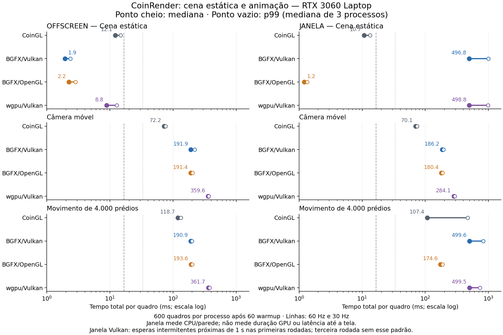
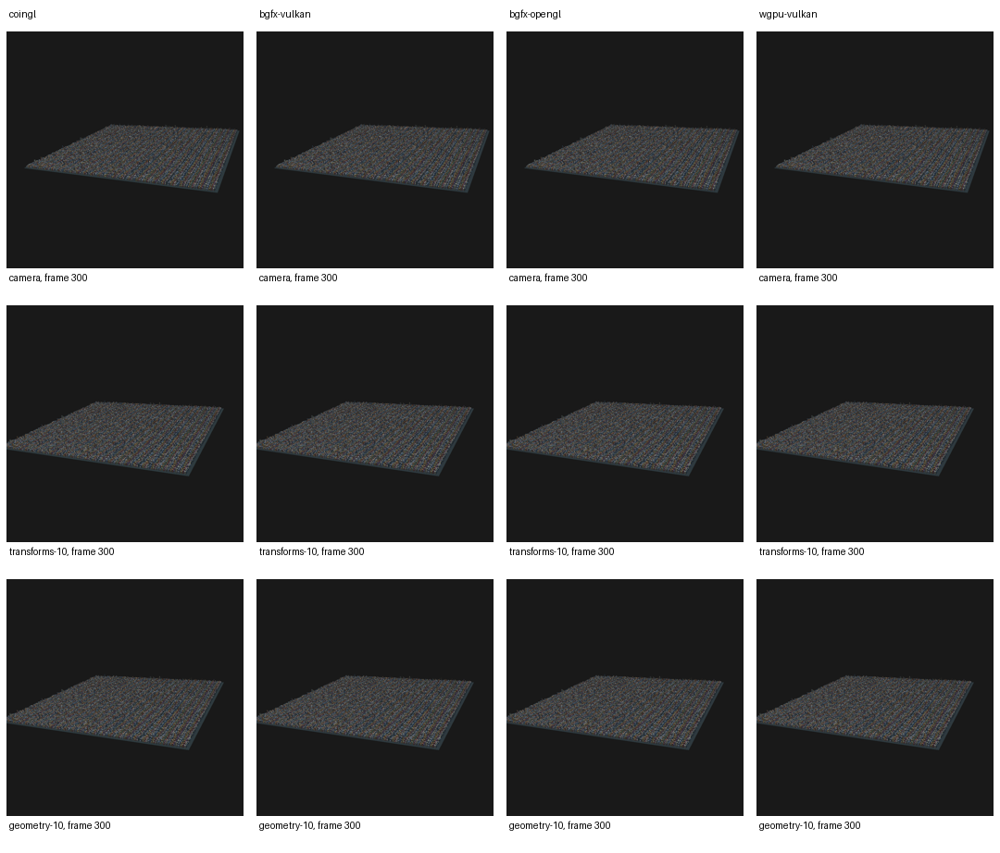

# Benchmark de animação do CoinRender — Linux, 2026-10-04

Implementação: `0cc3caffa7`, branch `codex/coin-render-transform-performance`.
O protocolo e os comandos estão em
[coin-render-animation-benchmark.md](coin-render-animation-benchmark.md).

## O que foi implementado

Os exemplos offscreen e janela compartilham uma sequência determinística de
animação com tempo lógico `frame / 60`. O CSV separa a atualização dos campos da
renderização e preserva cada amostra, inclusive warmup. Há casos de cena estática,
câmera, transforms de 1/10/100% dos prédios, materiais e geometria. Materiais e
cubos compartilhados recebem clones por ocorrência antes dos timers, para que
animação de uma fração não altere todos os objetos que usam o mesmo DEF/USE.

O runner alterna a ordem dos backends e dos casos entre rodadas, registra os
comandos/ambiente/hashes e permite retomar somente com parâmetros compatíveis.
Os testes CPU conferem seleção, determinismo, restauração, clones e tempo de vida
no build BGFX e no wgpu; ambos passaram.

## Método da campanha principal

- Referência: CoinGL (`SoGLRenderAction`) local na mesma GPU NVIDIA. Este checkout
  inclui as correções locais de GLX/PRIME e busca estrutural de sombras já usadas
  nas campanhas anteriores; não é uma cópia sem modificações do upstream.
  O diagnóstico separado `COIN_DEBUG_GLGLUE=1` confirma `GL_RENDERER=NVIDIA
  GeForce RTX 3060 Laptop GPU/PCIe/SSE2`, OpenGL 4.6 NVIDIA 610.57.04 e pbuffer.
- Cidade: 40.000 prédios, grade 200 × 200, seed 136, 480.012 triângulos, PHONG e
  duas luzes direcionais. SHA-256 da cena:
  `bb9ccc612cd38ffb749ee599d9350a80974649eab5bf477d2f344538a42b2576`.
- CPU AMD Ryzen 7 5800H, NVIDIA RTX 3060 Laptop, driver 610.57.04, builds Release
  GCC 13.3/Ninja com `-O3 -DNDEBUG`.
- Quatro variantes: CoinGL, BGFX/Vulkan, BGFX/OpenGL, wgpu/Vulkan.
- Três casos principais: estático, câmera móvel, transforms de 10% (4.000 prédios).
- Por processo: 60 warmup e 600 quadros medidos, 1024 × 1024, passo lógico 1.
- Três rodadas intercaladas, um processo por caso/variante/rodada. Nenhuma build
  ou outra execução de teste GPU concorrente. Caches de sistema/driver preservados.
- Offscreen: RGBA síncrono e publicação por cópia. Janela: sem captura de pixels.

A máquina usa governor CPU `powersave`, sem fixar os clocks. Um snapshot durante
a câmera BGFX/OpenGL da terceira rodada registrou CPU a 86,25 °C e frequência
instantânea de aproximadamente 3,29 GHz no primeiro policy. Esse controle pontual
não permite atribuir os picos à temperatura, frequência ou carga externa: não há
telemetria contínua dessas variáveis. As três rodadas e suas caudas foram
preservadas; não se descarta uma execução para obter um número melhor.

Cada escopo soma 36 processos e 21.600 quadros medidos. As tabelas usam a mediana
das três estatísticas por processo. Os p95/p99 agregados assim representam a
execução típica; não são percentis de uma distribuição única com 1.800 quadros.
O `medians.json` também contém a mediana dos máximos e das contagens por processo;
a tabela de contagens deste relatório soma os três processos diretamente a partir
das amostras e o máximo global é calculado sobre todos eles. O campo publication
da janela é não aplicável; o zero do resumo não representa uma medição de cópia.

A figura usa escala logarítmica. Os pontos vazios são p99 agregados por mediana
dos processos; os máximos globais ficam nas tabelas.

## Resultados offscreen

Medianas em ms, agregadas pelas três rodadas:

| Variante | Estático | Câmera | Transforms 10% |
|---|---:|---:|---:|
| CoinGL | 12,11 | 72,18 | 118,75 |
| BGFX/Vulkan | 1,94 | 191,89 | 190,93 |
| BGFX/OpenGL | 2,23 | 191,37 | 193,61 |
| wgpu/Vulkan | 8,81 | 359,58 | 361,74 |

BGFX ficou cerca de seis vezes mais rápido no quadro estático. Durante câmera
móvel, seus caminhos ficaram cerca de 2,7 vezes mais lentos que CoinGL; durante
transforms de 10%, cerca de 1,6 vezes. wgpu ficou cerca de cinco vezes mais lento
na câmera e três vezes nos transforms. O cache estático não representa o custo
da animação.

### Caudas e limites

Cada linha reúne 1.800 quadros medidos (600 por processo). p95/p99 são medianas
dos três percentis; máximo e contagens usam todos os quadros.

| Caso | Variante | p95 | p99 | Máximo global | >16,67 ms | >33,33 ms |
|---|---|---:|---:|---:|---:|---:|
| Estático | CoinGL | 14,15 | 14,74 | 16,13 | 0 | 0 |
| Estático | BGFX/Vulkan | 2,14 | 2,37 | 4,60 | 0 | 0 |
| Estático | BGFX/OpenGL | 2,45 | 2,84 | 4,21 | 0 | 0 |
| Estático | wgpu/Vulkan | 12,29 | 12,84 | 14,43 | 0 | 0 |
| Câmera | CoinGL | 74,84 | 76,27 | 102,79 | 1800 | 1800 |
| Câmera | BGFX/Vulkan | 200,93 | 219,94 | 384,19 | 1800 | 1800 |
| Câmera | BGFX/OpenGL | 198,00 | 203,19 | 234,20 | 1800 | 1800 |
| Câmera | wgpu/Vulkan | 364,59 | 367,87 | 441,48 | 1800 | 1800 |
| Transforms 10% | CoinGL | 125,74 | 132,75 | 233,63 | 1800 | 1800 |
| Transforms 10% | BGFX/Vulkan | 196,73 | 199,49 | 252,55 | 1800 | 1800 |
| Transforms 10% | BGFX/OpenGL | 198,15 | 201,31 | 390,59 | 1800 | 1800 |
| Transforms 10% | wgpu/Vulkan | 371,68 | 380,19 | 624,67 | 1800 | 1800 |

Todos os quadros estáticos ficaram dentro de 16,67 ms. Todos os dinâmicos
ultrapassaram 33,33 ms, inclusive CoinGL. A terceira rodada teve caudas maiores
em alguns casos: transforms BGFX/OpenGL p95 306,37 ms, transforms wgpu p95
471,90 ms e câmera BGFX/Vulkan p95 315,29 ms. Esses picos constam nos logs/CSV e
nos máximos acima; as medianas de percentis entre rodadas não os substituem.

### Inicialização e memória — controle estático

O primeiro quadro é o primeiro do warmup. A coluna desde main inclui parsing,
câmera, preparação e inicialização; RSS é memória residente máxima do processo,
sem representar VRAM. Valores agregados por mediana das três execuções.

| Variante | Primeiro total | Resultado desde main | RSS máximo |
|---|---:|---:|---:|
| CoinGL | 357,81 ms | 751,28 ms | 332,76 MiB |
| BGFX/Vulkan | 314,55 ms | 883,12 ms | 293,96 MiB |
| BGFX/OpenGL | 269,13 ms | 802,41 ms | 330,47 MiB |
| wgpu/Vulkan | 305,84 ms | 866,29 ms | 495,39 MiB |

## Resultados de janela

Medianas em ms, agregadas pelas três rodadas, sem readback. Os números incluem
a chamada de apresentação e suas esperas; não representam duração GPU.

| Variante | Estático | Câmera | Transforms 10% |
|---|---:|---:|---:|
| CoinGL | 10,72 | 70,07 | 107,37 |
| BGFX/Vulkan | 496,77 | 186,17 | 499,65 |
| BGFX/OpenGL | 1,20 | 180,36 | 174,63 |
| wgpu/Vulkan | 498,80 | 284,07 | 499,46 |

O estático Vulkan alternou quadros baratos com esperas próximas de um segundo nas
duas primeiras rodadas. A terceira rodada foi rápida: BGFX/Vulkan teve mediana
**0,65 ms** e wgpu/Vulkan **12,13 ms**. As medianas agregadas próximas de 500 ms
preservam a intermitência observada nas outras rodadas. Elas não são um custo de
captura constante nem o tempo de todos os quadros.

### Caudas e limites

Cada linha reúne 1.800 quadros medidos. p95/p99 são medianas dos percentis por
processo; máximo e contagens incluem todos os quadros das três rodadas.

| Caso | Variante | p95 | p99 | Máximo global | >16,67 ms | >33,33 ms |
|---|---|---:|---:|---:|---:|---:|
| Estático | CoinGL | 12,56 | 13,32 | 499,74 | 15 | 13 |
| Estático | BGFX/Vulkan | 1000,70 | 1001,26 | 1005,12 | 600 | 600 |
| Estático | BGFX/OpenGL | 1,29 | 1,35 | 502,68 | 4 | 4 |
| Estático | wgpu/Vulkan | 987,24 | 988,67 | 990,47 | 612 | 600 |
| Câmera | CoinGL | 72,74 | 74,02 | 498,57 | 1800 | 1800 |
| Câmera | BGFX/Vulkan | 191,45 | 193,09 | 835,78 | 1800 | 1800 |
| Câmera | BGFX/OpenGL | 184,37 | 188,64 | 201,05 | 1800 | 1800 |
| Câmera | wgpu/Vulkan | 290,15 | 292,50 | 734,95 | 1800 | 1800 |
| Transforms 10% | CoinGL | 468,49 | 471,66 | 476,98 | 1800 | 1800 |
| Transforms 10% | BGFX/Vulkan | 830,67 | 832,15 | 836,88 | 1800 | 1800 |
| Transforms 10% | BGFX/OpenGL | 181,48 | 187,31 | 197,58 | 1800 | 1800 |
| Transforms 10% | wgpu/Vulkan | 730,96 | 733,36 | 737,05 | 1800 | 1800 |

Todos os quadros dinâmicos excederam 33,33 ms. Os picos também aparecem em OpenGL:
CoinGL estático chegou a **499,74 ms** e BGFX/OpenGL a **502,68 ms**, mesmo com
medianas baixas. Os resultados completos foram mantidos.

### Variação entre processos

As esperas não persistiram durante toda a campanha. Estes controles de rodada
mostram por que a mediana agregada precisa ser lida junto com os CSVs:

| Caso e estatística | Rodada 1 | Rodada 2 | Rodada 3 |
|---|---:|---:|---:|
| Estático BGFX/Vulkan — mediana | 496,77 ms | 499,16 ms | 0,65 ms |
| Estático wgpu/Vulkan — mediana | 498,80 ms | 499,54 ms | 12,13 ms |
| Câmera BGFX/Vulkan — p95 | 832,00 ms | 186,18 ms | 191,45 ms |
| Câmera wgpu/Vulkan — p95 | 730,90 ms | 288,23 ms | 290,15 ms |
| Transforms 10% CoinGL — p95 | 471,42 ms | 468,49 ms | 115,62 ms |

### Inicialização e memória

Primeiro quadro do warmup; resultado desde main inclui carregamento e preparação.
RSS é memória residente máxima do processo, não VRAM. Valores são medianas de
três execuções do controle estático.

| Variante | Primeiro total | Resultado desde main | RSS máximo |
|---|---:|---:|---:|
| CoinGL | 250,31 ms | 796,39 ms | 354,02 MiB |
| BGFX/Vulkan | 307,05 ms | 1000,88 ms | 289,59 MiB |
| BGFX/OpenGL | 264,14 ms | 942,60 ms | 322,41 MiB |
| wgpu/Vulkan | 352,77 ms | 1035,52 ms | 482,65 MiB |

O RSS aumenta durante as animações em vários backends. A tabela reúne o pico de
cada processo por mediana; os resumos independentes também preservam a
inicialização de cada caso.

| Variante | RSS estático | RSS câmera | RSS transforms 10% |
|---|---:|---:|---:|
| CoinGL | 354,02 MiB | 424,37 MiB | 310,16 MiB |
| BGFX/Vulkan | 289,59 MiB | 378,44 MiB | 379,67 MiB |
| BGFX/OpenGL | 322,41 MiB | 409,54 MiB | 410,29 MiB |
| wgpu/Vulkan | 482,65 MiB | 656,04 MiB | 656,45 MiB |

## Casos adicionais — piloto offscreen

O piloto usou uma rodada, cinco warmup e 20 quadros medidos. Seus valores são
exploratórios; a amostra e o número de rodadas não qualificam estabilidade.

| Caso | CoinGL | BGFX/Vulkan | BGFX/OpenGL | wgpu/Vulkan |
|---|---:|---:|---:|---:|
| Transforms 1% (400 prédios) | 98,15 ms | 182,28 ms | 197,47 ms | 361,30 ms |
| Transforms 100% (40 mil) | 234,89 ms | 200,59 ms | 205,90 ms | 375,79 ms |
| Materiais 10% | 115,85 ms | 519,65 ms | 480,95 ms | 395,03 ms |
| Geometria 10% | 116,18 ms | 666,30 ms | 615,52 ms | 541,80 ms |

Mover 1% ainda paga grande parte do custo de recaptura nos caminhos experimentais.
Mover todos os prédios muda a comparação com o cache parcial do CoinGL: no piloto,
BGFX foi mais rápido nesse caso. Alterar materiais/geometria exige investigação
separada; esses valores não substituem uma campanha de três rodadas e 600 quadros.

## Qualidade das imagens

Uma campanha separada **offscreen** percorreu sete estados lógicos nos sete casos
e nos quatro backends: **196 comparações RGB** em resolução integral, incluindo
**49 autocontroles CoinGL**. Os digests de estado de cada quadro são iguais entre
variantes; os seis casos dinâmicos produziram sete estados e imagens distintos,
e o estático manteve um estado/imagem. Os checksums RGBA estáticos repetem a
referência anterior.

A maior MAE RGB observada contra CoinGL foi aproximadamente **0,0281 por canal**
na escala 0–255. O maior número de pixels com erro acima de 3 em algum canal foi
**13 de 1.048.576**, no movimento de câmera. Há diferenças pontuais nas bordas,
com máximo de 150 em um canal; não se exige igualdade byte a byte entre APIs.
A montagem também foi inspecionada visualmente, sem corrigir as imagens para
eliminar diferenças. As métricas foram calculadas nos pixels integrais. O
analisador registra os erros RGB; seu sucesso verifica correspondência dos
estados e movimento, sem impor um limiar automático de aceitação RGB.

## Limites do benchmark de janela

O gerenciador inicialmente reduziu a altura solicitada para 1008 pixels. Isso
provocou perda da superfície wgpu e tornaria a comparação de área incorreta.
O exemplo agora solicita tamanho fixo ao WM e valida o drawable real, rejeitando
um resize durante a medição. Os controles dos quatro backends passaram com
1024 × 1024. Na workarea 1920 × 1040, a origem (50, 32) deixa 16 pixels de altura
fora da workarea; os logs registram esse detalhe. O monitor opera a 165 Hz.

Os tempos de janela são CPU/parede, não duração GPU ou latência até a tela.
VSync é solicitado desligado, mas o driver/compositor pode impor esperas. Eventos
ficam fora de `total_ms` e entram no throughput do loop. CoinGL inclui um
`glFinish()` final; os backends nativos não oferecem fence final equivalente e
podem ter fila pendente. Por isso o throughput bruto não mede FPS físico da tela
e não é diretamente equivalente entre esses escopos de drenagem.

## Diagnósticos separados de fases

Após as duas campanhas, oito processos curtos usaram os mesmos binários e cena,
com `COIN_RENDER_TRACE_PHASES=1`. Quatro controles offscreen tiveram um warmup e
dois quadros medidos; quatro controles estáticos de janela tiveram um warmup e
quatro quadros medidos. Seus tempos não entram nas tabelas principais, e não são
timestamps GPU. Os comandos e todos os registros estão em
[phase-diagnostics/](validation/animation-linux/phase-diagnostics/summary.json).

### Recaptura durante animação

Faixas observadas nos dois quadros após warmup; backend inclui submissão/readback
offscreen. O primeiro quadro, com preparação do dispositivo, foi separado.

| Caso | Variante | Captura | Plano | Backend | Reuso classificado |
|---|---|---:|---:|---:|---|
| Câmera | BGFX/Vulkan | 136,35–137,13 ms | 26,15–26,76 ms | 17,06–23,18 ms | resource_rebuild |
| Câmera | wgpu/Vulkan | 132,17–143,70 ms | 25,26–26,19 ms | 141,04–143,77 ms | resource_rebuild |
| Transforms 10% | BGFX/Vulkan | 130,46–133,61 ms | 26,03–27,89 ms | 17,40–23,35 ms | full_rebuild |
| Transforms 10% | wgpu/Vulkan | 135,56–135,84 ms | 24,95–25,97 ms | 141,28–145,78 ms | full_rebuild |

Todos esses quadros tiveram `plan_cache_hit=0`. A cidade BGFX ainda usou
instancing com **dois draws e 40.001 instâncias**, incluindo o chão. Reutilizar a
capacidade dos buffers não evita recapturar a cena ou atualizar suas instâncias.
Essas amostras curtas identificam trabalho repetido; não substituem as medianas e
caudas de 600 quadros, medidas em outro momento da campanha.

### Janela estática: controle 1024 e 512

Os controles 512 × 512 ficam integralmente dentro da workarea. As quatro chamadas
após warmup mantiveram `plan_cache_hit=1` e `plan_reuse=reuse` nos dois tamanhos;
BGFX também manteve `resource_cache_hit=1`.

| Variante | Drawable | Fora da workarea | Primeiro backend após warmup | Outros três backends |
|---|---|---|---:|---:|
| BGFX/Vulkan | 1024 × 1024 | 16 pixels de altura | 62,95 ms | 0,31–1,46 ms |
| BGFX/Vulkan | 512 × 512 | Não | 62,10 ms | 0,16–1,40 ms |
| wgpu/Vulkan | 1024 × 1024 | 16 pixels de altura | 11,45 ms | 11,51–13,29 ms |
| wgpu/Vulkan | 512 × 512 | Não | 11,52 ms | 10,94–11,28 ms |

Nenhum desses traces posteriores reproduziu a espera de aproximadamente um
segundo. **A origem da intermitência continua não identificada.** Como nem o
controle 1024 reproduziu a anomalia, o controle 512 não estabelece causalmente se
os 16 pixels fora da workarea contribuíram para ela. Não se atribuem os picos a
DPMS, compositor, driver ou perda do cache sem uma reprodução instrumentada.

No BGFX, o tempo do primeiro quadro medido ficou em `submit_frame_ms` — a chamada
`bgfx::frame()` espera o render thread anterior. No wgpu, a aquisição da superfície
ficou em aproximadamente 0,016–0,029 ms e submit/present em 0,18–0,25 ms nesses
controles. A leitura do código identifica esperas possíveis de apresentação e
fences, mas não prova qual delas causou os picos da campanha anterior.

[display-state-observation.txt](validation/animation-linux/window/display-state-observation.txt)
registra três snapshots somente de leitura: monitor ligado e timeouts de
screensaver/DPMS em zero. Eles descrevem os instantes observados; não estabelecem
o histórico do display durante os processos anteriores.

## Onde procurar a próxima melhoria

A diferença entre estático e animação tem causas identificáveis no código:

1. A notificação de campos altera a identidade da cena usada para reuso. A cidade
   não qualifica o overlay de câmera: o filtro em `CoinRenderAction.cpp` não aceita
   seus `SoTransform` e luzes, e o Core exige BASE_COLOR nesse caminho.
2. Mover objetos altera `sortingCenterWorld`; o comparador de estrutura em
   `CoinRenderFrameReuseCore.cpp` conduz a reconstrução integral. Ainda não existe
   uma modalidade específica de patch de transforms no protocolo de reuso.
3. BGFX desabilita o patch de câmera/material quando o plano usa instancing.
   Nova revisão recompõe o lowering e reenfileira geometria/instâncias mesmo
   quando os handles existentes têm capacidade suficiente.
4. O batch opaco wgpu impede o camera patch e recompõe os vértices transformados
   por ocorrência. O bom custo do quadro estático não inclui esse trabalho.

Essa leitura explica quais operações são repetidas; sozinha não atribui os
milissegundos de cada fase. A próxima correção deve priorizar reuso de câmera com
PHONG e instancing, depois atualização parcial de transforms, preservando
matrizes normais, iluminação, ordenação e os digests/imagens desta campanha.

## Evidências

[Logs, CSV, manifests e imagens](validation/animation-linux/README.md).
As duas campanhas principais totalizaram **72 processos, 43.200 quadros medidos e
4.320 warmup**, sem falhas. Os oito diagnósticos completaram 80 processos nessas
duas etapas. Os pilotos e a verificação RGB são campanhas separadas e seus
resultados não pertencem às tabelas principais. O
[manifest geral](validation/animation-linux/manifest.json) reúne os controles e a
identidade dos dados; os manifests originais foram preservados.
