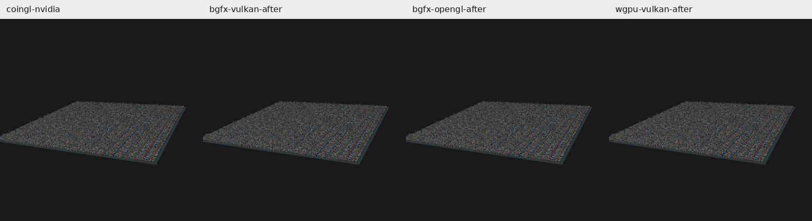

# Primeiro quadro BGFX — Linux, 2026-10-04

[Padrão de comparação](coin-render-benchmark-standard.md). Branch `codex/coin-render-transform-performance`.

Baseline: `8072f6306f`. Código depois: `ef39f25856` (captura comum) e `1cc68c65f7` (BGFX, shaders e testes), HEAD `1cc68c65f7`. Os binários medidos foram compilados desses mesmos conteúdos antes de criar os commits; os hashes estão nas evidências.

## Resultado

Na cidade de 40 mil prédios, o primeiro quadro BGFX/Vulkan caiu de **665,36 para 318,92 ms** (−52,07%) e BGFX/OpenGL de **630,62 para 270,78 ms** (−57,06%). A meta de 300 ms foi atingida no OpenGL. Vulkan ficou 18,92 ms acima dela, ou 6,31%.

CoinGL/NVIDIA, a referência principal na mesma GPU, mediu **343,53 ms**. O primeiro quadro de render + readback + cópia ficou 7,16% menor em BGFX/Vulkan e 21,18% menor em BGFX/OpenGL. Entretanto, **CoinGL ainda entregou a primeira imagem mais cedo desde `main`**: 724,27 ms, contra 887,77 ms e 786,47 ms. Capability probe e preparação anteriores ao primeiro render continuam relevantes.

## Método e referência

- Build Release/Ninja, GCC 13.3.0, `-O3 -DNDEBUG`; CPU AMD Ryzen 7 5800H e NVIDIA RTX 3060 Laptop, driver 610.57.04. **Todos os tempos usam a mesma NVIDIA**.
- Cidade determinística: grid 200, seed 136, 40.000 prédios, 480.012 triângulos, PHONG e duas luzes direcionais. Mesmo arquivo, câmera/enquadramento, materiais, fundo RGB e 1024 × 1024.
- Saída offscreen RGBA, readback síncrono de cor e cópia para o consumidor; cena estática e política de transparência object, com materiais opacos.
- Sete variantes × três rodadas intercaladas = **21 processos novos**, cada um com 30 quadros de aquecimento e 120 medidos. Sem build ou outra medição GPU concorrente. Caches de sistema/driver não foram limpos.
- CoinGL usa `SoGLRenderAction` e `SoOffscreenRenderer`, `--backend gl`, com pbuffer GLX NVIDIA. É a revisão local, com ajustes anteriores de GLX PRIME e busca estrutural de ShadowGroup, não um binário upstream intocado. BGFX/OpenGL é uma variante distinta. Seleção de GPU, contexto e hashes das bibliotecas estão nas evidências.

O primeiro quadro mede render + readback + cópia, excluindo parsing, enquadramento, construção do target e capability probe. “Desde início” inclui essas etapas e vai de `main` até a primeira imagem copiada. Primeiro quadro, aquecido, p95 e RSS são medianas dos três processos; aquecido e p95 são calculados primeiro sobre os 120 quadros de cada processo. RSS é o pico do processo inteiro, medido por `/usr/bin/time`, convertido de KiB para MiB.

## Tempos (ms) e pico RSS do processo (MiB)

| Caminho NVIDIA | Primeiro quadro | Aquecido | p95 aquecido | Desde início | Pico RSS |
|---|---:|---:|---:|---:|---:|
| **CoinGL — referência atual** | **343,53** | 12,34 | 14,29 | **724,27** | 331,65 |
| BGFX/Vulkan antes | 665,36 | 2,48 | 2,71 | 1240,95 | 619,41 |
| BGFX/Vulkan depois | **318,92** | **2,10** | 2,34 | 887,77 | **293,59** |
| BGFX/OpenGL antes | 630,62 | 2,98 | 3,20 | 1153,25 | 543,85 |
| BGFX/OpenGL depois | **270,78** | **2,40** | 2,63 | 786,47 | **328,09** |
| wgpu/Vulkan antes | 401,54 | 8,10 | 8,67 | 944,60 | 494,16 |
| wgpu/Vulkan depois | 315,37 | 8,33 | 9,07 | 870,90 | 489,61 |

| Variante depois | Primeiro antes/depois | Aquecido antes/depois | Primeiro vs CoinGL | Razão CoinGL/variante aquecida |
|---|---:|---:|---:|---:|
| BGFX/Vulkan | −52,07% | −15,22% | −7,16% | 5,87× |
| BGFX/OpenGL | −57,06% | −19,27% | −21,18% | 5,13× |
| wgpu/Vulkan | −21,46% | **+2,81%** | −8,20% | 1,48× |

Os três primeiros quadros depois ficaram entre 318,10–321,10 ms em BGFX/Vulkan e 264,78–293,52 ms em BGFX/OpenGL. A redução de pico RSS foi 52,60% em Vulkan e 39,67% em OpenGL. Esses números pertencem ao pacote de mudanças completo; a campanha não isola o ganho de cada componente.

wgpu/Vulkan serve também para observar o efeito das mudanças comuns de captura. Seu primeiro quadro melhorou, mas o aquecido foi 2,81% maior nesta amostra. Não se afirma invariância do tempo aquecido nem ganho do BGFX aplicável ao wgpu.

## Mudanças de arquitetura e execução

O fluxo permanece `CoinRenderAction → Builder/plano comum → Target → Backend BGFX → lowering Core → recursos BGFX`. O Core recebe valores, sem nodes/device/capabilities; o Backend seleciona a política da GPU. A captura agora copia um snapshot inicial padrão. A composição mantém as otimizações anteriores de calcular somente Z, com divisão homogênea/finitude preservadas, e evitar ordenar uma sequência já ordenada.

O Builder valida o plano e calcula a composição com a política de transparência selecionada antes da validação. Para uma captura ordinária recém-finalizada, entrega um `CoinRenderFramePreflight` privado que vincula **endereço do plano, revisão e política de transparência** ao resultado. O Target pode reutilizar esses dois passes comuns, mas continua verificando opções, perfil, admissão e recursos.

A prova vale apenas durante a submissão e é invalidada antes de montagem de sombras, resolução de RTT, reutilização/alteração do plano e transferência para o cache. Shadow groups, producers de textura e tokens GPU diretos não recebem a prova. Ausência ou incompatibilidade conduz à validação completa; ela não é guardada no cache/FFI/saída assíncrona.

A reserva de capacidade é uma dica estrutural limitada: examina até **64 nodes**, no máximo **dois níveis** de filhos, e para de descer ao encontrar um grupo com pelo menos 256 filhos. A estimativa é limitada a **65.536** entradas. Ela reserva vetores/mapas de captura e evita crescimento e cópias repetidas na cidade larga; não elimina travessia ou snapshots semânticos. `COIN_RENDER_DISABLE_CAPTURE_RESERVE=1` desativa essa reserva para diagnóstico.

O instancing transforma cada mesh em **24 bytes por vértice** (posição + normal) e cada ocorrência em **160 bytes** (10 `vec4`: model-view afim, matriz normal, diffuse/ambient/specular/emission, shininess e PHONG). Material por ocorrência conserva materiais alternados na sequência de instâncias.

O perfil exige pelo menos 256 draws, triângulos opacos PHONG, material uniforme por span, matrizes afins e os mesmos view, projection, viewport, iluminação e estado de face/cull. Rejeita texturas, fog, clipping, sombras, blend, stipple efetivo, overlays, offset, padrões de linha/polígono, overrides de interpolação e estados especiais de profundidade. SCREEN_DOOR com nível zero é opaco e pode qualificar.

A profundidade pode usar **LESS ou LEQUAL**, uniforme em todo o plano, com teste e escrita ligados e range 0–1. O template preserva a função original. Meshes combinam somente quando são **ocorrências consecutivas** com geometria e estado compatíveis; a sequência de instâncias permanece a da travessia. Não há sort global por mesh/material, nem agrupamento posterior de draws instanced. Isso conserva também a ordem de materiais coplanares sob LEQUAL.

Há limites de 4.096 vértices/65.536 índices por span, 1.024 spans e 256 meshes distintos, além de verificações de faixa, finitude e magnitude conservadora para posições/normais e coeficientes das matrizes. Valores extremos seguem pelo caminho geral. O Backend exige capabilities de instancing, dez slots de dados de instância e pelo menos doze atributos de vértice. Qualquer recusa deixa o plano de saída intacto e usa o lowering geral, com diagnóstico disponível em `COIN_RENDER_TRACE_PHASES=1`.

Na cidade, os 40.000 cubos e o chão passam a **48 vértices, 72 índices, 40.001 instâncias e dois draws**. O payload principal muda de 960.024 vértices × 188 bytes = **180,48 MB** para 40.001 instâncias × 160 bytes = **6,40 MB**, mais 1.152 bytes de vértices e 288 de índices compartilhados. O caminho anterior também enviava 5,76 MB de índices. São bytes úteis do plano, não uma medida de toda a memória GPU: buffers persistentes reservam capacidade e o instance buffer observado tem 65.536 slots, aproximadamente 10 MiB.

Buffers persistentes participam do cache estático; mudanças de câmera/material recompõem instâncias, recusando os patches do formato anterior. `COIN_BGFX_DISABLE_INSTANCING=1` força o caminho geral. Programas são criados sob demanda após selecionar o perfil; o opaco simples omite operações de textura/fog/clip/stipple no fragment shader e preserva PHONG/profundidade. Outros perfis usam seus programas correspondentes.

O runtime reserva um encoder (`maxEncoders=1`) e pools transientes de VB e IB de **64 KiB cada**. Este executor usa buffers persistentes para geometria/instâncias e para o fullscreen; os pools continuam não nulos para o ciclo interno do BGFX. `COIN_BGFX_DISABLE_SMALL_RUNTIME_RESERVATIONS=1` restaura as reservas padrão. Essa redução de reservas não tem ganho de latência validado isoladamente.

## Diagnósticos e ablações

Um [piloto separado](validation/bgfx-first-frame-linux/ablations/reserve/results.json), com trace e apenas uma amostra por configuração, mediu a reserva de captura:

| Configuração do piloto | BGFX/Vulkan primeiro | BGFX/OpenGL primeiro |
|---|---:|---:|
| Depois, reservas atuais | 335,90 | 274,87 |
| Sem reserva de captura | 385,98 | 340,14 |
| Reservas padrão do runtime BGFX | 330,63 | 270,66 |

Esse piloto apoia a direção da reserva de captura, mas não estima sua contribuição com a mesma confiança das três rodadas finais. O runtime com reservas padrão ficou ligeiramente mais rápido nesse piloto; não se atribui ganho de tempo ao ajuste de pools/encoder. Experimentos com a latência do runtime BGFX (`swapChain.maxFrameLatency`, valores 1 e 3) não mostraram ganho consistente e foram descartados como estratégia de aceleração. A campanha final conserva readback síncrono e a configuração normal.

O lowering geral também conserva um cache local limitado por span, reutilizando análise de material e remapeamento sem alterar bytes/ordem (`COIN_BGFX_DISABLE_SHARED_RANGE_LOWERING=1` para ablação). Seu ganho nos pilotos foi pequeno. Pilotos anteriores à correção de SCREEN_DOOR/LEQUAL não ativavam instancing e não demonstram seu efeito. Esses experimentos intermediários não têm builds com manifesto neste pacote.

Um [trace Vulkan depois](validation/bgfx-first-frame-linux/ablations/reserve/vulkan-after.log) registrou aproximadamente 135 ms de travessia/captura, 28 ms de finalização do plano, 140 ms de preparação do target e 17 ms de lowering instanced; esses tempos têm instrumentação e variação entre execuções. O preparo do device e a captura são candidatos para a próxima investigação. A campanha final sem trace, e o tempo desde `main`, são as medidas usadas na conclusão.

## Imagens e correção

Os três processos de cada variante conservaram seu checksum estático. Antes/depois, os PPM orientados 1024 × 1024 de BGFX/Vulkan, BGFX/OpenGL e wgpu/Vulkan têm **MAE zero, erro máximo zero e nenhum pixel RGB diferente**. Os seis pares de controle dinâmico (câmera e material, em cada um dos três caminhos) também conservaram checksum e RGB exatos antes/depois.

| Variante depois vs CoinGL/NVIDIA | MAE RGB (0–255) | Erro máximo de canal | Pixels diferentes | Pixels com erro > 3 |
|---|---:|---:|---:|---:|
| BGFX/Vulkan | 0,022607 | 31 | 63.723 (6,0771%) | 1 |
| BGFX/OpenGL | 0,022741 | 88 | 63.724 (6,0772%) | 3 |
| wgpu/Vulkan | 0,022607 | 31 | 63.723 (6,0771%) | 1 |

CoinGL limpa alpha do fundo em zero e transporta linhas bottom-up; os caminhos experimentais publicam alpha um e linhas top-down. Portanto, checksum RGBA bruto cruzado não é um gate de igualdade. A comparação acima usa o RGB na orientação final, sem correção de imagem para reduzir erro, e conserva as diferenças da referência anterior.

Validação concluída:

- **14 invocações CPU selecionadas** em três builds: seis BGFX, cinco wgpu e três recording. Incluem captura/prova, plano/composição, geometria indexada, bytes do lowering, materiais por instância, ordem LEQUAL, recusa de estados/extremos e seleção de programas.
- **26 invocações GPU Common** em BGFX e wgpu: fog, texturas/RTT, draw style, composição, shadows, profundidade, clipping, iluminação, multitexture e transparência. Vulkan NVIDIA nos dois builds, mais contratos de profundidade OpenGL BGFX/NVIDIA e wgpu/AMD. Estas últimas são validação de correção, não dados da tabela de desempenho NVIDIA.
- **18 invocações GPU runtime BGFX**, abrangendo superfícies, transparência/profundidade, instancing, offscreen, janela Xlib e ciclos de vida com múltiplos targets; mais **duas reexecuções de instancing/profundidade** após a correção do viewport fora do target.
- **Seis pares dinâmicos antes/depois** com checksum e RGB exatos, além dos 21 processos da campanha estática.

## Limites e próximo alvo

A redução é comprovada para esta cidade estática, este host e saída offscreen síncrona. As razões aquecidas não são FPS de janela e não qualificam animação, outras cenas/GPUs ou driver cache vazio. São três processos por caminho, sem intervalo de confiança. Guardas/fallback foram testados, mas cálculo no vertex shader pode arredondar diferente em outros dados/GPU; a comparação de imagens continua necessária.

BGFX/OpenGL alcançou menos de 300 ms nas três amostras; BGFX/Vulkan chegou perto, mas ainda excede a meta. A próxima investigação pode focar a captura de 40 mil estados e a preparação do device, acompanhando também `main` → primeira imagem para medir o custo total percebido. CoinGL continua sendo a referência na mesma GPU.

[Logs, scripts, hashes e métricas](validation/bgfx-first-frame-linux/README.md).
