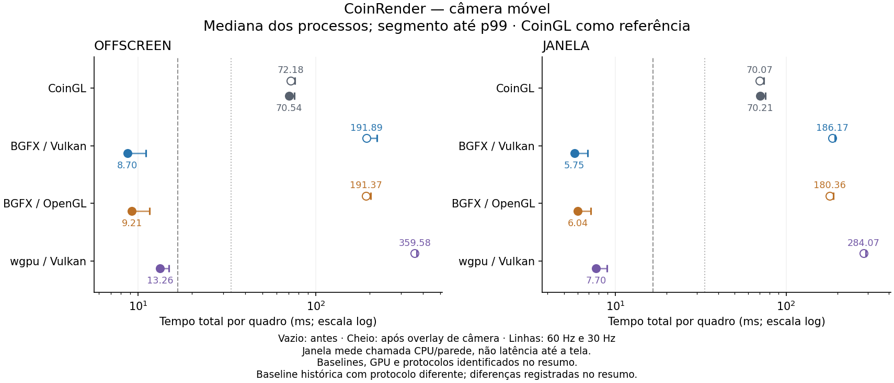
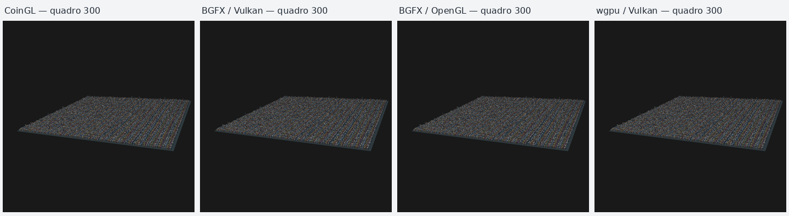

# Reutilização da câmera no CoinRender — Linux, 2026-10-04

Esta mudança responde ao custo de animação observado na
[campanha anterior](coin-render-animation-linux.md). A referência continua sendo
o OpenGL clássico do Coin3D (`SoGLRenderAction`, CoinGL) na mesma GPU.
Implementação: `4d63bb993022ee8d40802558b0871a4803002b8d`, branch
`codex/coin-render-transform-performance`.

## O que mudou

Uma mudança exclusiva da câmera conserva a geometria e os recursos já enviados
à GPU. O plano comum atualiza câmera e luzes; BGFX e wgpu aplicam a transformação
da câmera nos shaders. Cada atualização deriva da captura de referência, sem
acumular deltas entre quadros. A iluminação PHONG continua em espaço de câmera.

- **CoinRenderAction/Core:** um sensor distingue notificações dos campos da
  câmera das outras mutações. A qualificação exige uma câmera única no início
  do root e tipos de nós conhecidos, sem campos conectados fora da câmera.
  Após mudanças de objetos, a prova e a base de luzes são calculadas somente
  quando a câmera precisar delas; não há nova varredura a cada quadro de objetos.
  Nós folha compartilhados são verificados uma vez durante a qualificação.
- **BGFX:** instâncias e buffers de geometria são preservados. Um uniforme
  adicional transporta a transformação entre a câmera de referência e a atual;
  matrizes de projeção e luzes são atualizadas. O estado de reutilização só é
  publicado depois de uma submissão bem sucedida.
- **wgpu:** o batch opaco conserva a geometria capturada na câmera inicial. O
  bridge Rust possui uma cópia imutável validada, compartilhada por `Arc`, e
  conserva os buffers GPU entre revisões de câmera. Novas revisões completas
  consecutivas sem indicação de câmera suspendem essa cópia: animação de
  objetos não clona mais de 100 MB adicionais em todos os quadros. Uma indicação
  posterior de câmera readmite a base por validação completa; somente os
  patches seguintes podem usar essa base. Falhas preservam a base anterior e
  permitem retry. A política pertence ao device e à sua geração.

O perfil otimizado cobre batches opacos PHONG/BASE_COLOR compatíveis, sem
texturas, fog, clipping, transparência, sombras, RTT ou anotações. A prova comum
e cada backend continuam independentes: uma prova comum não obriga o backend
a usar o patch. Cenas não qualificadas seguem a captura e o empacotamento completos.

Escala, shear e reflexão na matriz da câmera, matrizes não finitas, modelos
quase singulares e coordenadas fora do domínio conservador de precisão recusam
o patch. A translação da câmera de referência e da atual fica limitada a
32.768 unidades por eixo. Coordenadas e transformações de luzes também são
limitadas na recuperação da base. Esse limite evita, por exemplo, reutilizar
uma captura em `1e8` que já tenha perdido um detalhe de uma unidade em float.

## Método

Mesma cidade da campanha anterior: 40.000 prédios, grade 200 × 200, seed 136,
480.012 triângulos, PHONG e duas luzes direcionais; cena SHA-256
`bb9ccc612cd38ffb749ee599d9350a80974649eab5bf477d2f344538a42b2576`.
Máquina: Ryzen 7 5800H, RTX 3060 Laptop, driver NVIDIA 610.57.04, GCC 13.3,
Release/Ninja, `-O3 -DNDEBUG`, governor `powersave`, clocks não fixados.
CoinGL usa as correções locais de GLX/PRIME e busca estrutural de sombras já
descritas no relatório anterior. O diagnóstico desta campanha confirmou o
renderer NVIDIA e o pbuffer offscreen.

O [protocolo de animação](coin-render-animation-benchmark.md) define atualização
determinística, seleção, estatísticas, orientação RGB e escopos dos timers.
Cada processo usa 1024 × 1024 e nenhuma build ou outra carga GPU de teste
concorrente. Caches de driver/sistema não foram esvaziados: primeiro quadro
significa processo novo, não sistema frio. As rodadas alternam variantes/casos.

- Offscreen: static e camera, três rodadas, 60 warmup e 600 quadros medidos
  por processo: 24 processos, 14.400 amostras medidas.
- Janela: camera, três rodadas, 15 warmup e 120 quadros medidos por processo:
  12 processos, 1.440 amostras medidas. É um controle mais curto que os 600
  quadros da campanha anterior; não qualifica ausência de esperas em execuções
  longas. O drawable real foi 1024 × 1024, com 16 pixels além da workarea,
  como registrado em todos os logs de geometria.
- Transforms-10: controle antes/depois com três rodadas, cinco warmup e 30
  quadros medidos por processo, 4.000 prédios animados. Os binários anteriores
  foram congelados antes das edições; seus hashes coincidem com o arquivo
  histórico. O manifesto do runner identifica o checkout que o executou;
  `frozen-binaries.json` identifica o conteúdo compilado anterior (`0cc3caffa7`)
  e o HEAD no momento da cópia (`5bc466fe04`). Os blocos anteriores foram
  executados primeiro, seguidos pelos atuais; clocks e temperatura não foram
  fixados. Esse controle curto não substitui a campanha histórica de 600 quadros.

Offscreen inclui render, readback de cor e cópia RGBA síncrona. Janela mede o
tempo CPU/parede da chamada render/present, sem readback; não mede duração GPU,
latência até a tela ou FPS físico. A cauda final `glFinish()` de CoinGL tem um
escopo diferente dos backends nativos. As esperas intermitentes de apresentação
registradas anteriormente não foram descartadas nem atribuídas à captura.

## Resultados

As tabelas abaixo usam mediana das estatísticas por processo. Máximos e contagens
somam as amostras de todas as rodadas. Os registros brutos e hashes ficam em
[validation/camera-reuse-linux](validation/camera-reuse-linux).

A figura usa escala logarítmica. Pontos preenchidos são as medianas atuais;
pontos vazios são o histórico; traços verticais marcam p99 agregados.

### Câmera offscreen

Tempo total por quadro em ms, incluindo atualização, render/readback e cópia:

| Variante | Antes, histórico | Atual | Atual / CoinGL | p95 atual | p99 atual |
|---|---:|---:|---:|---:|---:|
| CoinGL | 72,18 | 70,54 | 1,00 | 73,87 | 75,64 |
| BGFX/Vulkan | 191,89 | 8,70 | 0,12 | 10,75 | 11,05 |
| BGFX/OpenGL | 191,37 | 9,21 | 0,13 | 10,78 | 11,61 |
| wgpu/Vulkan | 359,58 | 13,26 | 0,19 | 14,16 | 14,84 |

BGFX ficou 7,7–8,1 vezes mais rápido que a referência CoinGL atual; wgpu,
5,3 vezes. Frente ao registro anterior, os tempos nativos de câmera caíram
aproximadamente 95% no BGFX e 96% no wgpu. São campanhas em momentos diferentes,
com os mesmos parâmetros offscreen e sem controle contínuo de clocks/carga.

| Variante | Amostras | Máximo global | >16,67 ms | >33,33 ms |
|---|---:|---:|---:|---:|
| CoinGL | 1.800 | 81,19 | 1.800 | 1.800 |
| BGFX/Vulkan | 1.800 | 13,13 | 0 | 0 |
| BGFX/OpenGL | 1.800 | 13,48 | 0 | 0 |
| wgpu/Vulkan | 1.800 | 19,38 | 12 | 0 |

O p99 agregado wgpu esconde a diferença entre processos: foi 14,84 / 14,57 /
18,39 ms. As 12 amostras acima de 16,67 ms estão na terceira rodada. Nenhum
quadro nativo medido excedeu 33,33 ms; não se eliminou warmup ou caudas da série
bruta, apenas se separaram os dois conjuntos nas estatísticas.

### Controle estático offscreen

| Variante | Antes, histórico | Atual | p95 atual | p99 atual | Máximo global |
|---|---:|---:|---:|---:|---:|
| CoinGL | 12,11 | 12,60 | 14,65 | 15,24 | 21,54 |
| BGFX/Vulkan | 1,94 | 1,92 | 2,17 | 2,44 | 4,34 |
| BGFX/OpenGL | 2,23 | 2,15 | 2,44 | 2,96 | 4,78 |
| wgpu/Vulkan | 8,81 | 1,90 | 2,36 | 2,81 | 4,35 |

wgpu também reutiliza os buffers GPU na revisão estática exata; o tempo caiu
4,6 vezes frente ao registro anterior. CoinGL teve 37/1.800 quadros acima de
16,67 ms; os três caminhos nativos tiveram zero. Nenhum excedeu 33,33 ms.

### Câmera em janela

Tempo CPU/parede da atualização e chamada render/present em ms, três rodadas
de 120 quadros. Publication é não aplicável, não uma cópia medida em zero ms.

| Variante | Atual | p95 | p99 | Máximo global | >16,67 ms / 360 |
|---|---:|---:|---:|---:|---:|
| CoinGL | 70,21 | 72,18 | 75,48 | 79,22 | 360 |
| BGFX/Vulkan | 5,75 | 6,79 | 6,89 | 7,76 | 0 |
| BGFX/OpenGL | 6,04 | 7,02 | 7,17 | 7,72 | 0 |
| wgpu/Vulkan | 7,70 | 8,69 | 8,94 | 9,40 | 0 |

As chamadas BGFX foram 11,6–12,2 vezes mais rápidas que CoinGL; wgpu, 9,1 vezes.
Não houve bloqueio próximo de um segundo neste controle curto. Isso não prova
que o comportamento intermitente da campanha anterior foi corrigido, nem mede
FPS físico. Os adaptadores registrados pelos quatro executáveis são NVIDIA.

### Primeiro quadro e memória

Controle estático offscreen; valores medianos das três execuções. O primeiro
quadro é o primeiro do warmup. RSS é memória residente máxima do processo.

| Variante | Primeiro anterior | Primeiro atual | RSS anterior | RSS atual |
|---|---:|---:|---:|---:|
| CoinGL | 357,81 ms | 348,27 ms | 332,76 MiB | 332,89 MiB |
| BGFX/Vulkan | 314,55 ms | 339,52 ms | 293,96 MiB | 294,01 MiB |
| BGFX/OpenGL | 269,13 ms | 282,27 ms | 330,47 MiB | 330,95 MiB |
| wgpu/Vulkan | 305,84 ms | 380,06 ms | 495,39 MiB | 588,16 MiB |

A preparação dos patches acrescenta trabalho no primeiro quadro. No wgpu,
o custo observado foi aproximadamente +74 ms e +93 MiB de RSS neste controle;
conservar a base imutável torna os quadros seguintes mais baratos. Não houve
economia de primeiro quadro nesta mudança. Os casos camera e a janela têm
RSS/primeiro quadro próprios, preservados nos JSONs; não se substituem por esse
controle estático.

### Objetos em movimento

Controle curto offscreen transforms-10, 90 quadros medidos por variante em cada
bloco (três processos de 30 quadros). Valores em ms:

| Variante | Antes congelado | Atual | Variação | p95 atual |
|---|---:|---:|---:|---:|
| CoinGL | 117,06 | 114,78 | -1,9% | 117,08 |
| BGFX/Vulkan | 190,89 | 193,55 | +1,4% | 201,87 |
| BGFX/OpenGL | 190,92 | 195,00 | +2,1% | 203,51 |
| wgpu/Vulkan | 359,51 | 366,20 | +1,9% | 370,62 |

Esse caso continua 1,7 vezes mais lento que CoinGL no BGFX e 3,2 vezes no wgpu.
As verificações adicionais têm custo nas reconstruções completas. O controle
registra uma pequena piora nativa, junto com variação da referência; sua duração
e a falta de clocks fixos limitam a atribuição de toda essa diferença ao código.
Todos os quadros desse controle excederam 33,33 ms, nos dois blocos.

Durante o desenvolvimento, o piloto wgpu chegou a aproximadamente 448 ms,
contra 319 ms no piloto anterior. Os diagnósticos localizaram cópias e descarte
de snapshots em cada reconstrução. Após a política transacional, a mediana da
fase Rust foi 39,81 ms, contra 40,25 ms nos binários congelados; snapshot/recycle
voltaram a aproximadamente zero. O pack C++ passou de 93,84 para 103,26 ms no
diagnóstico de cinco quadros. Esses traces com instrumentação explicam o custo;
seus timers não foram somados às campanhas principais. Pilotos intermediários
usaram código ainda sem commit e estão identificados como desenvolvimento.

### Controles de ablação

Uma execução diagnóstica por linha, três warmup e oito quadros, tracing ligado;
não é a campanha de 600 quadros. Medianas offscreen em ms:

| Variante | Otimizado | Overlay comum desligado | Patch do backend desligado |
|---|---:|---:|---:|
| BGFX/Vulkan | 8,07 | 181,81 | 49,42 |
| BGFX/OpenGL | 8,53 | 182,95 | 50,26 |
| wgpu/Vulkan | 10,20 | 308,34 | 163,78 |

Desligar somente o patch do backend mantém a redução de traversal comum, mas
refaz empacotamento/buffers. Desligar o overlay comum recupera o custo de captura
completa. Os logs preservam flags, checksums, fases e comandos; os hashes de
binários/cena são os da revisão medida.

## Qualidade e fallback

O teste `CoinRenderCameraReuseReferenceTest` usa 256 cubos compartilhados,
câmeras perspectiva/ortográfica, três luzes e modelos com escala não uniforme.
Compara patches com reconstrução completa e CoinGL em nove estados por câmera,
incluindo rotação, projeção e retorno à câmera inicial. O retorno deve reproduzir
exatamente a imagem inicial. O teste também altera objetos, materiais e luzes.
Tracing confirma o uso real dos patches nos dois caminhos BGFX e no wgpu.
Foram 16 patches comuns e 16 patches do backend em cada variante. Patch versus
rebake teve erro máximo por canal de uma unidade; a comparação desse fixture
com CoinGL mantém diferenças de borda (MAE abaixo de 0,08 e máximo 114 em poucos
pixels). Os limites do teste não foram alterados depois das comparações.

Testes CPU cobrem sensores, conexões, câmeras repetidas, invalidação de estrutura,
limites numéricos, iluminação, rollback e retry. Os testes privados do bridge
verificam geometria owned, cache GPU, estado por device e readmissão depois de
revisões completas. A janela wgpu executa seu cenário PHONG em processo novo,
isolado dos testes que injetam falhas de surface/device.
Passaram os quatro testes CPU selecionados em cada build, os dois testes Rust
de cena/política, `CoinWgpuMultiDeviceTest`, os dois modos de surface Vulkan e
as três execuções do teste GPU de câmera com CoinGL obrigatório. A readmissão
wgpu também foi submetida a uma falha de encode e a device loss depois de
submit/map/wait: saída sentinela e base não publicada foram verificadas, seguidas
de retry e comparação RGB/cache.

A cidade é verificada separadamente em sete estados lógicos por caso
(`0,100,...,600`), com static, camera e transforms-10 nas quatro variantes.
Esses timers não integram os resultados de desempenho. Os hashes de estado
precisam coincidir entre variantes; RGB é comparado com CoinGL sem corrigir
imagens para eliminar diferenças. Os PPM completos permanecem nos artefatos
locais; métricas e SHA-256 são versionados.

Na cidade, as 84 comparações incluem 21 controles CoinGL contra si próprio.
MAE máximo entre APIs foi **0,02803** em valores RGB de 0 a 255; máximo por canal
150, em até **13 pixels acima de 3** dentre 1.048.576. O estático conservou os
checksums RGBA anteriores. As 84 comparações adicionais com o mesmo backend da
campanha anterior tiveram MAE máximo 0,000250, máximo por canal 140 e até seis
pixels acima de 3; os 21 controles CoinGL foram exatos. Essas diferenças pequenas
se concentram em bordas, sem mudança dos estados ou deriva acumulada da câmera.

A montagem é reduzida para inspeção. Os quatro PNGs RGB em resolução original
estão no diretório `images/` das evidências.

## Limites e reprodução

O orçamento máximo da cópia owned wgpu para o batch opaco é 256 MiB; outros
perfis conservam o orçamento anterior de 32 MiB. A alocação dos vetores usa
`try_reserve_exact`; uma base indisponível mantém o caminho completo. RSS mede
memória residente do processo, não VRAM. A memória e o primeiro quadro precisam
ser lidos junto com a redução dos quadros seguintes.

Para desligar os caminhos em diagnóstico, use
`COIN_RENDER_DISABLE_CAMERA_OVERLAY=1`,
`COIN_BGFX_DISABLE_INSTANCED_CAMERA_PATCH=1` ou
`COIN_WGPU_DISABLE_OPAQUE_CAMERA_PATCH=1`. O runner limpa essas flags para uma
campanha normal; controles de ablação registram comandos explícitos.

Movimento de objetos ainda exige reconstrução completa e permanece um alvo de
otimização. Os ganhos de câmera não representam aceleração de todas as formas
de animação.
