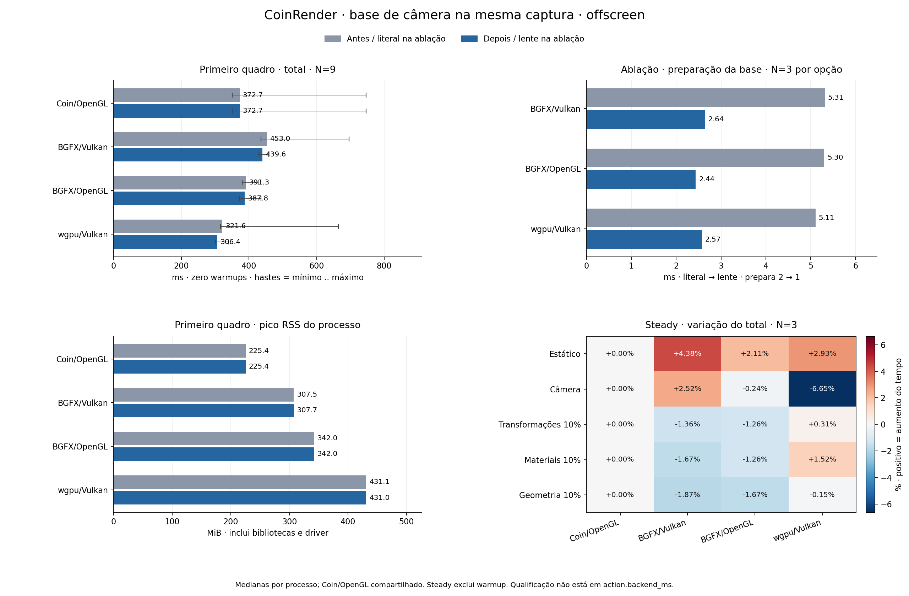

# CoinRender: base de câmera compartilhada na captura — Linux, 2026-10-05

Referência de render: Coin3D/Coin/OpenGL clássico (`SoGLRenderAction`).

## Mudança e organização

A Action empresta o resultado positivo de `prepareCameraOverlayBasis` à qualificação de objetos dentro da mesma chamada de `rememberFrameRoot`, após instalar a captura validada. A base continua pertencendo à Action; a lente expira ao retornar da chamada.

A admissão de câmera e a de objetos continuam independentes. A travessia estrita dos objetos, ownership, aliases, materiais e geometria permanecem verificados. Uma captura apenas de objetos conserva a preparação local e a política lazy da câmera. A lente não autoriza capturas futuras por revisão, ponteiro ou identidade de nó.

A mudança fica em Wiring/Action, que conecta a cena ao Core por snapshots e notificações. Core mantém a preparação da base e as transações por valores; Target conserva a admissão de submission; BGFX e wgpu mantêm seus próprios lowering/runtime. Não há nova prova de backend ou recurso GPU na lente.

Optout: `COIN_RENDER_DISABLE_CAPTURE_CAMERA_BASIS_REUSE=1`.

Cena de 40.000 objetos, 40.001 estados, 480.012 triângulos, PHONG e duas luzes direcionais; 1024 × 1024. Ryzen 5800H, RTX 3060 Laptop, driver NVIDIA 610.57.04, Linux 6.17.0-42; Release, GCC 13.3, C++11. Governador de CPU powersave. Snapshots de hardware antes/depois estão arquivados.

## Primeiro quadro em processo novo

Cada valor é a mediana de estatísticas por processo. Cold tem zero warmups e um quadro medido: total inclui update + render/readback + publication e representa o primeiro apply completo, não toda a inicialização do aplicativo.

| Variante | Total antes → depois (ms) | Δ total (ms) | Variação | Render antes → depois (ms) | N antes/depois |
|---|---:|---:|---:|---:|---:|
| Coin/OpenGL | 372.66 → 372.66 | +0.00 | +0.00% | 372.26 → 372.26 | 9/9 |
| BGFX/Vulkan | 452.97 → 439.64 | -13.33 | -2.94% | 452.57 → 439.24 | 9/9 |
| BGFX/OpenGL | 391.34 → 387.78 | -3.56 | -0.91% | 390.88 → 387.39 | 9/9 |
| wgpu/Vulkan | 321.59 → 306.38 | -15.21 | -4.73% | 319.43 → 304.34 | 9/9 |

| Variante | Intervalo dos totais por processo antes (ms) | Intervalo depois (ms) |
|---|---:|---:|
| Coin/OpenGL | 350.97 .. 746.67 | 350.97 .. 746.67 |
| BGFX/Vulkan | 436.12 .. 695.78 | 428.90 .. 459.12 |
| BGFX/OpenGL | 380.41 .. 427.19 | 372.47 .. 436.09 |
| wgpu/Vulkan | 315.85 .. 664.26 | 301.07 .. 340.53 |

Os intervalos mostram mínimo e máximo das medianas por processo, preservando todos os processos válidos e os outliers. Não são intervalos de confiança.

| Variante | Main → primeira imagem antes → depois (ms) | Pico RSS antes → depois (MiB) |
|---|---:|---:|
| Coin/OpenGL | 781.41 → 781.41 | 225.36 → 225.36 |
| BGFX/Vulkan | 1070.46 → 1064.61 | 307.53 → 307.67 |
| BGFX/OpenGL | 952.94 → 953.97 | 341.98 → 342.03 |
| wgpu/Vulkan | 921.37 → 910.80 | 431.13 → 430.99 |

Main → primeira imagem vem do log e inclui custos anteriores ao render. Pico RSS é memória residente máxima do processo, não memória GPU. Coin/OpenGL é o controle compartilhado, com igualdade de CSV/log comprovada por hashes.

## Quadros após warmup

Mediana das medianas por processo, excluindo linhas CSV de warmup. Todos os quatro caminhos de render são mostrados; valores positivos de Δ% indicam aumento do tempo.

| Caso | Coin/OpenGL (ms) | BGFX/Vulkan antes → depois (ms; Δ%) | BGFX/OpenGL antes → depois (ms; Δ%) | wgpu/Vulkan antes → depois (ms; Δ%) |
|---|---:|---:|---:|---:|
| Estático | 12.81 | 2.17 → 2.27; +4.38% | 2.42 → 2.47; +2.11% | 2.82 → 2.90; +2.93% |
| Câmera | 73.81 | 7.99 → 8.19; +2.52% | 8.58 → 8.56; -0.24% | 10.34 → 9.65; -6.65% |
| Transformações 10% | 117.83 | 45.16 → 44.55; -1.36% | 45.61 → 45.04; -1.26% | 42.69 → 42.83; +0.31% |
| Materiais 10% | 117.65 | 52.49 → 51.61; -1.67% | 53.53 → 52.86; -1.26% | 49.19 → 49.94; +1.52% |
| Geometria 10% | 118.34 | 60.52 → 59.39; -1.87% | 61.16 → 60.13; -1.67% | 56.22 → 56.14; -0.15% |

### Aumentos observados

- BGFX/Vulkan · Estático: 2.17 → 2.27 ms; +0.10 ms (+4.38%).
- BGFX/OpenGL · Estático: 2.42 → 2.47 ms; +0.05 ms (+2.11%).
- wgpu/Vulkan · Estático: 2.82 → 2.90 ms; +0.08 ms (+2.93%).
- BGFX/Vulkan · Câmera: 7.99 → 8.19 ms; +0.20 ms (+2.52%).
- wgpu/Vulkan · Transformações 10%: 42.69 → 42.83 ms; +0.13 ms (+0.31%).
- wgpu/Vulkan · Materiais 10%: 49.19 → 49.94 ms; +0.75 ms (+1.52%).

Essas diferenças descrevem esta amostra. A mudança elimina trabalho duplicado na captura elegível; não promete ganho em REUSE/CAMERA_PATCH nem atribui toda variação steady à lente.

## Ablação no mesmo binário

18 processos, 18 quadros medidos e 0 warmups. Cada opção tem N=3 processos por API; as medianas são de medianas por processo, sem juntar quadros.

| Variante | Basis literal → lente (ms) | Total literal → lente (ms) | Δ total | Prepares | Reuse | N por opção |
|---|---:|---:|---:|---:|---:|---:|
| BGFX/Vulkan | 5.314 → 2.642 | 437.88 → 435.55 | -2.33 ms; -0.53% | 2 → 1 | 0 → 1 | 3/3 |
| BGFX/OpenGL | 5.302 → 2.437 | 382.52 → 380.02 | -2.49 ms; -0.65% | 2 → 1 | 0 → 1 | 3/3 |
| wgpu/Vulkan | 5.110 → 2.575 | 303.32 → 301.16 | -2.16 ms; -0.71% | 2 → 1 | 0 → 1 | 3/3 |

`calls` permanece 1; `prepares` cai de 2 para 1 e `reuse` sobe de 0 para 1 em cada execução diagnosticada. `prepare_ms` mede as preparações Core feitas durante essa captura; exclui a qualificação lazy de câmera em quadros posteriores. O trace bruto e a correspondência de cardinalidade com o CSV ficam arquivados.

A qualificação ocorre após o ponto que encerra `action.backend_ms`; por isso esse campo e `action.frame_plan_ms` excluem esse custo. O total/render que envolve o apply completo inclui a qualificação. Intervalos de fases podem ser aninhados e não devem ser somados.

## Protocolo, fontes e gates

Código atual CoinRender: `24bc92d8d60d3a1ce782e7787d2060a6b08261fb`. Coin/OpenGL: `4d63bb993022ee8d40802558b0871a4803002b8d`.

O baseline foi congelado por variante; uma revisão global não descreve esse conjunto:

- Antes BGFX/Vulkan: `6182410f5789bbdc30d5ccd06fa341e1810aef8e`.
- Antes BGFX/OpenGL: `6182410f5789bbdc30d5ccd06fa341e1810aef8e`.
- Antes wgpu/Vulkan: `199b0e02b4f0b74ffb5d042d98e2837aafc31ad8`.

Cena SHA-256: `bb9ccc612cd38ffb749ee599d9350a80974649eab5bf477d2f344538a42b2576`.

- **Cold:** 9 rodadas, 0 warmups e 1 quadros medidos por processo; 63 processos únicos, 63 medidos e 0 warmups. Casos: `static`.
- **Steady:** 3 rodadas, 5 warmups e 15 quadros medidos por processo; 105 processos únicos, 1.575 medidos e 525 warmups. Casos: `transforms-10,materials-10,geometry-10,static,camera`.
- As três variantes CoinRender têm antes/depois próprios; Coin/OpenGL é compartilhado por caso/rodada e contado uma vez mediante hashes e metadados.
- Percentis usam nearest rank por processo; a agregação entre processos usa mediana, inclusive média dos dois centrais quando N é par. Amostras curtas não caracterizam caudas de latência.

Gates registrados: **18 execuções** — Core puro: 2, Action/Reuse misto: 4, GPU: 12. Resultados vêm dos metadados da etapa, sem inferência a partir dos tempos.

Verificação RGB: **196 comparações**, 392 PPMs antes/depois; todas idênticas por bytes. Comparações são da mesma variante/caso/quadro entre revisões, não igualdade entre backends.

Processos de verificação antes + depois: 56 (metadados da etapa).

### Gates e revisão

- Core: CoinRenderFrameCoreTest e CoinRenderPlanAssemblyCoreTest — 2 execuções.
- CoinRenderActionTest e CoinRenderFrameReuseCoreTest em wgpu e BGFX/Vulkan — 4 execuções mistas, incluindo integração com Target/GPU.
- CoinRenderCameraReuseReferenceTest e CoinRenderTransparencyTest em wgpu/Vulkan, BGFX/Vulkan e BGFX/OpenGL — 6 execuções GPU com referência GL exigida.
- wgpu: SceneTexture, SceneTextureDirect, MultiDevice e AsyncAction; BGFX: RttOwnership Vulkan/OpenGL — 6 execuções GPU.
- Histórico preservado: dois builds iniciais falharam no tipo SbPimplPtr do oracle. A primeira rodada de gates teve 4 execuções (3 passaram, 1 falhou): o oracle exigia revisão atual para a prova ancorada. Ambos os problemas foram corrigidos somente no teste; os 18 gates finais passaram sem skips.
- A primeira invocação do diagnóstico usou animated-percent=0, valor que o CLI rejeita antes da renderização. O script foi ajustado para 10, como o static da campanha principal. Esta invocação sem quadro/CSV não integra os 18 processos finais de ablação; log e comando rejeitados permanecem em diagnostic-cli-initial.
- Revisão independente do código: lente local à mesma chamada, dono/revisão/contagens/luzes conferidos, admissão estrita de objetos preservada, câmera lazy em recaptura apenas de objetos e rollback mantidos.
- Oracle com optout compara payloads, status, diagnóstico, admissão e pixels do backend mock; cobre perspectiva/ortográfica × PHONG/BASE_COLOR × recording/mock, roots A/B/A, campos ignorados/conectados, câmeras inválidas, recaptura, falha/retry, rollback, callbacks, path e planOnly.
- SHA-256 dos 20 arquivos de controle/binaries antes/depois/CoinGL foi conferido após toda a campanha.

## Limites da evidência

A campanha é offscreen: total inclui espera GPU e readback, sem medir duração GPU isolada, latência de exibição ou fluidez em janela.

- Cold N=9 e ablação N=3 por opção descrevem as amostras preservadas; não estabelecem variância populacional ou ganhos universais.
- A alternância e o controle compartilhado reduzem a dependência da ordem; não comprovam igualdade de clocks, temperatura ou estado do driver.
- Os aumentos steady foram mantidos na tabela e na lista. A ablação confirma o trabalho removido na captura, sem atribuir automaticamente todas as variações do quadro à mudança.
- Os 392 PPMs foram produzidos em 56 processos novos e os 196 pares RGB foram reabertos nesta etapa. O arquivo Git preserva métricas e hashes; não inclui os PPMs nem as bibliotecas.
- Outliers do primeiro quadro permanecem nas amostras. Nove processos por lado, na mesma sessão, não equivalem a nove reinicializações do driver ou do computador.
- O próximo custo de captura a investigar é a descoberta de cena repetida nos perfis de câmera e objetos. Estes dois perfis continuam executados conforme seus guards atuais; esta mudança remove apenas uma preparação duplicada da base.

[Evidência e reprodução](validation/capture-camera-basis-linux/README.md).

Entradas, configuração e SHA-256 do gerador estão em `report-inputs.json`. Nenhum resultado de desempenho é embutido no gerador.
