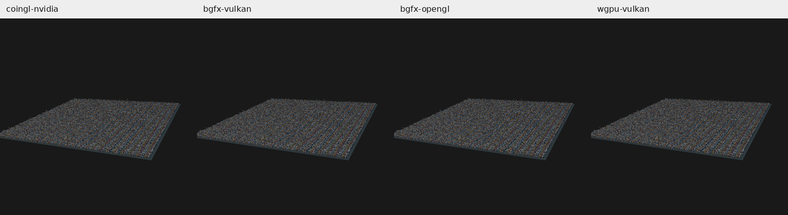
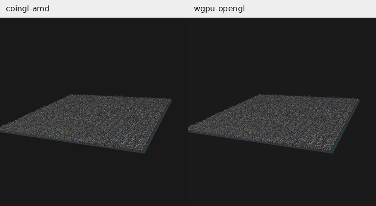

# CoinGL como referência — Linux, 2026-10-04

[Padrão da comparação](coin-render-benchmark-standard.md). Branch `codex/coin-render-transform-performance`.
Revisão medida: `bbc4945fbf`; código de produção: `52e1a9475c`.

## Referência

**CoinGL é o renderer OpenGL clássico do Coin3D**, exercitado por `SoGLRenderAction` e `SoOffscreenRenderer`, com `--backend gl`. BGFX/OpenGL é uma variante distinta.

A referência é o CoinGL desta revisão local. A biblioteca inclui ajustes anteriores de GLX PRIME e do renderer legado, inclusive a busca estrutural de ShadowGroup em separadores; não é um binário upstream intocado. O mecanismo de Cube e de display lists continua sendo o clássico do Coin3D. As variantes e a referência usam a mesma `libCoin.so.80` deste build; os hashes estão nas evidências.

CoinGL/NVIDIA é a referência para BGFX/Vulkan, BGFX/OpenGL e wgpu/Vulkan na NVIDIA. CoinGL/AMD é a referência para wgpu/OpenGL na AMD. Nenhuma razão abaixo cruza GPUs.

## Método

- Build Release/Ninja, GCC 13.3.0, `-O3 -DNDEBUG`.
- Cidade determinística: grid 200, seed 136, 40 mil prédios, 480.012 triângulos. Mesmo arquivo, câmera/enquadramento, luzes, materiais, fundo RGB e resolução 1024 × 1024. A cena define PHONG e duas luzes direcionais.
- Perfil estático, offscreen, readback RGBA síncrono e cópia para o consumidor. Transparência configurada como object; a cidade é opaca.
- Três rodadas de seis processos novos, com ordem intercalada; 30 quadros de aquecimento e 120 medidos por processo. Não houve compilação ou outra medição GPU concorrente.
- NVIDIA RTX 3060 Laptop, driver 610.57.04, para os quatro caminhos NVIDIA. AMD Renoir para os dois caminhos AMD. Sondas separadas `COIN_DEBUG_GLGLUE=1` confirmaram `GL_RENDERER` da referência; medições sem sonda.
- CoinGL/NVIDIA usa pbuffer GLX. CoinGL/AMD usa pixmap GLX direto (`COIN_GLXGLUE_NO_PBUFFERS=1`, `COIN_GLX_PIXMAP_DIRECT_RENDERING=1`), pois o driver informa `GLX_MAX_PBUFFER_PIXELS=0` e o pbuffer limita as dimensões a 1 × 0. A tentativa diagnóstica que falhou não entra nas estatísticas.
- Caches padrão preservados: CoinGL usa display lists conforme a heurística de `renderCaching AUTO`; CoinRender reutiliza o plano estático. Não há exigência de igual número de travessias ou submits. Caches do sistema/driver não foram limpos.

## Tempos

Valores em ms. Primeiro quadro: mediana de três processos novos; render + readback + cópia, excluindo parsing, enquadramento, construção dos targets e capability probe. Aquecido e p95: medianas dos respectivos valores de 120 quadros por processo. “Desde início” é a mediana do tempo desde `main` até a primeira imagem copiada, incluindo preparação anterior.

| Caminho | Primeiro quadro | Aquecido | p95 aquecido | Primeira imagem desde início |
|---|---:|---:|---:|---:|
| **CoinGL NVIDIA — referência** | 357.52 | 11.88 | 13.75 | 736.53 |
| BGFX/Vulkan NVIDIA | 654.02 | 2.24 | 2.45 | 1230.23 |
| BGFX/OpenGL NVIDIA | 618.57 | 2.92 | 3.14 | 1144.75 |
| wgpu/Vulkan NVIDIA | 392.78 | 8.20 | 8.85 | 936.88 |
| **CoinGL AMD — referência** | 298.37 | 19.19 | 20.32 | 677.71 |
| wgpu/OpenGL AMD | 398.15 | 11.16 | 11.75 | 864.03 |

### Relação com CoinGL na mesma GPU

Variação de tempo negativa significa menor tempo. A última coluna é CoinGL/variante, calculada pelas medianas aquecidas; não é uma medição de apresentação em janela.

| Variante | Tempo primeiro vs CoinGL | Tempo aquecido vs CoinGL | Razão de desempenho aquecido |
|---|---:|---:|---:|
| BGFX/Vulkan NVIDIA | +82.93% | -81.19% | 5.32× |
| BGFX/OpenGL NVIDIA | +73.02% | -75.41% | 4.07× |
| wgpu/Vulkan NVIDIA | +9.86% | -31.00% | 1.45× |
| wgpu/OpenGL AMD | +33.44% | -41.83% | 1.72× |

**CoinGL ainda entrega o primeiro quadro mais rápido nas quatro comparações.** Após o aquecimento, as quatro variantes apresentam tempos menores: BGFX/Vulkan 5,32×, BGFX/OpenGL 4,07×, wgpu/Vulkan 1,45× e wgpu/OpenGL 1,72× relativamente ao CoinGL da mesma GPU, neste perfil offscreen estático.

A comparação anterior antes/depois permanece útil para medir o efeito de cada otimização, mas não demonstra vantagem sobre CoinGL. As próximas melhorias de primeiro quadro devem ser avaliadas também contra esta referência.

## Comparação RGB

Os PPM foram comparados na orientação final, em 1024 × 1024. O alpha e o checksum RGBA bruto entre backends não servem como gate de igualdade: CoinGL limpa alpha em zero e transporta linhas bottom-up; os caminhos experimentais publicam fundo com alpha um e linhas top-down. O executável orienta os PPM corretamente.

| Variante vs CoinGL da mesma GPU | MAE RGB (0–255) | Maior erro de canal | Pixels diferentes | Pixels com erro de canal > 3 |
|---|---:|---:|---:|---:|
| BGFX/Vulkan NVIDIA | 0.02261 | 31 | 6.0771% | 0.000095% |
| BGFX/OpenGL NVIDIA | 0.02274 | 88 | 6.0772% | 0.000286% |
| wgpu/Vulkan NVIDIA | 0.02261 | 31 | 6.0771% | 0.000095% |
| wgpu/OpenGL AMD | 0.83789 | 31 | 86.8928% | 0.000191% |

As imagens estão visualmente próximas, mas não são byte a byte iguais. No wgpu/OpenGL, o fundo mede RGB 26/26/26 e no CoinGL/AMD 25/25/25, explicando grande parte dos pixels diferentes e do MAE. Os erros acima de três níveis afetam de um a três pixels por par. Não foi aplicada correção de fundo, alpha ou imagem para reduzir os erros medidos, nem um gate novo de equivalência para a cena PHONG.

Os 18 processos conservaram o checksum estático próprio de cada renderer. As quatro variantes experimentais também conservaram seus checksums conhecidos das medições anteriores. A inclusão de CoinGL não altera os resultados dos 33 testes e quatro controles dinâmicos da última validação; esta campanha não os reexecuta nem faz alteração de produção.

## Limites

A campanha mede esta cidade estática, este host e saída offscreen síncrona. Não qualifica janela, animação, outras cenas/GPUs ou um build pristine do upstream. Diferenças de caches e contexto offscreen fazem parte dos caminhos utilizados e estão registradas. O primeiro quadro em processo novo não representa driver/shader cache vazio.

[Logs, hashes, métricas RGB e scripts](validation/coingl-reference-linux/README.md).
