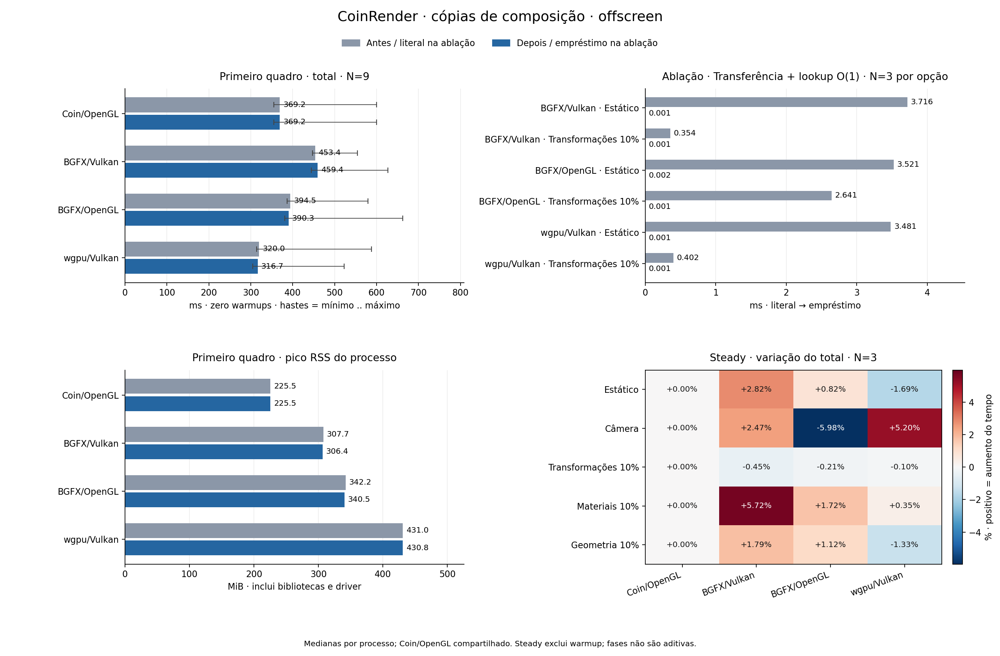

# CoinRender: cópias de composição — Linux, 2026-10-05

Referência de render: Coin3D/Coin/OpenGL clássico (`SoGLRenderAction`).

## Mudança e organização

A ordem opaca já qualificada é emprestada em escopos locais de captura/submission e lowering. Target deixa de copiar a ordem da captura elegível; o lowering usa uma view imutável em vez de copiar a schedule. A prova fica vinculada ao frame, à revisão e às opções de transparência da chamada atual.

O predicado de identidade é acumulado dentro da ordenação/classificação existente. O perfil preserva o modo opaco com sortObject e ordem de traversal; compositing fora do perfil mantém os vetores owned, validação e diagnósticos literais. RTT/shadow/expansão e estados que exigem outra ordem continuam fora do empréstimo.

computed_items descreve a ordem calculada localmente; mover esse vetor no Target não conta como cópia. As views não cruzam a submissão backend/Rust nem tickets assíncronos.

Optout: `COIN_RENDER_DISABLE_COMPOSITION_BORROW=1`.

Cidade de 40.000 objetos, offscreen 1024 × 1024, quatro variantes na mesma GPU NVIDIA. Metadados e snapshots de hardware antes/depois estão preservados; clocks não foram acompanhados em cada amostra.

Mudança de produção: `f6d05aedb83d01204c2ebb20fee78768a587e963`. A fonte atual inclui as correções dos oracles e está vinculada aos binários congelados.

## Primeiro quadro em processo novo

Mediana de estatísticas por processo. Cold tem zero warmups e um quadro medido: total inclui update + render/readback + publication e representa o primeiro apply completo. A inicialização anterior ao apply aparece separadamente no log main → primeira imagem.

| Variante | Total antes → depois (ms) | Δ total (ms) | Variação | Render antes → depois (ms) | N antes/depois |
|---|---:|---:|---:|---:|---:|
| Coin/OpenGL | 369.23 → 369.23 | +0.00 | +0.00% | 368.79 → 368.79 | 9/9 |
| BGFX/Vulkan | 453.38 → 459.40 | +6.02 | +1.33% | 453.03 → 458.42 | 9/9 |
| BGFX/OpenGL | 394.46 → 390.33 | -4.13 | -1.05% | 394.04 → 389.44 | 9/9 |
| wgpu/Vulkan | 319.96 → 316.72 | -3.24 | -1.01% | 317.69 → 314.35 | 9/9 |

| Variante | Intervalo dos totais por processo antes (ms) | Intervalo depois (ms) |
|---|---:|---:|
| Coin/OpenGL | 355.39 .. 599.77 | 355.39 .. 599.77 |
| BGFX/Vulkan | 447.57 .. 554.08 | 444.67 .. 627.15 |
| BGFX/OpenGL | 386.85 .. 580.04 | 381.32 .. 662.84 |
| wgpu/Vulkan | 314.11 .. 588.15 | 305.07 .. 522.60 |

Os intervalos preservam mínimo e máximo por processo, incluindo outliers; não são intervalos de confiança.

| Variante | Main → primeira imagem antes → depois (ms) | Pico RSS antes → depois (MiB) |
|---|---:|---:|
| Coin/OpenGL | 786.67 → 786.67 | 225.50 → 225.50 |
| BGFX/Vulkan | 1093.42 → 1090.89 | 307.68 → 306.38 |
| BGFX/OpenGL | 965.98 → 955.57 | 342.19 → 340.55 |
| wgpu/Vulkan | 930.79 → 928.22 | 431.03 → 430.80 |

Pico RSS é memória residente máxima do processo, não memória GPU. Coin/OpenGL é controle compartilhado: CSV e log antes/depois têm hashes iguais e a execução é contada uma vez.

## Quadros após warmup

Mediana das medianas por processo, usando exclusivamente índices CSV com warmup falso. Δ% positivo significa mais tempo.

| Caso | Coin/OpenGL (ms) | BGFX/Vulkan antes → depois (ms; Δ%) | BGFX/OpenGL antes → depois (ms; Δ%) | wgpu/Vulkan antes → depois (ms; Δ%) |
|---|---:|---:|---:|---:|
| Estático | 12.90 | 2.11 → 2.17; +2.82% | 2.42 → 2.44; +0.82% | 3.04 → 2.99; -1.69% |
| Câmera | 75.18 | 8.32 → 8.52; +2.47% | 9.18 → 8.63; -5.98% | 9.85 → 10.36; +5.20% |
| Transformações 10% | 117.31 | 45.26 → 45.06; -0.45% | 46.46 → 46.36; -0.21% | 43.56 → 43.51; -0.10% |
| Materiais 10% | 119.42 | 52.41 → 55.41; +5.72% | 53.41 → 54.33; +1.72% | 50.14 → 50.32; +0.35% |
| Geometria 10% | 118.83 | 60.67 → 61.76; +1.79% | 61.54 → 62.23; +1.12% | 56.88 → 56.13; -1.33% |

### Aumentos observados

- BGFX/Vulkan · Estático: 2.11 → 2.17 ms; +0.06 ms (+2.82%).
- BGFX/OpenGL · Estático: 2.42 → 2.44 ms; +0.02 ms (+0.82%).
- BGFX/Vulkan · Câmera: 8.32 → 8.52 ms; +0.21 ms (+2.47%).
- wgpu/Vulkan · Câmera: 9.85 → 10.36 ms; +0.51 ms (+5.20%).
- BGFX/Vulkan · Materiais 10%: 52.41 → 55.41 ms; +3.00 ms (+5.72%).
- BGFX/OpenGL · Materiais 10%: 53.41 → 54.33 ms; +0.92 ms (+1.72%).
- wgpu/Vulkan · Materiais 10%: 50.14 → 50.32 ms; +0.17 ms (+0.35%).
- BGFX/Vulkan · Geometria 10%: 60.67 → 61.76 ms; +1.08 ms (+1.79%).
- BGFX/OpenGL · Geometria 10%: 61.54 → 62.23 ms; +0.69 ms (+1.12%).

As diferenças descrevem esta amostra; a ablação abaixo isola a opção no mesmo binário e não atribui automaticamente toda variação do quadro à mudança.

## Ablação no mesmo binário

36 processos, 36 quadros medidos e 90 warmups. N=3 processos por opção/API/caso; a agregação usa medianas por processo.

### timing

| Variante | Caso | Total (ms) | Transferência + lookup O(1) (ms) | Target: cópia/ativação (ms) | Lowering: schedule literal (ms) | N literal/empréstimo |
|---|---|---|---|---|---|---|
| BGFX/Vulkan | Estático | 450.926 → 447.651 | 3.716 → 0.001 | 0.625 → 0.000 | 2.822 → 0.000 | 3/3 |
| BGFX/Vulkan | Transformações 10% | 45.948 → 44.307 | 0.354 → 0.001 | 0.000 → 0.000 | 0.353 → 0.000 | 3/3 |
| BGFX/OpenGL | Estático | 387.234 → 409.240 | 3.521 → 0.002 | 0.742 → 0.000 | 2.783 → 0.000 | 3/3 |
| BGFX/OpenGL | Transformações 10% | 52.335 → 45.327 | 2.641 → 0.001 | 0.000 → 0.000 | 2.640 → 0.000 | 3/3 |
| wgpu/Vulkan | Estático | 319.710 → 319.335 | 3.481 → 0.001 | 0.798 → 0.000 | 2.682 → 0.000 | 3/3 |
| wgpu/Vulkan | Transformações 10% | 45.526 → 45.800 | 0.402 → 0.001 | 0.000 → 0.000 | 0.401 → 0.000 | 3/3 |

### lookup

| Variante | Caso | Target: lookup (ms) | Lowering: lookup (ms) | N literal/empréstimo |
|---|---|---|---|---|
| BGFX/Vulkan | Estático | 0.000491 → 0.000672 | 0.000461 → 0.000641 | 3/3 |
| BGFX/Vulkan | Transformações 10% | 0.000160 → 0.000160 | 0.000341 → 0.000430 | 3/3 |
| BGFX/OpenGL | Estático | 0.000561 → 0.001503 | 0.000491 → 0.000641 | 3/3 |
| BGFX/OpenGL | Transformações 10% | 0.000141 → 0.000140 | 0.000281 → 0.000440 | 3/3 |
| wgpu/Vulkan | Estático | 0.000421 → 0.000751 | 0.000250 → 0.000251 | 3/3 |
| wgpu/Vulkan | Transformações 10% | 0.000140 → 0.000160 | 0.000210 → 0.000301 | 3/3 |

### Target

| Variante | Caso | Target: copied_items (itens) | Target: copied_bytes (bytes lógicos) | Target: borrowed_items (itens) | Target: borrowed_bytes (bytes lógicos) | Target: computed_items (itens) | N literal/empréstimo |
|---|---|---|---|---|---|---|---|
| BGFX/Vulkan | Estático | 40.001 → 0 | 2.240.056 → 0 | 0 → 40.001 | 0 → 2.240.056 | 0 → 0 | 3/3 |
| BGFX/Vulkan | Transformações 10% | 0 → 0 | 0 → 0 | 0 → 0 | 0 → 0 | 40.001 → 40.001 | 3/3 |
| BGFX/OpenGL | Estático | 40.001 → 0 | 2.240.056 → 0 | 0 → 40.001 | 0 → 2.240.056 | 0 → 0 | 3/3 |
| BGFX/OpenGL | Transformações 10% | 0 → 0 | 0 → 0 | 0 → 0 | 0 → 0 | 40.001 → 40.001 | 3/3 |
| wgpu/Vulkan | Estático | 40.001 → 0 | 2.240.056 → 0 | 0 → 40.001 | 0 → 2.240.056 | 0 → 0 | 3/3 |
| wgpu/Vulkan | Transformações 10% | 0 → 0 | 0 → 0 | 0 → 0 | 0 → 0 | 40.001 → 40.001 | 3/3 |

### Lowering

| Variante | Caso | Lowering: copied_items (itens) | Lowering: copied_bytes (bytes lógicos) | Lowering: borrowed_items (itens) | Lowering: borrowed_bytes (bytes lógicos) | Lowering: computed_items (itens) | N literal/empréstimo |
|---|---|---|---|---|---|---|---|
| BGFX/Vulkan | Estático | 40.001 → 0 | 2.240.056 → 0 | 0 → 40.001 | 0 → 2.240.056 | 0 → 0 | 3/3 |
| BGFX/Vulkan | Transformações 10% | 40.001 → 0 | 2.240.056 → 0 | 0 → 40.001 | 0 → 2.240.056 | 0 → 0 | 3/3 |
| BGFX/OpenGL | Estático | 40.001 → 0 | 2.240.056 → 0 | 0 → 40.001 | 0 → 2.240.056 | 0 → 0 | 3/3 |
| BGFX/OpenGL | Transformações 10% | 40.001 → 0 | 2.240.056 → 0 | 0 → 40.001 | 0 → 2.240.056 | 0 → 0 | 3/3 |
| wgpu/Vulkan | Estático | 40.001 → 0 | 2.240.056 → 0 | 0 → 40.001 | 0 → 2.240.056 | 0 → 0 | 3/3 |
| wgpu/Vulkan | Transformações 10% | 40.001 → 0 | 2.240.056 → 0 | 0 → 40.001 | 0 → 2.240.056 | 0 → 0 | 3/3 |

### Classificação existente: composition_identity

Medianas por processo da quantidade de eventos e da soma de qualify_ms de **todos os eventos, incluindo warmups**. Uma chamada de ordenação é um evento; estes valores não são medianas de quadros medidos nem overhead puro da mudança.

| Variante | Caso | Eventos literal → empréstimo por processo | Soma qualify_ms literal → empréstimo (ms) |
|---|---|---:|---:|
| BGFX/Vulkan | Estático | 1 → 1 | 0.000 → 7.400 |
| BGFX/Vulkan | Transformações 10% | 6 → 6 | 0.000 → 43.599 |
| BGFX/OpenGL | Estático | 1 → 1 | 0.000 → 7.584 |
| BGFX/OpenGL | Transformações 10% | 6 → 6 | 0.000 → 46.129 |
| wgpu/Vulkan | Estático | 1 → 1 | 0.000 → 7.320 |
| wgpu/Vulkan | Transformações 10% | 6 → 6 | 0.000 → 45.223 |

### Aumentos totais na ablação

- BGFX/OpenGL · Estático: 387.23 → 409.24 ms; +22.01 ms (+5.68%).
- wgpu/Vulkan · Transformações 10%: 45.53 → 45.80 ms; +0.27 ms (+0.60%).

A métrica primária mede transferência/ativação e lookup O(1), excluindo o predicado adicional acumulado na classificação. A comparação de total_ms on/off inclui o classificador e é o resultado conjunto. Redução da métrica primária não é ganho líquido após todo overhead.

copy_ms do lowering mede a realização literal completa da schedule, incluindo seus passos e verificações; não representa memcpy puro.

Na captura fria, o caminho literal copia a ordem no Target e no lowering; a opção ativa empresta a mesma ordem admitida a ambos. Em RESOURCE_REBUILD, Target calcula a ordem e move o vetor; somente o lowering faz a cópia literal. computed_items não representa uma cópia.

copied_bytes e borrowed_bytes representam itens × sizeof(CoinRenderCompositionItem), como transporte lógico. Não medem capacidade dos vetores, tráfego do alocador, RSS ou memória GPU.

copy_ms do Target inclui copiar ou ativar/mover a ordem; copy_ms do lowering engloba a chamada literal de preparação de schedule. qualify_ms desses dois scopes mede lookup. composition_identity.qualify_ms é a classificação/sort existente inteiro quando a prova é solicitada, não overhead puro da otimização.

A prova de uma observação Target e uma schedule por linha vale apenas para static/transforms-10 elegíveis nesta cidade. Tentativas extras são retidas e tornam a ablação incomparável. Em REUSE/CAMERA_PATCH, não se presume identity ou schedule por quadro.

A métrica primária soma, por linha CSV antes de selecionar os quadros medidos, copy_ms e qualify_ms dos scopes Target e schedule. São os quatro intervalos separados de transferência/ativação/lookup instrumentados; composition_identity.qualify_ms fica excluído. Ela não é a soma de medianas nem inclui a classificação inteira.

A redução de transferência/lookup exclui o predicado adicional acumulado no classificador; não representa ganho líquido após todo overhead. total_ms on/off inclui o classificador e mostra o resultado conjunto. copy_ms do lowering é a realização literal completa da schedule, não tempo de memcpy puro.

diagnostic-observation.json preserva a observação do contrato admitido. inclusive-description.json e inclusive-analysis.py preservam, separadamente, o subtotal descritivo de classify+sort+finish mais transferência/lookup, somado por linha medida. Esse subtotal inclui a classificação existente, não mede overhead incremental isolado e não substitui o primário transfer+lookup nem total_ms.

composition_schedule_copy.copy_ms inclui a realização literal completa do schedule, não apenas memcpy. A variação líquida conjunta é lida de total_ms; a classificação e o subtotal inclusivo permanecem evidência descritiva.

Séries brutas, eventos, valores por quadro e correspondência de cardinalidade com CSV estão preservados. Só séries com uma observação por linha CSV fornecem estatísticas de quadros medidos. Tempos de fases podem se sobrepor e não devem ser somados.

## Protocolo, fontes e gates

Código atual CoinRender: `9a594fa39c7ca7924f9931863d4bdd7a37165cee`. Coin/OpenGL: `4d63bb993022ee8d40802558b0871a4803002b8d`.

Fontes dos binários congelados por variante:

- Antes BGFX/Vulkan: `24bc92d8d60d3a1ce782e7787d2060a6b08261fb`.
- Antes BGFX/OpenGL: `24bc92d8d60d3a1ce782e7787d2060a6b08261fb`.
- Antes wgpu/Vulkan: `24bc92d8d60d3a1ce782e7787d2060a6b08261fb`.

Cena SHA-256: `bb9ccc612cd38ffb749ee599d9350a80974649eab5bf477d2f344538a42b2576`.

- **Cold:** 9 rodadas, 0 warmups e 1 quadros medidos por processo; 63 processos únicos, 63 medidos e 0 warmups. Casos: `static`.
- **Steady:** 3 rodadas, 5 warmups e 15 quadros medidos por processo; 105 processos únicos, 1.575 medidos e 525 warmups. Casos: `transforms-10,materials-10,geometry-10,static,camera`.
- As três variantes CoinRender têm antes/depois próprios; Coin/OpenGL é compartilhado por caso/rodada mediante igualdade de hashes e metadados.
- Percentis usam nearest rank por processo; entre processos usa-se mediana, inclusive média dos dois centrais quando N é par. Amostras curtas não caracterizam caudas de latência.

Gates registrados: **29 execuções** — Core puro: 7, Action/Reuse misto: 4, GPU: 18. Resultados vêm dos metadados preservados, sem inferência a partir dos tempos.

Verificação RGB: **196 comparações**, 392 PPMs antes/depois; todas idênticas por bytes. Cada par compara a mesma variante/caso/quadro entre revisões, sem afirmar igualdade entre backends.

Processos de verificação antes + depois: 56.

### Gates e revisão

- Core puro: 7 execuções finais aprovadas sem skips.
- Action/Reuse misto: 4 execuções finais aprovadas sem skips.
- GPU: 18 execuções finais aprovadas sem skips.
- As duas primeiras tentativas tiveram quatro execuções cada: três passaram e o novo fixture Action falhou. A primeira não admitia overlays por usar Material fora do escopo isolado do objeto. A segunda esperava sucesso no retry sem recuperar o Target: BACKEND_ERROR deixa TARGET_ERROR e bloqueia apply até resize. O oracle agora cobre bloqueio, recuperação pública e sucesso. As expectativas/estrutura do teste foram corrigidas, sem mudança adicional de produção. Comandos, fontes e resultados de cada tentativa permanecem separados dos 29 gates finais.
- 7 builds com exit_code=0 são preservados em build-commands.json e builds/: WG inicial na produção f6, WG incremental e BG na fonte 562, seguidos dos builds dos oracles corrigidos. O fixture BG foi ajustado para PHONG antes das execuções de teste.
- Revisão independente: profile/admission antes da ativação do recibo, restauração por RAII, wrapper local não copiável/não movível, bytes dos itens preservados e ausência de referência em tickets/caches/Rust. Os caminhos gerais de composição e anexação de sombras permanecem owned.
- Oracles com optout comparam composição, payloads, status e diagnóstico; os testes dos consumidores exigem instanciação efetiva e igualdade dos arrays/header. O fixture Action cobre captura real, overlays admitidos, REUSE, falha, rollback e retry.

## Limites da evidência

A campanha é offscreen: total inclui espera GPU e readback, sem medir duração GPU isolada, latência de exibição ou fluidez em janela.

- Cold N=9 e ablação N=3 por opção descrevem as amostras preservadas, sem estabelecer variância populacional ou ganho universal.
- A alternância e o controle compartilhado reduzem dependência da ordem; não comprovam igualdade de clocks, temperatura ou estado do driver.
- Aumentos de tempo permanecem registrados. A prova de contadores mostra o trabalho de cópia executado/evitado; não é medição de ganho GPU.
- O resumo descritivo de composition_identity agrega eventos da chamada de ordenação, incluindo warmups; o timer marca o passe original inteiro quando solicitado. Não mede overhead novo separado nem duração GPU.
- Execuções diretas dos gates usam a definição CTest registrada e override CLI exato. Composition --borrow/--gpu exigem markers; range memo e Depth --gpu não imprimem marker próprio em sua versão atual, e são validados por modo/SHA/exit/ausência de skip.
- A optout privada é conjunta para Target e schedule. A ablação não produz intervenções independentes das duas cópias; seus counters/intervalos descrevem partes instrumentadas do mesmo experimento.
- SCREEN_DOOR, incluindo nível zero, permanece fora do perfil de empréstimo. Esta campanha usa SORTED_OBJECT_BLEND com materiais opacos e preserva os campos e a ordem da composição opaca, incluindo sortObject.
- Os PPMs e os binários não integram o Git. A validação relocável confere métricas/hashes e logs de captura; só reabre pixels se os arquivos originais ainda estiverem disponíveis.
- Cold conserva todos os outliers. Processos novos na mesma sessão não reinicializam o driver/computador. Amostras curtas não estabelecem latência de cauda; regressões steady permanecem no relatório.
- Probe suplementar BGFX/Vulkan materials-10 na mesma build, três pares on/off: seis processos, 90 quadros medidos e 30 warmups, separados de matched168 e ablação36. Total off→on 52.641419→52.709456 ms (+0.068037 ms; +0.129%). Transferência/lookup 0.367967→0.000712 ms. O aumento de +2,997 ms (+5,72%) observado na comparação principal não se repetiu com essa magnitude no probe; a variação positiva do probe permanece registrada. Ele não substitui a campanha principal nem estabelece causalidade. hardware-after-main.json preserva o snapshot anterior ao probe; hardware-after.json e os 20 hashes pós-campanha foram atualizados após ele.

[Evidência e reprodução](validation/composition-copy-linux/README.md).

Entradas, configuração e SHA-256 do gerador estão em `report-inputs.json`. Valores de desempenho são lidos da evidência.
