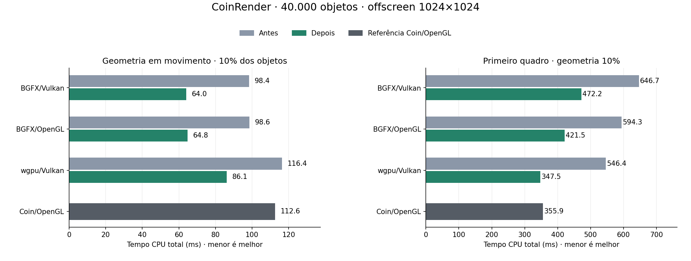

# CoinRender: cache de Cubes e qualificação CPU

Continuação de [materiais e geometria](coin-render-material-geometry-linux.md), usando Coin3D/Coin/OpenGL (`SoGLRenderAction`) como referência.

## Alterações no Common

O cache anterior retinha uma única geometria de Cube. Um Cube de dimensões diferentes descartava o template e seus intervalos por material. Numa sequência de objetos compartilhados intercalados com clones modificados, o mesmo Cube estável ganhava milhares de cópias no plano CPU.

O novo cache retém até **32 templates** com dimensões comparadas pelos bits dos floats e normal binding, e até **64 intervalos totais por template, identificados pelo material**. Os menos usados são substituídos; a substituição descarta somente metadados, preservando os vértices e índices já capturados. Payload e metadados lógicos do cache ficam abaixo de **256 KiB**, com `static_assert`. O total de geometria do plano não está limitado a esse tamanho.

A admissão continua limitada ao gerador nativo exato de `SoCube`, preenchimento e material OVERALL. Estado, material, câmera, transformações e centro de ordenação são capturados em cada ocorrência. Texturas habilitadas, funções de coordenadas, subclasses e callbacks adicionais seguem a captura correspondente. O Core recebe valores; não identifica nós, nomes de cena ou benchmark.

O compartilhamento permanece por valores. Cubes independentes inicialmente iguais podem compartilhar o mesmo intervalo: a prova de ownership recusa sua edição direta e exige recaptura. Quando os valores divergem, uma nova captura pode admitir fontes separadas. Isso conserva o comportamento de cenas estáticas com muitos objetos iguais sem ampliar desnecessariamente o plano.

A qualificação do object overlay agora memoriza verificações repetidas **apenas durante a qualificação atual**:

- Snapshot e igualdade do material por slot cuja fonte proprietária foi provada.
- Uniformidade dos materiais por intervalo de índices completo e slot esperado, preservando conflitos de todos os slots encontrados.
- Dimensões por fonte Cube; vértices por intervalo completo e fonte Cube.

As verificações de ownership, referências sintáticas, ocorrência, alias e rejeição da fonte inteira continuam em cada ocorrência. São três caches de até 1.024 entradas e um byte por material (até 65.536): estimativa lógica temporária até **448 KiB**. Saturação e falha de alocação opcional retornam às verificações originais. Nenhum resultado sobre valores mutáveis sobrevive à qualificação.

`COIN_RENDER_DISABLE_CUBE_TEMPLATE_CACHE=1` seleciona o cache legado de um template/32 intervalos. `COIN_RENDER_DISABLE_OBJECT_PROOF_MEMOIZATION=1` repete as verificações originais. O runner limpa ambos antes das campanhas normais.

## Perfil e resultados

### Geometria em movimento: 10% dos objetos

| Render | Antes → depois (ms) | Variação |
|---|---:|---:|
| BGFX/Vulkan | 98.42 → 63.97 | -35.00% |
| BGFX/OpenGL | 98.60 → 64.78 | -34.30% |
| wgpu/Vulkan | 116.39 → 86.11 | -26.01% |
| Coin/OpenGL | 112.62 → 112.62 | +0.00% |

O plano de origem caiu de **864.048 para 96.216 vértices**, de **36.002 para 4.009 intervalos**, e de **86,40 para 9,62 MB decimais de vértices** (−88,86%). O transporte GPU permanece em **24 vértices, 36 índices e 40.001 instâncias**. Não há redução do conteúdo renderizado.

Mesmo com quatro mil dimensões distintas, o Cube estável reaparece entre clones e permanece no LRU. O trace final mostra 32 templates, 39 ranges retidos e 3.970 evictions de templates. Os 4.009 ranges do plano capturado continuam válidos, independentemente da retenção no cache.

### Primeiro quadro e memória de processo: geometria 10%

| Render | Primeiro total antes → depois (ms) | RSS antes → depois (MiB) |
|---|---:|---:|
| BGFX/Vulkan | 646.71 → 472.20 | 418.4 → 345.9 |
| BGFX/OpenGL | 594.33 → 421.48 | 459.5 → 373.0 |
| wgpu/Vulkan | 546.38 → 347.51 | 546.1 → 449.0 |
| Coin/OpenGL | 355.85 → 355.85 | 305.2 → 305.2 |

O primeiro total é a primeira linha CSV, incluindo warmup, atualização, render e publicação. RSS é pico do processo, sem medir memória GPU. O primeiro total do wgpu aproxima-se do Coin/OpenGL neste caso; BGFX ainda fica acima.

### Controles de preservação

| Caso | BGFX/Vulkan (ms) | BGFX/OpenGL (ms) | wgpu/Vulkan (ms) | Coin/OpenGL (ms) |
|---|---:|---:|---:|---:|
| materials-10 | 55.22 → 56.58 | 56.59 → 58.01 | 79.68 → 78.72 | 112.80 |
| transforms-10 | 49.60 → 50.05 | 50.55 → 51.08 | 71.19 → 72.41 | 111.51 |
| static | 2.01 → 2.04 | 2.40 → 2.34 | 2.76 → 2.53 | 12.47 |
| camera | 8.08 → 8.20 | 8.42 → 8.21 | 8.63 → 8.79 | 72.84 |

Materiais e transformação apresentaram aumentos de até **1,42 ms** e **1,22 ms**, respectivamente. A cena estática e câmera variaram entre −0,23 e +0,16 ms. O primeiro quadro estático BGFX/Vulkan aumentou de **424,78 para 447,93 ms** (+23,15 ms); o BGFX/OpenGL variou +0,98 ms, e wgpu reduziu 10,24 ms. O ganho de geometria parcial não representa melhora uniforme em todos os casos. A ablação demonstra redução local da qualificação, mas não atribui sozinha cada variação do primeiro total.

### Todos os objetos alterando geometria

| Render | Antes → depois (ms) | Variação |
|---|---:|---:|
| BGFX/Vulkan | 217.90 → 224.56 | +3.05% |
| BGFX/OpenGL | 221.31 → 223.15 | +0.83% |
| wgpu/Vulkan | 234.26 → 236.30 | +0.87% |
| Coin/OpenGL | 233.05 → 233.05 | +0.00% |

Com 100% de geometria distinta não há Cube estável repetido a preservar. Observamos **+6,65 ms em BGFX/Vulkan**, **+1,84 ms em BGFX/OpenGL** e **+2,04 ms em wgpu/Vulkan**. Essa amostra curta serve para detectar a ausência de ganho e possíveis regressões, sem caracterizar caudas p99. O custo do cache é de captura/qualificação; os resultados não isolam a causa dessas variações em regime.

### Ablação e custo que permanece

Oito execuções instrumentadas wgpu/Vulkan alternaram cache de templates e memoização. São diagnósticos isolados, não medianas de campanhas:

- geometry-10, ambos ligados: validação target **24,92 ms**, contra **31,50 ms** com ambos desligados; medianas das sete amostras após o primeiro quadro (quatro warmups e três medidos). Considerando somente os três medidos, são **24,91 e 31,10 ms**. São 4.009 contra 36.002 ranges. A reutilização continua resource_rebuild; o ganho não é mera transferência de tempo para uma recaptura.
- Payload da qualificação geometry-10: **13,65 ms** com ambos ligados, **19,26 ms** sem memoização e **23,83 ms** com ambos desligados.
- Estático: payload da qualificação **11,25 ms** com memoização contra **17,59 ms** sem ela. Os checks de material passam de uma verificação por ocorrência para oito snapshots, mantendo todos os checks de ownership.

A qualificação aparece agora como object_qualification (scene_profile/frame_profile/ownership/payload). Ela ocorria depois da linha action e não fazia parte da soma antiga traversal/frame_plan/backend. Ainda ficam cerca de **65,6 MB de snapshots de render state** e ~25 ms de validação target no diagnóstico; reduzir geometria não elimina esse custo.

## Protocolo

Código final: 9737b2e1e60eba6b44988d684c2838271d99dc05; controle CoinRender congelado: ff289a50b971fbc012e791194acf0a5ec24cfb3b; controle Coin/OpenGL: 4d63bb993022ee8d40802558b0871a4803002b8d. Bibliotecas e executáveis foram identificados por SHA-256. A master e o checkout principal foram preservados; trabalho na branch codex/coin-render-transform-performance.

Cena coin-render-city-40000.iv, SHA-256 bb9ccc612cd38ffb749ee599d9350a80974649eab5bf477d2f344538a42b2576: 40.000 objetos, 480.012 triângulos, PHONG, duas luzes direcionais, 1024×1024. Ryzen 5800H e NVIDIA RTX 3060 Laptop; GCC 13.3, Release/Ninja, governor powersave. ABI privado C++/Rust permanece 43; Rust, shaders e backends não receberam alterações nesta etapa.

Campanha principal: cinco casos, três rodadas, cinco warmups e 15 quadros medidos por processo. Stress geometry100: três rodadas, três warmups e sete quadros medidos. Ordem alternada entre antes/depois e variantes; uma execução Coin/OpenGL por caso/rodada é compartilhada nos dois conjuntos (CSV/log idênticos). Seu 0% na tabela não é uma segunda medição. Total: **126 processos válidos, 1.722 quadros medidos e 588 de warmup**. Valores são medianas de três medianas por processo; CPU wall total = update + render + publication, sem medir duração GPU ou latência de exibição.

A campanha em janela foi interrompida e excluída: DPMS registrou **Monitor Off** e Cinnamon ScreenSaver GetActive=true. Múltiplas variantes apresentaram outliers de apresentação próximos de 1.000 ms. Os dados incompletos e o diagnóstico foram preservados em window-excluded/; não são utilizados como comparação de desempenho. A sessão não foi desbloqueada nem teve seus ajustes alterados. wgpu/OpenGL fica fora desta campanha pela limitação de criação do device documentada no relatório anterior.

## Validação

- **Nove gates CPU** passaram: Action, PlanAssemblyCore, FrameReuseCore, TransformCore, WgpuFfiFrame, BgfxCore, DepthContract, DrawStyle e ClipPlane.
- **Dez gates GPU** passaram: três wgpu/Vulkan (referência de câmera obrigatória, multi-device e RTT), surface camera com display obrigatório, e seis BGFX/Vulkan/OpenGL (instancing, profundidade e RTT).
- Oráculo por callbacks completos compara payload expandido, normais/UVs/material/estado/índices. Testes cobrem LRU, limites, signed zero, binding, reset, optout, invalidação, copy/append/transfer/swap, índices combinados e ownership A/B/C intercalado.
- Cubes distintos inicialmente iguais: alias é recusado para edição direta; mudança só de C recaptura, preserva A, readmite C e permite atualização posterior com rollback/retry.
- **168 comparações RGB foram idênticas por bytes**, nos seis casos × quatro variantes × sete quadros lógicos (0..600, passo100), com digests de estado iguais e movimento confirmado. Incluem 42 comparações Coin/OpenGL entre suas duas execuções de verificação. Essas imagens demonstram preservação antes/depois de cada variante; os testes GPU específicos mantêm o oráculo de profundidade/PHONG.

[Pacote de evidência](validation/cube-template-linux/) conserva CSVs, logs, comandos, protocolo, controles de binários, digests/SHAs das imagens, métricas, diagnóstico, gates e scripts de reprodução. PPMs permanecem em /tmp, sem cópia para Git. Os resumos recalculam estatísticas dos CSVs; a validação posterior pode reutilizar as métricas RGB arquivadas sem alegar nova comparação de pixels.

## Próximos custos identificados

A inspeção de código encontrou candidatos no wgpu ainda sem atribuição isolada de tempo:

1. `CoinWgpuFfiFrame::tryOpaqueInstancing` monta `CoinWgpuRenderState` inteiro para cada estado, recalcula projeção/MVP e depois substitui as matrizes para comparar o estado comum. A struct tem 2.280 bytes; 40.001 structs somam 91,2 MB lógicos por passagem, sem implicar medição de tráfego de memória. Um caminho específico pode validar todos os campos comuns, inclusive campos desabilitados, uma vez e calcular somente model-view/normal authored por estado.
2. `rememberOpaqueCamera` refaz model-view, inversa e prova residual depois da admissão de instâncias que acabou de calcular e provar essas matrizes. Uma prova pertencente ao mesmo `prepare` pode alimentar a câmera, sendo publicada somente após sucesso.
3. A matriz de posição com escala diagonal é montada para a prova de bounds e novamente para o payload final. Scratch limitado pode evitar a repetição sem publicar saída parcial.
4. A normalização e igualdade da geometria executam vários passes. Uma comparação direta dos pontos reconstruídos contra o primeiro mesh canônico pode reduzir passes, preservando signed zero, normais, UVs, índices, materiais e fallback exato.

No BGFX, o novo trabalho por ocorrência inclui cópia da model-view, 12 produtos de escala e uma segunda verificação de magnitude. O corpo de normalização por range toca poucos vértices no caso de transformação (~9 ranges); atribuir os ~2 ms anteriores a ele seria prematuro. A seção por instância precisa de uma subfase ou ablação antes de mudar a implementação.

Esses candidatos precisam manter validação de estados não referenciados, erros tardios, luzes, reflexão, matriz singular, RTT, falha/retry, alterações com a mesma revision e oráculos RGB/depth PHONG. Nenhum backend foi alterado nesta etapa.
