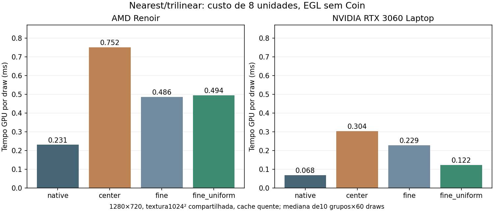

# Sampling portátil pelo mip fino ativo — 2026-10-08

**O candidato `fine_uniform` corrige os controles nearest CPU–GPU desta máquina
com menor custo que dois centros. Sampling nativo continua sendo o padrão
recomendado.** A centralização ocorre no mip `floor(LOD)`, preservando a margem
entre texels nos dois níveis participantes. Uniformizar dimensões do mip base
sem mudar o centro (`base_uniform`) continua incorreto na AMD.

Implementação isolada em `codex/coin-portable-sampling-study`, sobre o estudo
anterior. Coin original fica intacto; `codex/coin-render` recebe apenas relatório,
checklist e evidências. Não há promoção do seletor experimental à API pública.

## Implementação e alcance

- `fine`: deriva LOD das UV originais, consulta dimensões e centraliza no mip fino
  ativo. POT usa uma chamada ao sampler com LOD fracionário e mistura no hardware.
- `fine_uniform`: mesma seleção; deriva cada tamanho com `max(1, base >> mip)`.
  wgpu usa o tamanho real da textura/view ligada, incluindo o recurso RTT;
  BGFX captura dimensões no lowering e sobrescreve com o recurso direto ligado.
- NPOT: duas amostras, centros independentes e mistura explícita que preserva
  canais constantes. Não se estende a hipótese de correspondência POT a NPOT.
- Somente `NEAREST_MIPMAP_LINEAR` isotrópico. Magnificação permanece linear nas UV
  originais; outros filtros e anisotropia acima de 1 permanecem nativos.
- WGSL e GLSL compartilham esta regra; flags temporários em `tex_params.x` são
  laboratório. Há 128 bytes extras no bloco GPU privado e uniforme BGFX por draw.
  O ABI C transportado não muda; não se alteram publicação, matrizes ou codecs.

A centralização do mip ativo deixa margem mínima de 0,25 texel no próximo mip
POT, em vez de 0,5/2^L texel ao centralizar no mip base. Isso explica o resultado
nesta máquina; não promete identidade universal de rasterização/LOD.

## Qualidade integrada

AMD Renoir Mesa 25.2.8 e NVIDIA RTX 3060 Laptop, driver 610.57.04: wgpu Vulkan em ambas,
wgpu OpenGL/AMD, BGFX Vulkan em ambas e BGFX/OpenGL. BGFX/OpenGL informa
vendor/device0: passe funcional sem certificação de GPU física.

O controle profundo tem 162 casos por processo: POT 128/512/4096 quadrados,
4096×128, NPOT 511×257, RGBA8 linear/SRGB, RGBA16F e BC3 linear/SRGB; magnificação,
LOD inteiro/fracionário, repeat/clamp, unidades 0,7 e 0+7. A textura de duas bandas
40/160 (BC3 usa endpoints RGB565 0x2800/0xa000) e o pixel imediatamente antes da
fronteira têm expectativa independente.
O CPU também é comparado com o GPU em todo o interior, RGBA, mantendo
MAE≤1,5/max≤4. Nenhum gate anterior é relaxado.

O controle RTT explícito tem 48 casos por processo: produtor GPU de duas bandas,
recursos diretos RGBA8/RGBA16F, dimensões512×128,1024×64,128×256 e retorno512×128;
unidades0/7, magnificação e minificação inteira/fracionária. Seu consumidor
privado solicita filter2; **SoSceneTexture2 público solicita linear/trilinear
(filter1/3), portanto não ativa fine**. Os controles públicos RTT são separados.

| Coorte | Processos | PASS | FAIL |
|---|---:|---:|---:|
| Mip profundo/formatos | 24 | 20 | 4 |
| RTT direto filter2 | 24 | 20 | 4 |
| Viewport deslocado | 24 | 24 | 0 |
| Gates anteriores | 120 | 80 | 40 |
| Multitextura/FragmentPolicy | 36 | 12 | 24 |
| Bindings/dispositivos/instancing | 12 | 12 | 0 |

Os FAIL profundos e RTT são os quatro controles native/AMD. Todos os candidatos
passaram as seis configurações:972 imagens profundas,288 RTT e216 com viewport
por variante, com zero divergências acima do gate. Native tem 396+128 divergências
nos dois primeiros grupos. O viewport24×18 na origem(4,5) passa também em native.

Nearest projetivo, offsets±0,001: todas as comparações CPU–GPU dos três
candidatos ficam em max1; native chega aMAE8,08/max78 na AMD. O controle
profundo fica em MAE máximo0,75/max1; RTT direto em 0,25/max1. SRGB/HDR/compressão
não são convertidos para bytes lineares apenas para fazer o teste passar.

Os 45 testes Rust passaram. AdvancedTexture e RTT público passaram em todas as
combinações executadas, incluindo alpha128/255 com EQUAL, unidades0/7, quatro
filtros, matriz projetiva, admissão de formatos e recuperação. LargeBindings,
MultiDevice e stress passaram nos três perfis wgpu; instancing passou nos três
perfis BGFX:12 processos, sem SKIP.

A matriz anterior continua com os mesmos FAIL: sampling/CoinGL AMD; linha
CPU/CoinGL273/253 antes da cobertura multitextura GPU; esfera/defaultUV OpenGL
max4 contra limite3; alpha/clamp1 CoinGL AMD. Os testes completos que param
nesses controles continuam FAIL. O shader portátil não corrige CoinGL nem o
sampler nativo do driver.

## Custo GPU e janela

GPU isolado EGL, sem Coin: RGBA8,1280×720, checker1024²,1/4/8 unidades,
30 warmups,5×60 draws/grupo, duas execuções intercaladas por combinação.
GL_TIME_ELAPSED, sem readback na medição, imagem compartilhada/cache quente.
96 processos passaram. Tabela para oito unidades nearest, mediana em ms:

| Perfil | native | center | fine | fine_uniform |
|---|---:|---:|---:|---:|
| AMD / EGL | 0.231 | 0.752 | 0.486 | 0.494 |
| NVIDIA / EGL | 0.068 | 0.304 | 0.229 | 0.122 |

Redução frente a center: fine≈35% AMD/25% NVIDIA; fine_uniform≈34% AMD/60% NVIDIA.
Custo frente a native: fine_uniform≈2,14× AMD/1,80× NVIDIA.

Uma amostra reduz o custo frente a dois centros. Na NVIDIA, o uniforme também
reduz o custo frente à consulta de dimensões; na AMD essa diferença é pequena.
Ainda há custo de derivadas, log2, endereçamento e centralização: nenhum
candidato supera o sampler nativo neste workload. Não se afirma número de
instruções GPU a partir da contagem de chamadas no fonte.

Janela wgpu/BGFX Vulkan,1280×720,45 warmups e150 quadros medidos, ordem direta
e inversa; baseline da produção atual, native do estudo e os três candidatos.
Cenas POT128² e NPOT129×127,1/8 unidades. Mede a chamada CPU de render/present,
não tempo GPU nem latência da tela. CSV exclui warmups. O relatório registra
adaptador real e o estado DPMS antes/depois de cada processo.

| Perfil | baseline | native | center | fine | fine_uniform |
|---|---:|---:|---:|---:|---:|
| AMD / wgpu | 0.410 | 0.486 | 1.324 | 1.066 | 0.989 |
| AMD / BGFX | 0.407 | 0.459 | 1.532 | 1.261 | 1.188 |
| NVIDIA / wgpu | 0.581 | 0.587 | 0.583 | 0.588 | 0.585 |
| NVIDIA / BGFX | 0.586 | 0.592 | 0.593 | 0.591 | 0.584 |

160 processos, sem falha e com DPMS On antes/depois. Em POT/AMD, fine_uniform
reduz≈25% em wgpu e≈22% em BGFX frente a center. Native do laboratório custa
≈18,5%/12,8% mais que baseline em wgpu/BGFX nesta cena: não promover assim.

NPOT, oito unidades (ms):
| Perfil | baseline | native | center | fine | fine_uniform |
|---|---:|---:|---:|---:|---:|
| AMD / wgpu | 0.432 | 0.464 | 1.334 | 1.345 | 1.229 |
| AMD / BGFX | 0.406 | 0.507 | 1.580 | 1.540 | 1.469 |

Na NVIDIA, esta janela fica dominada por CPU/apresentação, e não revela a
redução de custo GPU vista no EGL. Em NPOT há duas amostras: não se espera a
mesma economia da variante POT. Mesmo em native, o shader e os uniformes do
laboratório podem custar mais que a produção; esse custo precisa desaparecer
numa proposta de promoção.

| GPU / prédios | baseline | native | fine_uniform |
|---|---:|---:|---:|
| amd / 40000 | 0.922 | 0.932 | 0.941 |
| amd / 1000000 | 18.485 | 18.206 | 17.862 |
| nvidia / 40000 | 0.614 | 0.609 | 0.619 |
| nvidia / 1000000 | 9.070 | 9.689 | 10.740 |

24 processos passaram. NVIDIA/1milhão apresentou mediana acima do baseline e
maior variação entre execuções: fine_uniform11,010/10,077ms; native9,837/9,671ms;
baseline9,071/9,058ms. A seleção de sampling não se ativa nessas cenas, e os dois
modos do estudo executam o mesmo caminho sem textura. Esse resultado não é
evidência de ganho; permanece um limite de desempenho a investigar antes de
promover o bloco/shader experimental. Não se ocultam as amostras desfavoráveis.

As cidades40mil/1milhão não têm texturas: fine não se ativa. Variação de tempo
entre processos iguais não é ganho de sampling nem previsão de FPS no Android.
A campanha não requalifica AVD, Windows, FreeCAD, Metal ou D3D.

## Ensaios descartados e limites

Uma primeira tentativa de oracle RTT público assumia nearest; a política
SoSceneTexture2 é linear/trilinear. Além disso, ADJUST_CAMERA deixava bordas
limpas no produtor retangular. Essa tentativa foi descartada e seus logs foram
preservados como ensaio, sem relaxar tolerância nem alterar a política pública.
O consumidor direto explícito usa a projeção capturada para cobrir todo o alvo.

O monitor entrou em repouso durante uma primeira medição de janela. NVIDIA
baseline passou a alternar esperas de≈1s, com GPU ociosa. DPMS foi reativado,
o piloto voltou a≈0,6ms, e a campanha inteira de janela foi repetida com tela
confirmada On. A rodada anterior está preservada, excluída das medianas.
Não foram mudadas preferências de suspensão nem desbloqueada a sessão.

Derivadas, interpolação e rasterização ainda limitam paridade geral; GLSL330
usa derivadas comuns, e o backend Naga pode fazer fallback de fine em GL.
Faltam streaming, cargas de memória realistas, outros drivers e plataformas.

## Decisão e reprodução

Recomendar `fine_uniform` como próximo candidato **opt-in** para nearest portátil.
A nova implementação substitui o candidato de dois centros em POT no estudo;
NPOT conserva o fallback. Manter native na produção e implementar política
comum/API/capacidades com pipelines adequados antes de propor promoção.
A economia medida é frente ao contrato portátil de duas amostras.

Fontes e comandos estão no [laboratório](https://github.com/Dikluwe/coin/blob/2369685893fac545153d63756ac578d3b33cd6dc/testsuite/reproducers/portable-sampling-study/README.md).
[Resultados agregados](validation/fine-sampling-study-20261008/results-fine.json),
[manifest](validation/fine-sampling-study-20261008/manifest.json), logs e CSV
comprimidos ficam versionados. Fontes das revisões testadas e hashes distinguem
os executáveis de QA e os benchmarks. Implementação/testes: `2369685893fac545153d63756ac578d3b33cd6dc`.
Os artefatos completos/builds permanecem
em `/mnt/Laranja/Git/externos/coin-portable-sampling-artifacts/20261008-fine`.

## Continuação: custo nativo e NVIDIA/1milhão

O [estudo de separação nativa](coin-render-native-sampling-path-study-20261008.md)
remove o apêndice/helpers dos perfis nativos e mantém instancing sem textura
no perfil original. Revalida qualidade/recursos/sombras, mede o controle anterior
congelado e repete o milhão com permutações, telemetria, hash de uniformes e
timestamps separados. A regressão anterior não se reproduz como efeito
persistente do seletor; a tabela deste relatório permanece histórica.
A política portátil pública e qualificação fora deste PC continuam pendentes.
