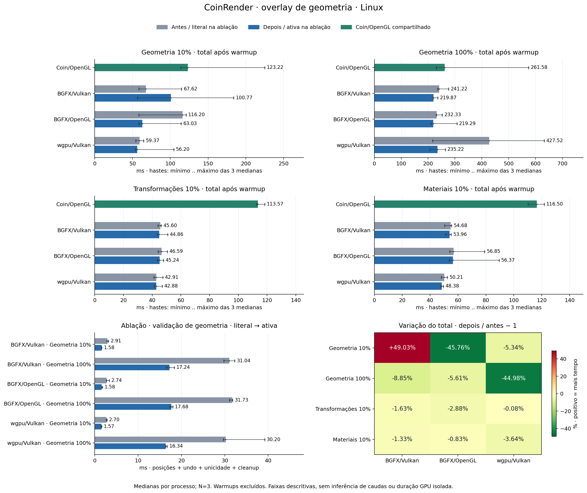

# CoinRender: overlay de geometria — Linux

Referência principal: Coin3D/Coin/OpenGL clássico (`SoGLRenderAction`).

## Mudança

Validação usa valores atuais, sem cache persistente ou confiança em revisão. Slots estritamente crescentes dispensam sort e scratch; na primeira inversão, runs consecutivos inclusivos são reconstruídos e apenas seus intervalos são ordenados.

União usa uint64_t(last)+1. Sobreposição/duplicação recusa a transação. Capacidade opcional ≤65536 runs e ≤4×N bytes; cap/OOM usa o algoritmo literal de slots+sort após liberar scratch. Updates e undo mantêm a ordem original; mutações continuam após toda a validação.

Optout privada COIN_RENDER_DISABLE_GEOMETRY_INTERVAL_VALIDATION=1 força o caminho literal. Materiais/transformações sem posições não consultam essa opção nem emitem evento geometry_overlay_validation.

Optout literal: `COIN_RENDER_DISABLE_GEOMETRY_INTERVAL_VALIDATION=1`.

Cidade de 40.000 objetos, offscreen 1024 × 1024, quatro variantes na mesma GPU NVIDIA; sem campanha de startup nesta etapa.

Baseline Render medido em 9a594fa39c7ca7924f9931863d4bdd7a37165cee; snapshot de organização/documentação a2e19d360db9c4ef187550ae1513fddd0585a371. Atual 96e5ed80fa3ab3c9016cf10e6bbfc9b638335a33; controle CoinGL 4d63bb993022ee8d40802558b0871a4803002b8d.

## Quadros após warmup

Mediana das medianas de três processos/rodadas por variante e caso. Cada processo tem cinco warmups excluídos e quinze quadros medidos. Total inclui update, render/readback e publicação; Δ% positivo significa mais tempo.

| Caso | Coin/OpenGL (ms) | BGFX/Vulkan antes → depois (ms; Δ%) | BGFX/OpenGL antes → depois (ms; Δ%) | wgpu/Vulkan antes → depois (ms; Δ%) |
|---|---:|---:|---:|---:|
| Geometria 10% | 123.22 | 67.62 → 100.77; +49.03% | 116.20 → 63.03; -45.76% | 59.37 → 56.20; -5.34% |
| Geometria 100% | 261.58 | 241.22 → 219.87; -8.85% | 232.33 → 219.29; -5.61% | 427.52 → 235.22; -44.98% |
| Transformações 10% | 113.57 | 45.60 → 44.86; -1.63% | 46.59 → 45.24; -2.88% | 42.91 → 42.88; -0.08% |
| Materiais 10% | 116.50 | 54.68 → 53.96; -1.33% | 56.85 → 56.37; -0.83% | 50.21 → 48.38; -3.64% |

### Faixa das medianas por processo

Mínimo .. máximo das três medianas por processo, sem remover extremos. Estas faixas não são intervalos de confiança.

| Caso | Coin/OpenGL (ms) | BGFX/Vulkan antes → depois (ms) | BGFX/OpenGL antes → depois (ms) | wgpu/Vulkan antes → depois (ms) |
|---|---:|---:|---:|---:|
| Geometria 10% | 113.94 .. 224.84 | 58.47 .. 114.96 → 56.43 .. 183.86 | 58.45 .. 120.91 → 58.44 .. 114.39 | 54.17 .. 64.68 → 54.09 .. 104.64 |
| Geometria 100% | 230.06 .. 573.95 | 236.04 .. 276.08 → 218.35 .. 236.21 | 230.66 .. 252.45 → 210.88 .. 307.28 | 217.18 .. 632.16 → 206.45 .. 263.92 |
| Transformações 10% | 112.57 .. 118.29 | 43.99 .. 46.32 → 43.45 .. 50.86 | 44.14 .. 50.55 → 43.56 .. 47.92 | 41.18 .. 47.39 → 41.42 .. 47.02 |
| Materiais 10% | 110.20 .. 121.79 | 50.46 .. 55.39 → 51.11 .. 55.04 | 54.16 .. 79.05 → 53.60 .. 89.41 | 47.98 .. 52.33 → 47.72 .. 49.56 |

### Aumentos observados

- BGFX/Vulkan · Geometria 10%: 67.62 → 100.77 ms; +33.15 ms (+49.03%).

## Ablação no mesmo binário

Opção desligada → ligada; três processos por API/caso/opção, três warmups e sete quadros medidos por processo. O controle é o caminho literal no mesmo binário.

| Variante | Caso | Validação off → on (ms; Δ%) | Total off → on (ms; Δ%) | Posições | Runs off → on | Itens ordenados off → on | Scratch off → on (bytes) |
|---|---|---:|---:|---:|---:|---:|---:|
| BGFX/Vulkan | Geometria 10% | 2.911 → 1.582; -45.65% | 59.53 → 58.08; -2.43% | 96.000 → 96.000 | 0 → 4.000 | 96.000 → 4.000 | 384.000 → 384.000 |
| BGFX/Vulkan | Geometria 100% | 31.040 → 17.236; -44.47% | 233.08 → 220.71; -5.31% | 960.000 → 960.000 | 0 → 40.000 | 960.000 → 40.000 | 3.840.000 → 524.288 |
| BGFX/OpenGL | Geometria 10% | 2.739 → 1.582; -42.24% | 60.85 → 59.17; -2.75% | 96.000 → 96.000 | 0 → 4.000 | 96.000 → 4.000 | 384.000 → 384.000 |
| BGFX/OpenGL | Geometria 100% | 31.732 → 17.677; -44.29% | 232.41 → 221.54; -4.68% | 960.000 → 960.000 | 0 → 40.000 | 960.000 → 40.000 | 3.840.000 → 524.288 |
| wgpu/Vulkan | Geometria 10% | 2.701 → 1.572; -41.79% | 55.55 → 54.94; -1.10% | 96.000 → 96.000 | 0 → 4.000 | 96.000 → 4.000 | 384.000 → 384.000 |
| wgpu/Vulkan | Geometria 100% | 30.197 → 16.337; -45.90% | 220.93 → 208.88; -5.45% | 960.000 → 960.000 | 0 → 40.000 | 960.000 → 40.000 | 3.840.000 → 524.288 |

`validation_ms` inclui checagem de posições, preparação do undo, unicidade e liberação do scratch. Exclui verificações posteriores de draws/modelos e não mede o overlay inteiro, memcpy isolado ou sort puro. `scratch_bytes` mede capacidade do scratch de colisão; exclui undo obrigatório e overhead do alocador.

O vínculo com CSV usa eventos anteriores ao próximo marcador `action`: primeiro full rebuild sem evento e cada resource rebuild posterior com exatamente um evento. Os índices medidos 3..9 só são usados após esta prova. Não há deslocamento inferido apenas pela contagem.

A fase local variou de -45.90% a -41.79% na ablação. As variações do total na campanha principal — BGFX/Vulkan · Geometria 10% +49.03%; BGFX/OpenGL · Geometria 10% -45.76%; wgpu/Vulkan · Geometria 100% -44.98% — permanecem registradas e não são atribuídas causalmente à otimização desta fase.

A redução da fase não explica automaticamente toda mudança no total. Fases são aninhadas e suas medianas não devem ser somadas.

## Probe suplementar: BGFX/Vulkan · geometria 10%

Comparação on/off no mesmo binário, sem trace de fases, com três processos por opção. São seis processos adicionais, 90 quadros medidos e 30 warmups. A campanha principal mantém suas 84 execuções, contabilizadas separadamente.

| Opção | Mediana total (ms) | Mínimo .. máximo das três medianas (ms) |
|---|---:|---:|
| Literal (off) | 60.16 | 58.65 .. 60.23 |
| Ativa (on) | 56.84 | 56.30 .. 62.18 |

Total on − off: -3.31 ms (-5.51%). A mudança +49.03% da campanha principal continua na tabela e figura. Este probe separado descreve somente esta amostra e não identifica a causa da discrepância nem mede validation_ms.

| Rodada | Total off → on (ms) | Δ (ms) | Variação |
|---|---:|---:|---:|
| 1 | 58.65 → 62.18 | +3.53 | +6.01% |
| 2 | 60.16 → 56.30 | -3.85 | -6.40% |
| 3 | 60.23 → 56.84 | -3.38 | -5.62% |

Os pares que aumentaram o tempo permanecem nesta tabela; a mediana agregada não estabelece ausência universal de regressão.

[Comandos, CSVs, logs e resumo do probe](validation/geometry-overlay-linux/regression-probe/summary.json).

## Protocolo e fontes

- Campanha pareada: **84 processos únicos, 1.260 quadros medidos e 420 warmups**. São quatro casos × três rodadas × sete papéis: três backends antes, três depois e um Coin/OpenGL compartilhado.
- Ablação: **36 processos, 252 quadros medidos e 108 warmups**.
- Verificação: **32 processos, 224 PPMs e 112 pares antes/depois**. Cada par usa a mesma variante, caso e quadro; não compara imagens entre backends.
- Dois builds e doze execuções de gates registrados. Categorias: Core (inclui integração GPU)=4, Action/Reuse misto=2, GPU dedicado=6. Os resultados vêm dos registros preservados; não se presume teste GPU a partir de saída CPU ou duração.

CoinRender depois: `96e5ed80fa3ab3c9016cf10e6bbfc9b638335a33`. Coin/OpenGL: `4d63bb993022ee8d40802558b0871a4803002b8d`.

- Antes BGFX/Vulkan: `9a594fa39c7ca7924f9931863d4bdd7a37165cee`.
- Antes BGFX/OpenGL: `9a594fa39c7ca7924f9931863d4bdd7a37165cee`.
- Antes wgpu/Vulkan: `9a594fa39c7ca7924f9931863d4bdd7a37165cee`.

Snapshot da baseline: `a2e19d360db9c4ef187550ae1513fddd0585a371`; o código de render medido é identificado pelas revisões dos binários acima.

Cena SHA-256: `bb9ccc612cd38ffb749ee599d9350a80974649eab5bf477d2f344538a42b2576`.

Os doze controles Coin/OpenGL têm CSV/log iguais por SHA-256 e são contados uma vez, embora estejam presentes nos dois diretórios. O primeiro quadro destes processos pertence ao warmup; esta etapa não é uma campanha de primeiro quadro frio.

RGB antes/depois: todos os 112 pares são idênticos por bytes.

Este gerador lê os resultados RGB fornecidos e não reabre os PPMs. A reprodução do analisador/validador é a evidência da comparação de pixels.

- O bootstrap do executor de gates falhou ao localizar um caminho de fonte antes de executar qualquer teste. O caminho foi corrigido; diretório vazio, log e comandos da tentativa permanecem em history/, fora dos12 gates finais.
- A categoria registrada core_cpu é preservada no manifesto: suas quatro execuções são dois Core CPU (FrameCore e PlanAssembly) e duas integrações GPU (FrameReuseCore WG/BG, que executam Target/backend real). As outras execuções são dois Action/Reuse mistos e seis GPU dedicados; não há quatro Core CPU puros.

## Limites

- A medição offscreen inclui espera GPU/readback; não isola tempo GPU, apresentação em janela ou fluidez percebida.
- N=3 processos e quinze quadros medidos por processo descrevem esta amostra. Percentis p95/p99 preservados usam nearest rank; amostras curtas não caracterizam caudas de latência ou variância populacional.
- A alternância e os controles compartilhados não garantem clocks, temperatura ou estado do driver iguais.
- Todos os aumentos das medianas totais permanecem no relatório. Ganhos locais de validação e ganhos totais têm escopos diferentes.
- validation_ms cobre posições, preparação do undo, unicidade e limpeza do scratch; exclui fprintf, validação posterior de draws/modelos e as escritas finais do overlay. Não é tempo de whole overlay, sort isolado ou memcpy.
- scratch_bytes mede a capacidade do scratch de colisão usada na fase, sem undo obrigatório ou overhead do allocator. ordered usa zero; intervals ordena R runs; literal ordena N slots.
- Na ablação, o primeiro full capture não emite esta fase. Eventos são associados ao próximo marcador Action antes de usar as flags warmup do CSV; nenhum slice arbitrário da sequência bruta é tratado como medido.
- A comparação principal e a ablação preservam regressões e outliers. Medianas por processo/rodada, com amostras curtas, não estabelecem latência de cauda nem causalidade de toda variação do quadro.
- Snapshots de hardware antes/depois não acompanham clocks continuamente. Binários e PPMs não integram este arquivo de evidências; hashes e logs permanecem registrados.
- A terceira rodada teve outliers grandes, mantidos nos dados e nas faixas do gráfico. load-observation.json preserva um snapshot de carga durante essa rodada: a lista GPU amostrada mostrou nosso benchmark, e ps incluiu Codex/navegadores. Essa amostra não prova a causa da variação nem acompanha a carga de toda a campanha.
- O probe suplementar usa a mesma build BGFX/Vulkan, geometry-10, sem trace: seis processos, 90 medidos e 30 warmups. Todas as três diferenças por par permanecem, inclusive o primeiro par positivo. Não substitui a campanha principal ou a ablação e não identifica a causa da variação observada.

[Evidência e reprodução](validation/geometry-overlay-linux/README.md).

Entradas e SHA-256 do gerador estão em `report-inputs.json`; os valores são lidos da evidência.
