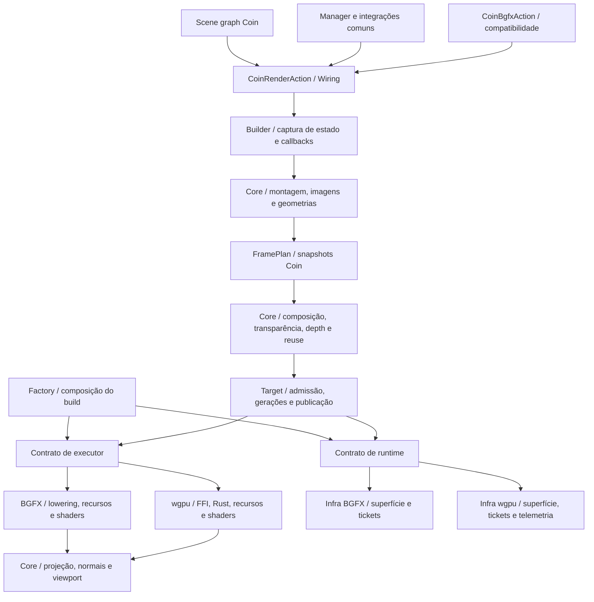

# Organização do render: quatro fases

Campanha concluída na branch `codex/coin-render-isolation`. A seleção de executor
continua no build; a API pública comum e `CoinBgfxAction` de compatibilidade foram
preservadas. Os consumidores C++ devem ser recompilados com o módulo.

| Fase | Estado | Resultado |
| --- | --- | --- |
| 1 — Entrada comum | Concluída (`d6b87cb6a2`) | Action e manager comuns; seleção na factory; submissão pelo contrato do executor. [Detalhes](coin-render-isolation.md). |
| 2 — Infra do target | Concluída (`15c21e097a`) | Serviços de superfície, tickets e telemetria nos runtimes específicos; publicação e admissão comuns. [Detalhes](coin-render-runtime-isolation.md). |
| 3 — Captura e montagem | Concluída (`f25e6e4110`) | Leitura de Coin no builder; montagem, deduplicação e cache geométrico no Core. [Detalhes](coin-render-builder-isolation.md). |
| 4 — Transformações e lowering | Concluída | Matemática compartilhada; layout/agrupamento específico BGFX; lowering excluído dos módulos wgpu/RECORDING. [Detalhes](coin-render-lowering-isolation.md). |

O isolamento dessas quatro fronteiras foi validado em Linux, com builds Release
RECORDING, BGFX e RUST_BRIDGE, testes de Core e GPU, janelas reais e preservação dos
checksums estáticos/dinâmicos. Cada relatório registra o conjunto executado; não são
alegadas execução completa de todas as variantes/suítes ou equivalência total a GL.

A [checklist geral](rendering-responsibilities-checklist.md) continua acompanhando
qualificação funcional, demais mecanismos e possíveis extrações internas futuras.
Esses itens não são novas fases pendentes desta campanha de organização.
