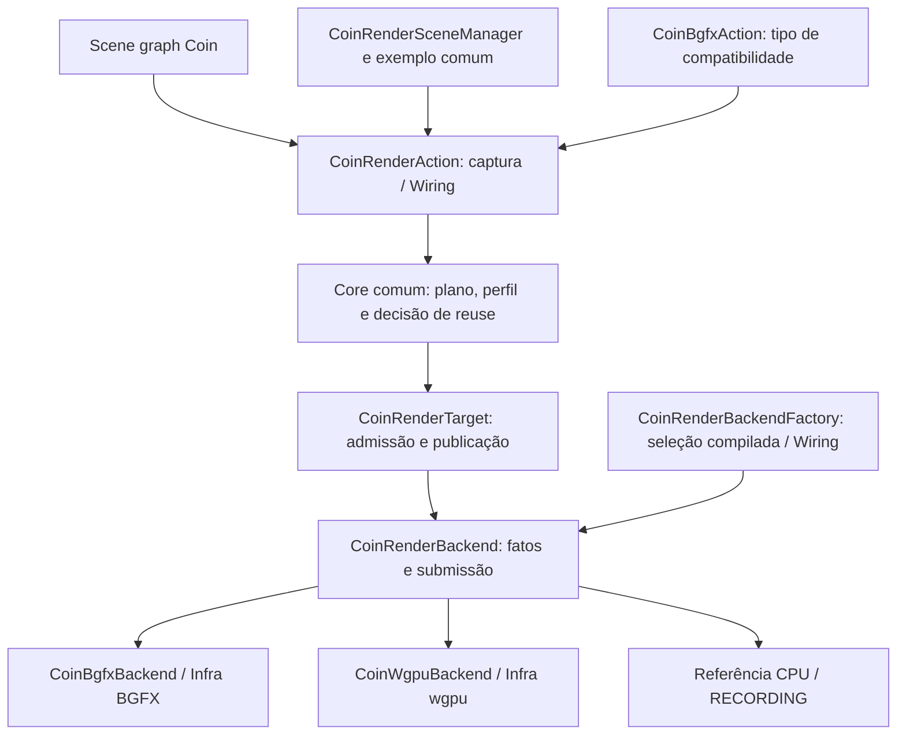

# Isolamento da entrada CoinRender e dos executores

Primeira etapa na branch `codex/coin-render-isolation`, sobre `ad82572bd3`.
A biblioteca continua opcional; a API pública comum e os tipos de compatibilidade
permanecem disponíveis. Consumidores C++ devem ser recompilados com o módulo.

## Fronteira implementada

- `CoinRenderAction.cpp` não inclui executores específicos nem seleciona comportamento
  por macros de BGFX/wgpu. A consulta de disponibilidade delega à composição.
- `CoinRenderBackendFactory.cpp` concentra a criação do executor compilado e a
  consulta de GPU usada pela API de compatibilidade. A seleção continua no build;
  esta mudança não introduz seleção pública de backend por target.
- Sombras usam um fato virtual da implementação. O target verifica a política
  de saída (offscreen síncrono, sem textura direta); o Core valida o perfil capturado.
  Consultar o fato não prepara dispositivo nem submete trabalho.
- Submissão síncrona com reuse e submissão assíncrona passam por métodos virtuais
  comuns, sem `dynamic_cast` para BGFX/wgpu nessa etapa da execução. Executores
  sem reuse especializado delegam ao submit simples; falta de capacidade assíncrona
  é rejeitada pelo contrato, sem escolher comportamento pelo backend compilado.
- O manager e o exemplo de janela instanciam `CoinRenderAction` em ambos os builds.
- `CoinBgfxAction` foi movida para `src/rendering/coinbgfx`. Continua registrada com
  o mesmo nome e derivação, encaminhando funcionalidade para a action comum.

## Validação Linux

Conjuntos selecionados: 5 casos em RECORDING, 8 em BGFX e 8 em Rust/wgpu,
todos aprovados, sem skips. Os testes de GPU usaram Vulkan/NVIDIA com o perfil de
sombras obrigatório. BGFX também verificou seu tipo de action registrado legado.
O exemplo de janela e o benchmark compilaram em ambos os builds.

O novo `CoinRenderBackendBoundaryTest` injeta um executor sem identidade BGFX ou
wgpu e verifica a action comum do manager, captura de sombras, transporte da decisão
de reuse, rejeição assíncrona com rollback de pixels/ticket e rejeição de sombras
sem alterar a última imagem. Executa também em RECORDING, sem GPU.

Ao validar RECORDING foi ajustada uma expectativa antiga de `CoinRenderActionTest`:
a mensagem existente informa os executores de janela suportados (`RUST_BRIDGE or
BGFX`), enquanto o teste exigia a palavra `RECORDING`. A mensagem de produção
permanece a mesma.

Cena estática: 40 mil edifícios, 1024×1024, dois warmups e três quadros medidos.
As quatro variantes preservaram os checksums do benchmark anterior:

| Variante | GPU | RGBA FNV64 |
| --- | --- | --- |
| BGFX Vulkan | NVIDIA | `0x6714299260985122` |
| BGFX OpenGL | NVIDIA | `0x156847cec1d97864` |
| wgpu Vulkan | NVIDIA | `0x6714299260985122` |
| wgpu OpenGL | AMD | `0x3a998bbb78caa846` |

[Logs e resultados](validation/render-isolation-linux/) registram os comandos e
resultados. Esta execução verifica preservação da saída; não estabelece novo ganho
de desempenho. Windows e os protótipos DAWN/WGPU_NATIVE não foram executados.

## Separação ainda pendente

O target ainda contém integração concreta de superfícies, polling/cancelamento de
readbacks, aposentadoria do runtime BGFX e política de buffers CPU. Essa Infra
precisa de uma etapa própria de extração. O builder ainda mistura leitura de estado
Coin com transformação mecânica; partes do lowering reutilizável também continuam
em `CoinBgfxLowering`. Esses limites seguem na
[checklist de responsabilidades](rendering-responsibilities-checklist.md).

Esta etapa fecha o acoplamento da entrada comum à identidade dos executores;
não declara concluído o isolamento completo de Core, Shell, Infra e Wiring.
