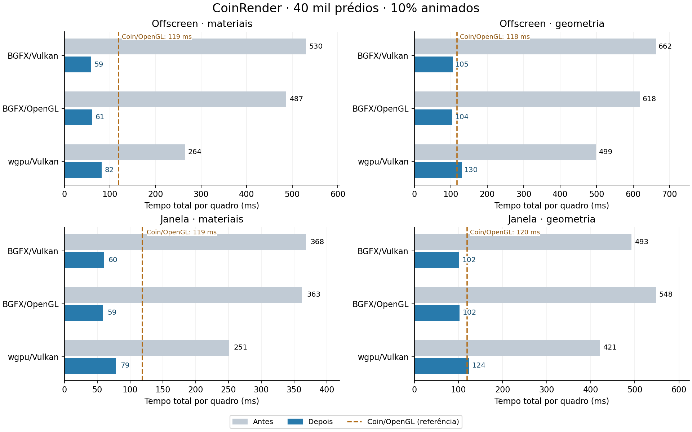

# Materiais e geometria no CoinRender — Linux, 2026-10-05

Branch: `codex/coin-render-transform-performance`.
Implementação de overlays e lowering: `6d076c4707`.
Índice de materiais e notificações: `ff289a50b9`.
Antes: conteúdo compilado `b02aa54783`. Coin/OpenGL clássico
(`SoGLRenderAction`, Coin3D): controle congelado `4d63bb9930`.
Continuação da [etapa de instâncias e transformação](coin-render-wgpu-instancing-linux.md).

## Alterações

- **Common:** atualiza materiais opacos escalares na tabela e posições locais de
  `SoCube` positivo, junto das translações pendentes. Preserva índices, UVs,
  normais, matrizes e centros de ordenação. Atualiza o ID de origem do draw
  quando o Cube muda. A transação restaura todos os campos e a revisão em caso
  de falha; os objetos continuam pendentes para retry.
- **Prova do Common:** exige tipos exatos, objeto isolado `SoSeparator` com
  material, transform e Cube, material OVERALL, ausência de override efetivo,
  conexões/ignored e callbacks adicionais. Confere todos os consumidores de
  slots/ranges e todas as ocorrências sintáticas do material, inclusive sob
  overrides parciais. Referências guardadas para restauração não contam como
  ocorrência renderizada. Aliases ambíguos fazem captura completa.
- **Captura de materiais:** índice temporário no builder, hash dos bytes e
  `memcmp` em colisões, mantendo o menor slot e a ordem da busca anterior.
  Ativa a partir de 32 materiais; sincroniza acréscimos por polygon/stroke,
  cópia, transferência, reset e troca de builders. Abrange `captureMaterial`
  de triângulos, linhas, pontos, formas nativas e geometria indexada. A função
  independente `Core::material` e os loops de assembly mantêm a busca anterior.
- **BGFX e wgpu:** fatoram posições quando cada eixo contém extremos opostos
  e apenas valores `−h`, zero com sinal ou `+h`, com reconstrução float exata.
  Canonicalizam em `−1/0/+1` e levam a escala positiva para a matriz de posição
  da instância. **As normais e a matriz normal authored são preservadas**;
  essa escala de transporte não redefine a transformação authored.
  A prova depende de valores/atributos/topologia, sem reconhecer nós ou cenas.
- **Lowering:** comparação exata com a primeira/última malha evita FNV de
  ranges repetidos. BGFX admite até 65.536 spans, mantendo o teto de 256 malhas;
  wgpu mantém 128 grupos consecutivos. A/B/A conserva sua ordem. Geometria
  plana, zero, subnormal, com pontos interiores ou sem reconstrução exata
  continua pelo caminho de igualdade/fallback existente.
- **Notificações:** campos estáveis são verificados uma vez por fonte dirty
  antes da mutação, evitando repetir a inspeção em cada width/height/depth.

A ABI privada continua 43. Rust e shaders não mudaram nesta etapa.
O material overlay depende da propriedade dos slots: fontes diferentes com
valores inicialmente iguais podem compartilhar slot e exigir captura completa
antes de readmissão. A atualização não funde novamente slots que se tornam
iguais. A comparação de semântica usa atributos expandidos por draw.

### Limites

O Common mantém até 65.536 objetos/estados/draws/materiais, dimensões Cube
entre 0,0001 e 32.768, 24 vértices/36 índices no range qualificado e metadata
suplementar estimada até 16 MiB. Posições pendentes + undo têm teto de 32 MiB
(1.048.576 entradas por vetor); a validação usa até 4 MiB temporários de slots.
O índice de materiais limita metadata a 65.536 slots, estimativa abaixo de
9 MiB, e retorna à busca linear no excesso ou falha de alocação opcional.
Não limita a tabela de materiais. Lowerers limitam metadata estimada a 8 MiB.
Os budgets anteriores de geometria/instâncias/materiais continuam. São limites
de payload/metadata; o RSS inclui planos, drivers e recursos coexistentes.

Optouts: `COIN_RENDER_DISABLE_MATERIAL_OVERLAY=1`,
`COIN_RENDER_DISABLE_CUBE_OVERLAY=1`,
`COIN_RENDER_DISABLE_MATERIAL_INTERNING=1` e
`COIN_WGPU_DISABLE_DIAGONAL_MESH_LOWERING=1`.
O optout de translação continua desativando o perfil comum completo.

## Protocolo e resultados

Cidade com 40.000 prédios, seed 136, 480.012 triângulos, PHONG, duas luzes
direcionais e 1024². Cena SHA256:
`bb9ccc612cd38ffb749ee599d9350a80974649eab5bf477d2f344538a42b2576`.
Ryzen 5800H, NVIDIA RTX 3060 Laptop, driver 610.57.04, Linux
6.17.0-42, GCC 13.3, Release; governor powersave. O ambiente seleciona NVIDIA
explicitamente. Os números são tempos CPU de parede, incluindo update, render
e publicação; não são tempo GPU isolado nem garantia de FPS em outras cenas.

O runner alterna antes/depois e rotaciona ordem por rodada. O Coin/OpenGL
congelado é executado **uma vez por caso/rodada**, com CSV/log compartilhados
nas duas campanhas. O controle não é uma segunda execução depois da mudança.
Agregação: mediana das três medianas por processo. p95/p99 e máximos completos
estão nos JSON/CSV. Parâmetros iguais dentro de cada par não estabelecem
igualdade de estado térmico, driver ou compositor.

### Offscreen, 10% dos objetos

Três rodadas × 30 quadros medidos, após 5 warmup.

| Render | Materiais (ms) | Geometria (ms) |
|---|---:|---:|
| Coin/OpenGL | 119.00 (referência) | 117.52 (referência) |
| BGFX/Vulkan | 529.89 → **58.77** | 662.24 → **105.06** |
| BGFX/OpenGL | 486.60 → **60.60** | 618.43 → **104.48** |
| wgpu/Vulkan | 264.14 → **81.93** | 498.74 → **129.94** |

Redução: materiais BGFX/Vulkan 88,9%, BGFX/OpenGL 87,5%, wgpu 69,0%;
geometria 84,1%, 83,1% e 73,9%, respectivamente. Wgpu/geometria continua
10,6% acima do Coin/OpenGL nessa medição.

### Janela real, 10% dos objetos

Três rodadas × 15 quadros medidos, após 3 warmup. A política de apresentação
foi preservada; o drain final continua registrado separadamente pelo bench.

| Render | Materiais (ms) | Geometria (ms) |
|---|---:|---:|
| Coin/OpenGL | 118.66 (referência) | 119.61 (referência) |
| BGFX/Vulkan | 368.08 → **60.10** | 492.58 → **101.51** |
| BGFX/OpenGL | 362.51 → **58.81** | 547.56 → **102.47** |
| wgpu/Vulkan | 250.95 → **78.64** | 420.53 → **124.30** |

Wgpu/geometria ficou 3,9% acima do controle em janela.

### Carga com 100% dos objetos

Três rodadas × 7 quadros medidos, após 3 warmup; teste curto de carga.
Não se usa esse conjunto para concluir estabilidade de cauda p99.

| Render | Materiais (ms) | Geometria (ms) |
|---|---:|---:|
| Coin/OpenGL | 232.25 (referência) | 237.16 (referência) |
| BGFX/Vulkan | 2674.21 → **163.69** | 722.49 → **231.09** |
| BGFX/OpenGL | 2599.18 → **168.07** | 679.85 → **232.08** |
| wgpu/Vulkan | 2553.05 → **186.10** | 544.16 → **241.42** |

### Primeiro quadro e memória

Primeiro total obtido da primeira linha do CSV, incluindo warmup; RSS é o
pico do processo, não VRAM.

| Caso | Render | Primeiro total antes → depois (ms) | RSS antes → depois (MiB) |
|---|---|---:|---:|
| geometry-10 | BGFX/OpenGL | 832.5 → 626.7 | 844.5 → 459.2 |
| geometry-10 | BGFX/Vulkan | 862.9 → 675.4 | 935.5 → 418.1 |
| geometry-10 | wgpu/Vulkan | 654.4 → 563.0 | 939.1 → 546.1 |
| materials-10 | BGFX/OpenGL | 682.6 → 421.1 | 670.6 → 373.3 |
| materials-10 | BGFX/Vulkan | 734.5 → 494.1 | 759.2 → 346.8 |
| materials-10 | wgpu/Vulkan | 377.2 → 379.3 | 525.8 → 444.8 |
| geometry-100 | BGFX/OpenGL | 909.1 → 731.3 | 893.8 → 517.0 |
| geometry-100 | BGFX/Vulkan | 949.2 → 798.4 | 977.4 → 475.9 |
| geometry-100 | wgpu/Vulkan | 739.0 → 660.4 | 920.8 → 591.7 |
| materials-100 | BGFX/OpenGL | 2771.5 → 711.8 | 899.7 → 506.2 |
| materials-100 | BGFX/Vulkan | 2816.4 → 759.0 | 986.0 → 469.0 |
| materials-100 | wgpu/Vulkan | 2684.3 → 661.1 | 818.9 → 589.0 |

A ablação instrumentada na mesma revisão, wgpu/materials-100, deu primeira
travessia CPU de **377,14 ms com índice** e **2555,19 ms sem índice**. São
duas execuções de diagnóstico, não uma mediana qualificada.

### Preservação de transformação, câmera e estático

Três rodadas curtas × 7 quadros, após 3 warmup.

| Caso | Render | Antes → depois (ms) | Primeiro total antes → depois (ms) |
|---|---|---:|---:|
| camera | BGFX/OpenGL | 8.85 → 8.78 | 360.1 → 403.5 |
| camera | BGFX/Vulkan | 8.76 → 8.44 | 410.0 → 462.3 |
| camera | wgpu/Vulkan | 10.42 → 10.54 | 316.1 → 342.8 |
| static | BGFX/OpenGL | 2.54 → 2.53 | 363.5 → 395.8 |
| static | BGFX/Vulkan | 2.23 → 2.27 | 418.1 → 460.2 |
| static | wgpu/Vulkan | 3.01 → 2.94 | 322.4 → 345.0 |
| transforms-10 | BGFX/OpenGL | 51.21 → 53.90 | 370.8 → 410.9 |
| transforms-10 | BGFX/Vulkan | 50.83 → 52.75 | 427.9 → 457.6 |
| transforms-10 | wgpu/Vulkan | 74.19 → 74.62 | 319.0 → 341.9 |

Há custo observado: transformação BGFX aumentou 1,91–2,68 ms; wgpu 0,42 ms.
Estático/câmera variaram até 0,32 ms na mediana. O primeiro quadro desses
controles aumentou **22,6–52,3 ms**. Essas regressões pequenas acompanham
as novas provas e fatoração; a campanha não isola cada parcela desse custo.
Os tempos de transformação continuam abaixo do controle Coin/OpenGL.

## Correção e disponibilidade

- Sete gates CPU finais passaram: Action, ReuseCore, TransformCore, FfiFrame,
  BgfxCore, DepthContract e DrawStyle. Incluem limites, aliases, overrides
  parciais, campos conectados/ignored, callback tardio, mixed updates, rollback,
  retry, câmera, signed zero, colisão do índice e suffix polygon/stroke.
- Dez gates GPU finais passaram: packer wgpu real em dois dispositivos,
  referência de câmera com Coin/OpenGL, câmera em janela, RTT direto e
  instâncias/depth/RTT em BGFX Vulkan/OpenGL. O oracle expandido independe do
  normalizador, usa PHONG direcional+pontual, normais oblíquas e depth; exige
  detectar a contraprova com normal calculada do transporte errado.
- **196 comparações RGB antes/depois** em frames lógicos 0,100,…,600, com
  digests da cena iguais e movimento confirmado. Materiais/geometria 10%,
  transformação e estático ficaram idênticos. Camera BGFX/Vulkan diferiu em
  até 2 pixels (máximo canal 30); materiais100 BGFX em até 2 pixels de 1 nível.
  Geometria100 e demais combinações ficaram idênticas. As diferenças existentes
  contra Coin/OpenGL também foram quantificadas nos arquivos de verificação.
- **wgpu/OpenGL: N/A.** A versão antiga já falhava na criação do dispositivo.
  O probe da dependência wgpu24 mostrou contexto desktop GL3.3 no NVIDIA e
  falha do shader interno de validação por BUFFER_STORAGE/COMPUTE_SHADER/
  DYNAMIC_ARRAY_SIZE, terminando em `Parent device is lost`. Os logs/probe
  estão preservados em `availability`. A medição cobre BGFX/Vulkan,
  BGFX/OpenGL e wgpu/Vulkan. O lowering wgpu é comum às suas APIs, mas
  OpenGL não pôde ser validado em runtime nesta máquina.

## Evidência e reprodução

[Pacote de validação](validation/material-geometry-linux/) contém comandos,
ambiente relevante, SHA256 dos binários, fonte declarada por variante, logs,
CSV, máximos, contagens de frames acima de budgets, RSS e hashes das imagens.
PPMs originais permanecem nos diretórios locais `/tmp`; o pacote versionado
guarda métricas/hash e não copia esses binários grandes. `exploratory-*` e
`diagnostic` registram a etapa intermediária `6d076c4707`; campanhas finais
identificam o conteúdo compilado `ff289a50b9`.

Foram 189 processos de timing alternados (42 offscreen + 42 stress + 42
janela + 63 controles), além de verificação e gates. Os CSVs do Coin/OpenGL
compartilhados não contam como dois processos.

Para repetir, use `run-all-matched.py` com os builds antes/depois e CoinGL
separado, `--runner <repo>/scripts/coinrender/run_animation_benchmark.py` e
`--row-helper <pacote>/matched-rows.py`. Os manifestos guardam os argumentos
completos. `summarize.py` recomputa estatísticas dos CSVs; para validar o pacote
sem PPMs, passe `--recorded-rgb <campanha>/rgb-before-after.json` e
`--validate-only`. Esse modo declara que reutiliza métricas RGB arquivadas.
O helper acomoda o arredondamento a seis algarismos significativos do log
do primeiro quadro; o CSV de precisão completa continua autoritativo.

O custo restante de geometria wgpu está sobretudo na validação/composição
e pack CPU do plano expandido (no piloto geometry10, cerca de 32,6 ms no
target e 64,7 ms no pack), com 864.048 vértices de origem. O transporte GPU
qualificado usa 24 vértices, 36 índices e 40.001 instâncias. Um próximo passo
concreto é reduzir a duplicação do plano de origem e a revalidação de partes
comprovadamente preservadas.
