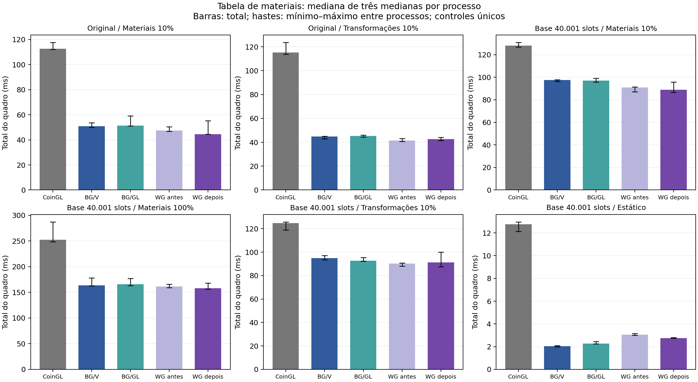

# CoinRender: tabela de materiais no Linux

A mudança separa a reutilização dos recursos de materiais e instâncias no perfil instanced já validado do wgpu. A comparação usa Coin/OpenGL do Coin3D como referência e mantém BGFX como controle.

Fontes compiladas: Render antes/BGFX `96e5ed80fa3ab3c9016cf10e6bbfc9b638335a33`; wgpu depois `a0bda8b5ccc8d04efa96c5c807b88e5aa4e34c9d`; CoinGL `4d63bb993022ee8d40802558b0871a4803002b8d`. Os 20 artefatos permaneceram com os mesmos hashes após as campanhas.

## Comparação sem traces

Mediana de três medianas por processo. Os colchetes mostram mínimo–máximo dessas três medianas; não são intervalos de confiança. Controles CoinGL/BGFX são únicos por caso/rodada e não são duplicados como amostras antes/depois.

| Cena / caso | Coin/OpenGL ms | BGFX/Vulkan ms | BGFX/OpenGL ms | wgpu antes ms | wgpu depois ms | Δ wgpu |
|---|---:|---:|---:|---:|---:|---:|
| Original / Materiais 10% | 112.62 [112.27–117.65] | 50.79 [50.04–53.65] | 51.30 [51.19–59.11] | 47.51 [46.65–50.35] | 44.59 [44.45–55.31] | -2.92 ms (-6.15%) |
| Original / Transformações 10% | 115.21 [113.80–123.64] | 44.78 [42.87–45.16] | 45.22 [44.29–46.08] | 41.50 [40.80–43.18] | 42.74 [41.36–44.22] | +1.23 ms (+2.97%) |
| Base 40.001 slots / Materiais 10% | 128.14 [126.69–130.82] | 97.64 [96.18–97.73] | 96.91 [95.72–98.94] | 90.97 [87.01–91.30] | 88.76 [86.52–95.85] | -2.20 ms (-2.42%) |
| Base 40.001 slots / Materiais 100% | 252.45 [248.42–287.26] | 163.63 [162.26–178.42] | 165.77 [163.19–176.88] | 161.22 [158.90–166.02] | 157.82 [156.40–168.12] | -3.40 ms (-2.11%) |
| Base 40.001 slots / Transformações 10% | 124.69 [118.96–125.77] | 94.78 [93.44–96.96] | 92.73 [92.12–95.33] | 90.26 [88.14–90.71] | 91.23 [87.64–99.90] | +0.97 ms (+1.07%) |
| Base 40.001 slots / Estático | 12.75 [12.14–12.97] | 2.05 [2.00–2.10] | 2.26 [2.25–2.44] | 3.04 [3.00–3.15] | 2.75 [2.75–2.81] | -0.29 ms (-9.53%) |

### Fases do quadro e variações positivas

| Cena / caso | Update antes→depois ms | Render antes→depois ms | Publicação antes→depois ms | Total Δ |
|---|---:|---:|---:|---:|
| Original / Materiais 10% | 4.32→4.39 | 42.73→39.85 | 0.40→0.41 | -2.92 ms (-6.15%) |
| Original / Transformações 10% | 3.39→3.27 | 37.72→38.96 | 0.39→0.41 | +1.23 ms (+2.97%) |
| Base 40.001 slots / Materiais 10% | 5.23→5.15 | 85.31→83.13 | 0.36→0.38 | -2.20 ms (-2.42%) |
| Base 40.001 slots / Materiais 100% | 43.26→43.14 | 117.83→114.44 | 0.39→0.42 | -3.40 ms (-2.11%) |
| Base 40.001 slots / Transformações 10% | 3.61→3.54 | 86.27→87.13 | 0.38→0.36 | +0.97 ms (+1.07%) |
| Base 40.001 slots / Estático | 0.00→0.00 | 2.64→2.40 | 0.39→0.36 | -0.29 ms (-9.53%) |

Aumentos do total observado: Original / Transformações 10% +1.23 ms (+2.97%); Base 40.001 slots / Transformações 10% +0.97 ms (+1.07%).

Amostra curta: três processos por papel/caso; cada valor é mediana de medianas por processo. Faixas mantêm todos os processos, sem descarte de outliers.

Controles são compartilhados e executados uma vez por caso/rodada. Quiet não emite timers de fase; ablação trace é separada e não atribui causalidade ao total quiet.

O cenário estático usa 30 warmups/120 quadros; dinâmicos usam 5/15. Métricas de primeiro quadro dos logs são descritivas e não constituem uma nova campanha de startup.

Quiet CoinGL reporta adapter=not-queried; a seleção NVIDIA é pedida por environment. Um processo separado com debug de contexto confirmou NVIDIA RTX3060/OpenGL, sem fornecer uma série de desempenho adicional.

## Recursos de materiais: contrato e ablação

A fonte usa 72 bytes por slot; a tabela GPU usa 80 bytes com padding zero. Igualdade byte a byte contra o último payload próprio bem sucedido licencia hits de instância e material separadamente, após a prova de geometria. Dados sem referência e signed zero continuam presentes. Buffers imutáveis são publicados somente após sucesso; erro/retry mantém a base anterior e o escopo por device.

O packing GPU é realizado quando falta uma tabela reutilizável. A opção privada `COIN_WGPU_DISABLE_MATERIAL_RESOURCE_REUSE=1` restaura os hits acoplados e o packing literal antecipado. BGFX não foi alterado nesta etapa; seu material continua no payload de 160 bytes por instância.

A ablação trace principal tem 42 processos (294 medidos/126 warmups); o suplemento dimensional tem oito (56/24), separados. `payload_compare_ms`, `pack_ms` e `resource_ms` são fases CPU. `snapshot_ms` cobre vários componentes do snapshot, não apenas cópia de materiais. Eventos `attempt=1` descrevem tentativas; não demonstram commit. Eventos são alinhados ao próximo Action concluído antes de excluir warmups pelo CSV.

| Cena / caso (trace) | Total off→on ms | Δ total | Compare off→on ms | Pack off→on ms | Resource off→on ms | Upload instâncias off→on MiB | Upload materiais off→on MiB |
|---|---:|---:|---:|---:|---:|---:|---:|
| Original / Materiais 10% | 50.70→47.51 | -6.30% | 0.432→0.397 | 0.029→0.027 | 1.026→0.062 | 5.493→0.000 | 0.306→0.306 |
| Original / Transformações 10% | 42.38→42.78 | +0.95% | 0.000→0.001 | 0.000→0.000 | 0.918→0.868 | 5.493→5.493 | 0.001→0.000 |
| Original / Geometria 10% | 57.24→56.32 | -1.60% | 0.000→0.001 | 0.000→0.000 | 0.890→0.937 | 5.493→5.493 | 0.001→0.000 |
| Base 40.001 slots / Materiais 10% | 100.00→102.75 | +2.74% | 0.429→0.440 | 0.408→0.303 | 0.723→0.316 | 5.493→0.000 | 3.052→3.052 |
| Base 40.001 slots / Materiais 100% | 175.04→176.57 | +0.87% | 0.467→0.410 | 0.376→0.298 | 0.801→0.301 | 5.493→0.000 | 3.052→3.052 |
| Base 40.001 slots / Transformações 10% | 94.69→91.15 | -3.74% | 0.000→0.272 | 0.355→0.000 | 0.832→0.509 | 5.493→5.493 | 3.052→0.000 |
| Base 40.001 slots / Estático | 3.78→3.17 | -16.16% | 0.000→0.000 | 0.264→0.000 | 0.000→0.000 | 0.000→0.000 | 0.000→0.000 |

Aumentos do total na ablação trace: Original / Transformações 10%: +0.95%, 1/3 pares positivos; Base 40.001 slots / Materiais 10%: +2.74%, 2/3 pares positivos; Base 40.001 slots / Materiais 100%: +0.87%, 3/3 pares positivos.

Quiet e trace são campanhas distintas. Melhorias locais de packing/recursos e sinais diferentes no total de uma mesma cena são observações preservadas; os timers não estabelecem a causa da variação do total.

Snapshot e dimensão observada (bytes lógicos; mediana por processo):

| Cena / caso | Slots off→on | Material fonte copiado off→on MiB | Instâncias copiadas off→on MiB | Snapshot off→on ms |
|---|---:|---:|---:|---:|
| Original / Materiais 10% | 4009→4009 | 0.275→0.275 | 5.493→5.493 | 0.711→0.691 |
| Original / Transformações 10% | 9→9 | 0.001→0.001 | 5.493→5.493 | 0.668→0.644 |
| Original / Geometria 10% | 9→9 | 0.001→0.001 | 5.493→5.493 | 0.681→0.657 |
| Base 40.001 slots / Materiais 10% | 40001→40001 | 2.747→2.747 | 5.493→5.493 | 1.153→1.236 |
| Base 40.001 slots / Materiais 100% | 40001→40001 | 2.747→2.747 | 5.493→5.493 | 1.227→1.280 |
| Base 40.001 slots / Transformações 10% | 40001→40001 | 2.747→2.747 | 5.493→5.493 | 1.176→1.068 |
| Base 40.001 slots / Estático | 40001→40001 | 0.000→0.000 | 0.000→0.000 | 0.001→0.001 |

Suplemento dimensional: uma rodada off/on por caso, separado do N3 principal.

| Cena / caso | Slots off→on medidos | Total off→on ms | Pack off→on ms | Upload instâncias off→on MiB | Upload materiais off→on MiB |
|---|---:|---:|---:|---:|---:|
| Base 257 slots / Materiais 10% | 4257→4257 | 91.00→90.21 | 0.030→0.029 | 5.493→0.000 | 0.325→0.325 |
| Base 257 slots / Transformações 10% | 257→257 | 92.35→91.69 | 0.002→0.000 | 5.493→5.493 | 0.020→0.000 |
| Base 4097 slots / Materiais 10% | 8097→8097 | 91.11→88.09 | 0.061→0.061 | 5.493→0.000 | 0.618→0.618 |
| Base 4097 slots / Transformações 10% | 4097→4097 | 94.50→97.07 | 0.036→0.000 | 5.493→5.493 | 0.313→0.000 |

### Próximo custo observado

O snapshot CPU ainda copia 5.760.144 bytes de instâncias no caso materials-10 e 2.880.072 bytes da tabela estável no caso transforms-10 da cena base 40.001 slots. Os buffers GPU já podem ser conservados nesses casos; o snapshot continua mantendo o payload fonte atual. Uma proposta futura é propriedade compartilhada por payload, com igualdade exata e commit transacional. Essa proposta não foi implementada nesta etapa.

## Imagem e gates

Os 49 pares wgpu antes/depois (sete casos × sete quadros lógicos 0–600) são byte a byte iguais em RGB. Foram 14 processos e 98 PPMs. A verificação confirmou movimento nos casos animados e estabilidade no estático; cenas e state digests pareados constam nos dados.

Os 12 gates passaram sem skips; Cargo passou 29 testes CPU, incluindo os dois novos oráculos de bytes/hits. Os seis testes CPU do gerador também passaram. A categoria registrada `core_cpu` conserva quatro execuções: duas CPU e duas Core com integração GPU. Action/Reuse tem duas execuções mistas; seis gates são GPU dedicados.

Comparação com CoinGL no cenário de muitos materiais: 12 processos de controles e 84 PPMs novos; os quatro processos/28 PPMs wgpu depois foram reutilizados. A agregação contém 84 comparações experimentais contra CoinGL e 28 auto-comparações CoinGL excluídas do resumo. São 26 processos de imagem/182 PPMs únicos no conjunto.

| Variante vs CoinGL | Maior MAE RGB | Maior erro de canal | Maior contagem de pixels >3 |
|---|---:|---:|---:|
| bgfx-opengl | 0.024740 | 103 | 3 |
| bgfx-vulkan | 0.024683 | 122 | 2 |
| wgpu-vulkan | 0.024683 | 122 | 2 |
## Diagnóstico BGFX separado

A etapa histórica registrou BGFX/Vulkan geometry-10 67,62→100,77 ms (+49,03%); o resultado é preservado. O diagnóstico posterior usou a mesma fonte 96e5, 18 processos/270 medidos/90 warmups nos três backends, com traces CPU e sem GPU timestamps. Não substitui a comparação histórica nem prova sua causa.

| Variante (diagnóstico geometry-10) | Total off→on ms | Δ | Maior espera observada ms |
|---|---:|---:|---:|
| bgfx-opengl | 60.27→59.18 | -1.82% | 4.03 |
| bgfx-vulkan | 59.39→58.24 | -1.95% | 3.57 |
| wgpu-vulkan | 59.86→55.79 | -6.80% | n/d |

Os 90 quadros medidos de cada API BGFX conservaram instancing=1, 40.001 instâncias, 24 vértices, um draw e geometria GPU reutilizada. As esperas e os pares/outliers permanecem nos dados. O diagnóstico não mostrou evidência específica de stall BGFX que justificasse uma correção de backend; a causa do +49,03% histórico permanece indeterminada.

Quadros lentos mostraram aumentos em update/validação/lowering CPU. `update_ms` inclui setters/notificações; não há notify isolado. O marcador Action antecede commit/qualificação final, e o residual fora das fases não identifica essa causa. Observações `/proc/stat` e pressão CPU a 1 Hz incluem startup/warmups; não atribuem causa a um quadro ou à campanha histórica.

## Protocolo e reprodução

Quiet: 90 processos, 2.925 medidos e 825 warmups. Cinco casos dinâmicos usam 5 warmups/15 quadros; o estático de 40.001 slots usa 30/120. Três rodadas e cinco papéis: CoinGL, BGFX/Vulkan, BGFX/OpenGL, wgpu antes/depois. Cena offscreen 1024×1024; dados de animação e setters determinísticos, controles compartilhados, nenhum processo descartado.

Os slots declarados pelo gerador são previsão da cena estática. Capturas podem internar materiais/clonar ocorrências; os contadores da tabela real são medidos por frame. O total inclui update, render/readback e publicação. Fases sobrepostas e medianas não devem ser somadas como decomposição causal.

[Evidências e reprodução CPU](validation/material-table-linux/README.md). CSVs, logs, comandos, fontes/hashes, cenas/geradores e ferramentas estão arquivados; PPMs e binários ficam fora. A validação relocada rederiva estatísticas/provas/logs e Markdown; conferências de pixels foram feitas antes da coleta e são preservadas por hashes/métricas.

A primeira tentativa CPU de análise cross usou um diretório como --reference, embora a opção espere uma variante; foi corrigida para agregação explícita. Nenhum processo GPU falhou nem foi repetido por esse erro de análise.

O runner quiet executado é preservado com seu SHA original. Um snapshot independente dos quatro inputs de cena após todo runtime comprova hashes antes/depois; nenhum manifesto executado foi alterado retroativamente.

A primeira chamada do diagnóstico omitiu caminhos de cenas obrigatórios e parou na validação do plano, antes de criar renderer/processos. Após corrigir apenas a CLI, os 50 processos finais foram executados; o bootstrap de zero processos fica em history/, fora dessas contagens.
