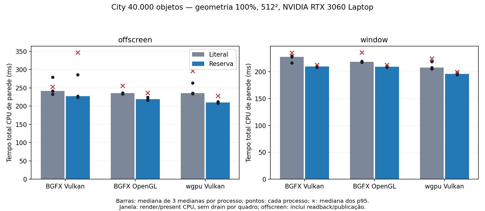

# Desempenho: continuação de P17/P18/P19 no Linux

Esta rodada compara uma reserva antecipada dos vetores temporários de updates
de Cube com o crescimento literal anterior. O controle CoinGL parte de
`f89dfcbc548b9fb927527f5af1dc4b6a125029ca`. Os caminhos CoinRender usam a mesma
base com os hashes de fontes e binários do manifesto da campanha. A comparação
A/B usa o mesmo executável e biblioteca por API; apenas
`COIN_RENDER_DISABLE_OBJECT_UPDATE_RESERVE=1/0` muda entre as opções.

## Protocolo e escopo

Cena city de 40.000 objetos, 512 × 512, transparência `object`, RTX 3060 Laptop
`10de:2560`, driver NVIDIA 610.57.04, Ryzen 7 5800H, Linux 6.17.0-42-generic.
A GPU física é selecionada explicitamente para GLX, EGL e Vulkan. CoinGL, BGFX Vulkan,
BGFX OpenGL e wgpu Vulkan são medidos em processos novos, em ordem intercalada.
Os executáveis e bibliotecas ficam congelados antes da coleta. Não há builds,
outros testes GPU, captura de imagens, traces ou timestamps GPU concorrentes.

Cada célula tem três processos, 30 quadros de aquecimento e 120 amostras por
processo. Casos: estático, câmera, materiais 10%, transformações 10%, geometria
10% e geometria 100%. Offscreen e janela constituem campanhas separadas.
O helper escolhe ocorrências por ordinais determinísticos e prepara clones
locais de Material/Cube nos casos de materiais/geometria, antes de medir, para
alterar somente os prédios selecionados apesar dos `USE` compartilhados da
cena original. São 4.000 ou 40.000 Cubes alterados; o chão fica excluído.
Mediana, p95 e p99 são calculados dentro de cada processo; o resumo usa a
mediana dessas três estatísticas, sem misturar processos numa distribuição.
CSV, máximos e contagens acima de 16,67/33,33 ms preservam as caudas.

Primeiro quadro inclui a primeira captura e preparação de recursos dentro do
escopo de renderização. Parsing e criação inicial do alvo ficam fora desse
tempo; o marco desde `main` aparece separadamente. Processo novo não implica
cache de driver frio. Na janela, o tempo mede CPU render/present, com vsync
solicitado desligado e drain final separado. CoinGL termina com `glFinish`;
os caminhos nativos não drenam toda a fila em cada present. Portanto, a razão
de tempos de janela não demonstra throughput GPU equivalente. Offscreen inclui
conclusão do readback e publicação; não subtrair seus tempos dos de janela para
estimar tempo GPU.

## Mudança delimitada

`CoinRenderActionP::prepareTranslationOverlay` estima 24 posições por Cube
sujo admitido e reserva os vetores locais de posições e draw sources. A
capacidade usa as classes de crescimento em potências de dois, respeitando o
limite existente: até 1.048.576 posições, 16 MiB de payload e o orçamento nominal
de 32 MiB incluindo undo. O vetor de draw sources mantém o limite de 65.536.
As estimativas são sugestões: ocorrências compartilhadas podem exigir mais
entradas e seguem o crescimento/validação anterior. `bad_alloc` na reserva
opcional retorna ao caminho normal. Não há cache persistente novo.

O Core continua validando e compondo o overlay antes da publicação. Rejeições,
undo e retry não dependem da estimativa. A instrumentação opt-in separa models,
materiais, geometria e aplicação do overlay; registra capacidade inicial/final
para verificar crescimento. Traces são intrusivos e ficam em execuções de
diagnóstico separadas, sem contribuir para os resultados de latência.

## Limites de interpretação e próximos estudos

O perfil de CPU já identifica validação/composição do frame e lowering/FFI
como custos relevantes nas mutações. A reserva temporária trata apenas as
realocações da preparação dos updates. Não remove a validação completa nem a
reconstrução de dados para o backend. Otimizações futuras desses custos precisam
preservar as provas de identidade, rejeições, atomicidade da publicação e
recuperação; não podem assumir que frame estático ou geometria compartilhada
autoriza ignorar alterações.

Estudos para a próxima rodada:

- Validação incremental no Core, com provas e invalidação explícita para
  revisões, aliases, campos conectados, callbacks e alterações estruturais.
- Reuso de lowering/packing de faixas sem alteração, verificando conteúdo e
  identidade; checksum sozinho não autoriza reaproveitamento.
- Repetição em sessão isolada com seleção EGL/Vulkan física comprovada e
  controle adicional do host, antes de generalizar os deltas observados.
- Timestamps de janela wgpu associados à submissão correta, se implementados;
  não estimar duração GPU pela diferença de tempos CPU.

A qualificação desta rodada vale para o host, GPU, APIs, cena e resolução
registrados. Windows, outras GPUs, cenas maiores e throughput GPU sustentado
continuam fora desse fechamento local. RSS é máximo do processo observado;
capacidades nominais de vetores e telemetria de recursos GPU têm domínios
diferentes e não devem ser somadas nem apresentadas como memória total física.
Não houve build ou teste GPU nosso concorrente. A sessão de desktop `:0` não
é um compositor isolado; atividade externa, frequência da CPU e estado térmico
não foram congelados. A dispersão entre processos permanece parte do resultado.
A campanha de janela qualificada mantém o monitor ativo e desabilita
temporariamente somente a economia de energia DPMS, com restauração do estado
original ao final. Um probe estático precede a coleta; o estado é auditado
antes/depois de cada processo. A primeira tentativa foi interrompida com 118
processos completos: DPMS indicava `Monitor is Off`, e controles estáticos sem
updates chegaram a 499–1.001 ms por apresentação. Seus dados ficam como
diagnóstico excluído. Deltas A/B daquela tentativa não qualificam uma regressão
causada pela reserva, pois a política de apresentação estava interferindo.

## Resultado local e regressões observadas

Fechamento desta rodada: **252 processos qualificados**, 30.240 quadros
medidos e 7.560 de aquecimento. Os [dados brutos e critérios de
verificação](validation/performance-linux-20261007/README.md) preservam cada
processo. A [comparação CSV](validation/performance-linux-20261007/comparison.csv)
contém todos os seis casos, primeiro quadro, p95 e RSS; as séries brutas também
mantêm p99, máximos e contagens acima dos orçamentos de quadro.

Geometria 100%; tempos totais em ms. As estatísticas são medianas dos valores
por processo, conforme o protocolo acima. CoinGL permanece a referência
principal; os pares literal/reserva qualificam o mecanismo complementar.

| Alvo | API | Literal mediana / p95 | Reserva mediana / p95 | Delta mediana | CoinGL mediana |
|---|---|---:|---:|---:|---:|
| Offscreen | BGFX Vulkan | 241,26 / 252,97 | 227,38 / 347,03 | −5,8% | 246,48 |
| Offscreen | BGFX OpenGL | 235,19 / 255,77 | 218,86 / 236,34 | −6,9% | 246,48 |
| Offscreen | wgpu Vulkan | 235,73 / 296,28 | 210,10 / 227,72 | −10,9% | 246,48 |
| Janela | BGFX Vulkan | 227,36 / 235,26 | 209,42 / 212,72 | −7,9% | 230,91 |
| Janela | BGFX OpenGL | 218,16 / 235,91 | 209,09 / 212,50 | −4,2% | 230,91 |
| Janela | wgpu Vulkan | 207,82 / 224,63 | 195,76 / 199,58 | −5,8% | 230,91 |



A mediana caiu nas seis células acima, mas **BGFX/Vulkan offscreen piorou
o p95 resumido de 252,97 para 347,03 ms (+37,2%)**. Não há garantia de menor
cauda ou ganho geral de FPS. O caso estático offscreen também variou de
0,892 para 0,953 ms no BGFX/Vulkan e de 0,971 para 1,082 ms no OpenGL;
ele não chama a preparação de updates, portanto esses deltas não demonstram
efeito da reserva. Não descartamos repetições lentas da campanha qualificada.
O interruptor `COIN_RENDER_DISABLE_OBJECT_UPDATE_RESERVE=1` mantém o caminho
literal disponível para comparação e para cargas que priorizem outra política.

O primeiro quadro de geometria 100% ficou entre aproximadamente 822 e
1.007 ms nas medianas dos processos experimentais. A reserva opera no overlay
aquecido, após a primeira captura; diferenças de primeiro quadro não são
atribuídas a ela. O tempo desde `main` e os detalhes de preparação permanecem
nos logs. RSS máximo observado nesse caso caiu 6,5–8,6 MiB entre as medianas
A/B. Isso é uma observação do processo; a capacidade final do vetor de posições
continua igual: 1.048.576 entradas, 16 MiB. Não foi introduzido cache persistente.

## Atribuição de custo, reuso e memória

O diagnóstico original de seis quadros por célula (dois warmups, quatro
observados) serve para localizar custos, não para qualificar latência. Em
materiais 10%, BGFX/Vulkan registrou aproximadamente 25,2 ms de validação do
alvo, 24,3 ms de lowering e 2,8 ms de plano/overlay, com traversal abaixo de
0,005 ms. O wgpu registrou 21,4 ms de validação do alvo e 18,5 ms na submissão
da ponte, incluindo packing/FFI. Em geometria 100%, o perfil BGFX original
mostrou cerca de 66,8 ms no plano/overlay, 40,0 ms na validação do alvo e
50,4 ms no lowering. Esses spans são aninhados; não somar suas medianas.

Os 24 diagnósticos finais usam cinco warmups e 15 quadros com trace/timestamps,
separados da medição. Na geometria 100%, a fase de preparação de geometria
passou de 31,4–33,0 ms no literal para 28,1–30,3 ms com reserva. O overlay
seguinte ainda custa aproximadamente 29–30 ms. Todos os 15 registros de cada
célula reservada mantiveram capacidade inicial igual à final, sem crescimento
de posições/draw sources; os controles literais cresceram. Em geometria 10%,
o vetor de posições termina em 131.072 entradas (2 MiB); em 100%, em
1.048.576 (16 MiB), nas duas opções.

O instancing permaneceu ativo: 40.001 instâncias, incluindo o chão, com
malha canônica de 24 vértices/36 índices no wgpu; BGFX registrou dois submits
GPU nesses diagnósticos. A ponte wgpu manteve 4.080 bytes de geometria ativa,
um vertex buffer e um index buffer, sem bytes aposentados após o aquecimento.
Janela apresentou zero staging de readback em todos os diagnósticos. Offscreen
BGFX manteve 1 MiB GPU + 1 MiB CPU de staging; wgpu, 1 MiB de cor e nenhum
staging de depth nesse contrato RGB/RGBA de consumidor.

Todas as células BGFX e wgpu offscreen tiveram 15 amostras GPU válidas. Os
tempos reportados de render GPU ficaram abaixo de 1 ms nesse perfil. Isso não
transforma os spans CPU de submit/present/espera em duração GPU. O campo de
espera do profiler BGFX pode se referir a outro frame e não é aditivo ao span
da action. O tempo GPU de janela wgpu e a memória total GPU da ponte continuam
indisponíveis; BGFX/OpenGL também não informou memória total GPU. Os valores
não são substituídos por zero nem estimados por subtração.

## Conteúdo e recuperação

A verificação offscreen fez 294 comparações RGB com CoinGL em sete estados
por caso, com mesmo digest de cena e movimento efetivo nas imagens dinâmicas.
**126 pares A/B produziram PPM idêntico**. Contra CoinGL, MAE máximo ficou
em 0,02825 unidades de canal (escala 0–255), com até quatro pixels por imagem
acima de erro 3; o erro máximo isolado de canal chegou a 141. São diferenças
registradas, não igualdade absoluta com o raster clássico.

Na janela, 72 processos separados capturaram os estados lógicos 0 e 600:
36 pares mantiveram digest RGBA e digest de cena iguais entre literal/reserva;
os casos dinâmicos alteraram ambos. O executável exporta digest final, sem
PPMs de janela. Esse gate é auxiliar e não equivale à comparação de pixels
offscreen nem a uma prova de ausência de colisões FNV64.

Passaram os 12 gates Core/Action/reuso em BGFX e wgpu, com reserva ligada e
desligada, incluindo payload contra recaptura, recusa sem publicação, rollback
e retry. Passaram também 15 gates focados de lowering/instancing, cache e
aposentadoria, readback/backpressure, múltiplos alvos, RTT e publicação, sem
skips. Os 16 testes Python incluem seleção A/B, estatística, sanitização do
ambiente e restauração do DPMS em interrupção/falha. Tempos CTest não entram
no benchmark.

## Reprodução local

Com os controles congelados nos caminhos registrados no manifesto:

```sh
env DISPLAY=:0 python3 scripts/coinrender/run_performance_continuation.py \
  --bgfx-build /tmp/coin-perf-final/bgfx \
  --wgpu-build /tmp/coin-perf-final/wgpu \
  --coingl-build /tmp/coin-perf-baseline/bgfx \
  --scene /tmp/coin-perf-final/city.iv --gpu nvidia \
  --scope offscreen --mode measure --size 512 \
  --warmup 30 --frames 120 --rounds 3 --output /tmp/performance-offscreen-new
```

Para janela, repetir os mesmos argumentos com `--scope window`, outro
diretório de resultados e o helper de energia:

```sh
env DISPLAY=:0 python3 scripts/coinrender/run_active_window_performance.py \
  --audit-dir /tmp/performance-window-power --manage-dpms \
  --bgfx-build /tmp/coin-perf-final/bgfx \
  --wgpu-build /tmp/coin-perf-final/wgpu \
  --coingl-build /tmp/coin-perf-baseline/bgfx \
  --scene /tmp/coin-perf-final/city.iv --gpu nvidia \
  --scope window --mode measure --size 512 \
  --warmup 30 --frames 120 --rounds 3 --output /tmp/performance-window-new
```

Sem `--manage-dpms`, esse helper só verifica a sessão existente e rejeita
monitor desligado/estado desconhecido. Com a opção, o DPMS original é
restaurado também em falha/interrupção; configurações de bloqueio de tela não
são alteradas. A coleta desta rodada usou o coordenador equivalente arquivado,
com probe estático e auditoria antes/depois de cada processo.

A verificação PPM usa
`--scope offscreen --mode verify`, separadamente, com sete estados e passo de
animação 100. O runner congela a escolha A/B por processo e remove flags de
trace/timestamp. Os scripts de diagnóstico e de digest de janela ficam na
evidência; seus tempos não entram no resultado de latência. Não executar novas
medições durante builds, testes GPU ou a campanha já em andamento.
