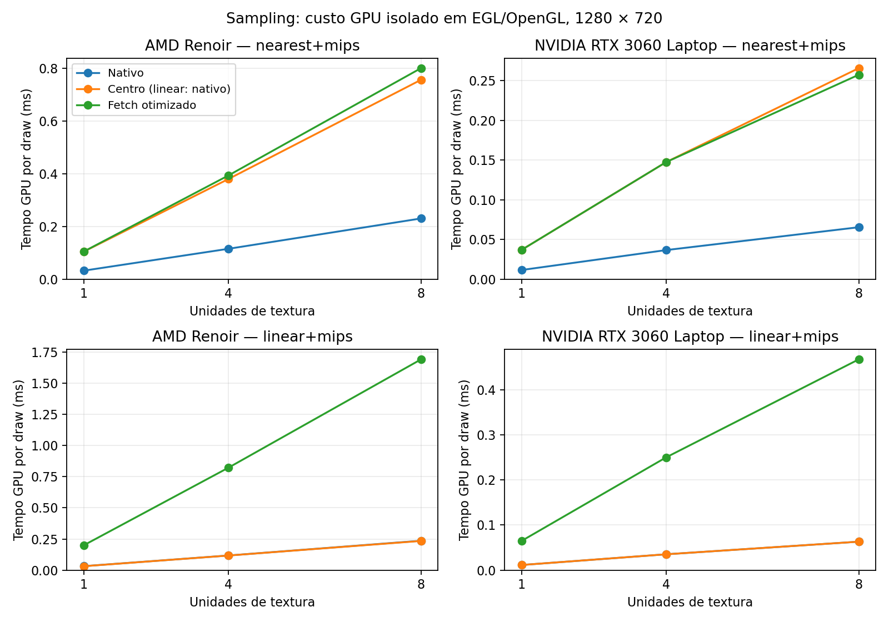

# Sampling portátil: escolha para CoinRender — 2026-10-07

**Recomendação: manter sampling nativo como padrão.** O contrato portátil
nearest/trilinear isotrópico merece uma opção explícita; a reconstrução completa
de todos os filtros não é a melhor substituição geral. O candidato por centro do
texel ficou mais econômico na janela AMD desta rodada e resolveu a ambiguidade
nearest nas duas GPUs. O fetch inteiro otimizado permanece seu controle e uma
alternativa de implementação. Não promover o seletor de laboratório como API.

Implementação/testes isolados em `codex/coin-portable-sampling-study`, base
`f94a6c2898582d6dfd5796771392c38a541f4fb2`. Coin original não foi alterado;
`codex/coin-render` recebe apenas documentação/checklist/evidências desta rodada.
A origem permanece sampling nativo, reproduzível sem Coin; não foi aplicada
correção de biblioteca Coin nem patch que imite AMD no CPU.

## O que foi comparado

- Native: sampler existente, inclusive anisotropia.
- Fetch inicial: LOD max-norma/fine e `floor` + fetch inteiro, wrap por módulo,
  reconstrução bilinear/trilinear.
- Fetch otimizado: wrap normalizado antes da escala, vizinhos corrigidos por
  comparações, interpolação que preserva canais constantes. Mesma ordem CPU.
- Centro: somente filtro `NEAREST_MIPMAP_LINEAR` isotrópico; LOD explícito,
  `floor` do texel e sampling de seu centro em cada mip, mistura dos dois níveis.
  Magnificação linear, outros filtros e anisotropia continuam nativos.
- Nearest: variante de fetch restrita ao mesmo filtro, controle de escopo.

As primitivas têm semânticas diferentes: `textureLoad` lê texel sem filtragem,
`textureSampleLevel` continua usando sampler com LOD explícito. A escolha do
centro evita a coordenada junto à fronteira nearest; isso é uma estratégia
validada nesta campanha, não garantia normativa de identidade em toda GPU.
Referências primárias: [WGSL textureLoad](https://www.w3.org/TR/2026/CRD-WGSL-20260921/#textureload),
[textureSampleLevel](https://www.w3.org/TR/2026/CRD-WGSL-20260921/#texturesamplelevel),
[derivadas](https://www.w3.org/TR/2026/CRD-WGSL-20260921/#dpdxfine).

## Qualidade e compatibilidade

Seis configurações: wgpu AMD Vulkan/OpenGL, wgpu NVIDIA Vulkan, BGFX AMD/NVIDIA
Vulkan e BGFX/OpenGL. AMD Renoir Mesa25.2.8; RTX3060Laptop610.57.04.
BGFX/OpenGL informa vendor/device0: seu passe funcional não certifica GPU física.
O projeto WGSL e todos os perfis especializados passaram **45 testes Rust**.

No caso projetivo original e offsets ±0,001, nearest explícito/centro deu
**MAE0/max0 CPU–GPU nas seis configurações**, incluindo NVIDIA. Fetch completo
linear deu max1; centro conserva linear nativo, max3, dentro do gate original
MAE≤1,5/max≤4. Não se mudou tolerância, textura, matriz ou referência para obter
esse resultado. Na AMD o caso original ainda difere do CoinGL: MAE8,08/max78.
O resultado completo desse teste continua FAIL, mesmo com CPU–GPU correto.

O oracle EGL sem Coin verifica todos os 4.096 pixels no mip3 da cadeia128²:
native AMD troca na coluna24, NVIDIA na32; **centro e fetch trocam na32 nas duas
GPUs, zero diferenças em16.384 canais por imagem**. Isso confirma que só LOD
explícito com coordenada original não basta; escolher o texel também é necessário.
O controle inicial base-only16² não reproduzia a diferença; o controle final usa
cadeia completa e sampler do reproducer original. Veja [boundary](validation/portable-sampling-study-20261007/boundary/amd.log).

NPOT, repeat/clamp, modelos legados, SRGB/HDR, BC3, samplers compartilhados,
anisotropia suportada, RTT direto/mips, rejeição sem publicação e recuperação:
os executáveis AdvancedTexture e RTT passaram em todas as combinações de modo
executadas. Anisotropia **não** foi substituída por isotropia para obter FPS.
Unidades0/7, quatro filtros, Q projetivo e cinco funções alpha tiveram um oracle
autoral adicional: **720 casos, CPU e GPU, todos passaram**, inclusive EQUAL
em128/255. Interpolação preserva canais constantes. Este oracle não depende da
recusa anterior do controle CoinGL AMD em `alpha/reference-clamped-one`.

| Matriz completa | Execuções | PASS | FAIL |
|---|---:|---:|---:|
| Inicial | 108 | 66 | 42 |
| Otimizada | 96 | 52 | 44 |
| Alpha + Advanced | 18 | 18 | 0 |

As falhas foram preservadas e possuem controle nativo: sampling/GL projetivo
AMD; linha CPU/CoinGL (273/253 fragmentos, antes do contrato multitextura GPU);
esfera/defaultUV em OpenGL (max4 contra limite3); alpha/clamp1 CoinGL AMD.
O teste FragmentPolicy completo passou na NVIDIA e interrompe na AMD antes dos
seus casos seguintes. Não se declara cobertura destes casos por esse executável.
O oracle alpha autoral e AdvancedTexture cobrem separadamente o sampling.
Os logs e retornos completos estão em [manifest](validation/portable-sampling-study-20261007/manifest.json).

## Desempenho: medido, sem inferir FPS geral do shader

GPU isolado EGL/OpenGL: alvo RGBA8 1280×720, checker1024², 1/4/8 unidades,
mips residentes, 30 warmups, cinco grupos de60 draws por processo; duas rodadas
intercaladas por modo. GL_TIME_ELAPSED, sem readback no intervalo. **144 processos
passaram** nas duas fases. Este workload usa mips muito minificados e cache quente;
não mede bandas de memória de uma cidade texturizada nem apresentação.

A primeira versão de fetch custou8,1–8,6× native em nearest e13,8–14,8× em linear
na AMD. A remoção do módulo inteiro reduziu muito esse custo, mas native continua
mais econômico. Valores abaixo são medianas dos dez grupos por combinação:

| GPU / filtro / unidades | Native ms | Centro ms | Fetch otimizado ms |
|---|---:|---:|---:|
| amd / nearest / 1 | 0.0324 | 0.1047 | 0.1050 |
| amd / nearest / 8 | 0.2305 | 0.7565 | 0.8007 |
| amd / linear / 1 | 0.0325 | 0.0320 | 0.1999 |
| amd / linear / 8 | 0.2362 | 0.2346 | 1.6894 |
| nvidia / nearest / 1 | 0.0116 | 0.0369 | 0.0369 |
| nvidia / nearest / 8 | 0.0654 | 0.2655 | 0.2573 |
| nvidia / linear / 1 | 0.0116 | 0.0116 | 0.0649 |
| nvidia / linear / 8 | 0.0632 | 0.0632 | 0.4670 |

Centro no filtro linear é native; não representa reconstrução linear. Em nearest,
centro custa cerca3,2–4,1× native neste microbenchmark; é próxima do fetch inteiro
otimizado. Bilinear/trilinear manual custa cerca6–7,4× native.

Janela wgpu/Vulkan: 1280×720, 45 warmups, 150 quadros por processo, sequência
intercalada, CSV. **120 processos passaram** nas duas fases. Mede chamada CPU
render/present e throughput do loop, sem timestamps GPU ou latência até a tela.
Com oito texturas na AMD, nearest native0,637ms/centro1,484ms/fetch1,645ms;
linear native0,605ms/centro0,582ms/fetch2,873ms. O primeiro fetch nearest era3,262ms.
Na NVIDIA a janela permaneceu aproximadamente0,59–0,61ms: a pequena diferença
CPU/present não elimina o custo visto nos timestamps GPU do controle EGL.

As cidades são **sem texturas** e servem como controle da geometria/instancing,
não como prova de custo de sampling. Medianas entre as duas rodadas de cada
processo, em ms da chamada CPU render/present:

| GPU / prédios | Build coin-render | Native do estudo | Fetch inicial |
|---|---:|---:|---:|
| amd / 40000 | 0.980 | 0.927 | 0.887 |
| amd / 1000000 | 18.035 | 17.746 | 17.843 |
| nvidia / 40000 | 0.613 | 0.610 | 0.627 |
| nvidia / 1000000 | 9.745 | 10.234 | 9.577 |

Não há ganho de FPS atribuível a sampling nessas cidades. A variação entre
processos existe mesmo quando o modo não altera os dados de textura, pois não
há textura na cena. Não extrapolar para Android2400×1080; o AVD não foi requalificado.

## Decisão de arquitetura e pendências para promoção

Manter native padrão atende compatibilidade CoinGL e desempenho. Para o contrato
CPU/BGFX/wgpu, o próximo passo de produção deve ser uma **política comum explícita
nearest portátil**, descrita nos snapshots e capacidades; escolher centro/fetch
por backend somente se mantiver o mesmo contrato. Usar centro como candidato de
custo para AMD e fetch inteiro como oracle/alternativa. A diferença pequena entre
eles não estabelece um vencedor universal. Não identificar fabricante para
adicionar quantização ao CPU: o experimento anterior já falhou NVIDIA.

Antes de promoção: retirar seletor de ambiente/packing em has_texture; definir
política e limites (isotropia, níveis/view, derivadas); validar perspectiva com
viewport/origem/triângulos recortados, mais footprints NPOT e SRGB/HDR contrastantes;
qualificar Windows/Android físico/FreeCAD; especializar pipelines para não impor
custo do caminho experimental ao native. `textureNumLevels` foi recusado no
tradutor GLSL deste stack; o estudo usa a cadeia completa já validada pelo perfil.
BGFXGLSL330 usa derivadas comuns; Naga24 substitui fine por comum quando GLSL não
suporta controle. Isto delimita a promessa de paridade; não fechar universalidade.

Bateia foi considerado e sua documentação local consultada. O catálogo de
mecanismos cobre log/fila/CAS/portas, não sampling; não foi emitido laudo Bateia
sobre GPU nem atribuída prova de correção a insights externos.

Fontes/reprodução: [README do estudo](https://github.com/Dikluwe/coin/blob/codex/coin-portable-sampling-study/testsuite/reproducers/portable-sampling-study/README.md),
[resumo derivado](validation/portable-sampling-study-20261007/results.json),
[patch inicial](validation/portable-sampling-study-20261007/phase1/source.patch),
[patch final](validation/portable-sampling-study-20261007/final-source.patch).
Artefatos/builds persistem em `/mnt/Laranja/Git/externos/coin-portable-sampling-artifacts/20261007`;
evidências, CSV, dumps, hashes e cenas pequenas comprimidas estão versionados.
Os pilotos inválidos de compilação não entram nas contagens; logs foram preservados.
