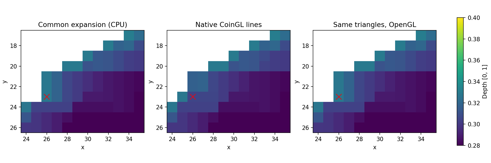
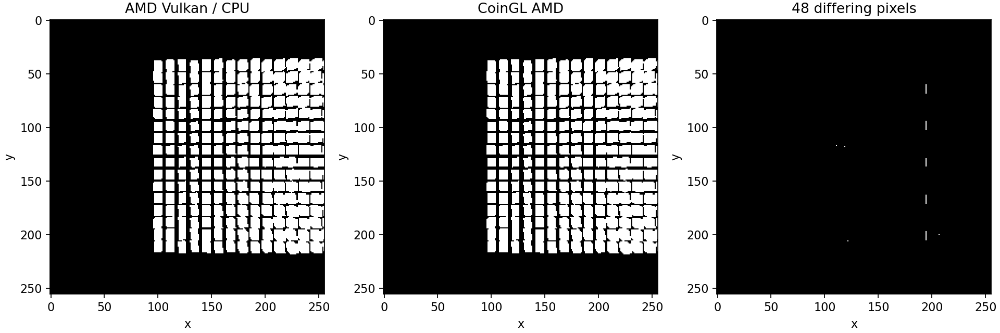

# Rasterização: estudo controlado de 2026-10-07

O estudo separou **três mecanismos**: cobertura de endpoints dependente do
sentido da linha nativa, extrapolação de profundidade nos caps nativos e
quantização subpixel distinta na câmera AMD. Não alterou o renderizador nem
os gates. O esperado escolhido continua sendo o contrato portátil CPU/BGFX/wgpu.
O diagnóstico foi executado em AMD Renoir/Mesa 25.2.8 e NVIDIA RTX 3060
Laptop/610.57.04, com referências CoinGL na mesma GPU de cada execução.

[Dados, comandos, hashes e figuras](validation/raster-study-20261007/README.md).
O relatório distingue mecanismos demonstrados de hipóteses de driver e das
melhorias que ainda precisam de implementação e qualificação.

Foram coletadas **50 execuções com GPU/API identificadas**, mais dez BGFX
OpenGL com vendor desconhecido, registradas separadamente. BGFX/wgpu Vulkan
produzem imagens RGB idênticas nas vinte comparações entre backends das duas
GPUs. Os gates existentes de 84 células curvas passaram nas quatro combinações
wgpu/BGFX × Vulkan/OpenGL; isso não transforma coleta diagnóstica em gate.

## Método e controles

`CoinRenderRasterStudy` é um executável manual, sem inscrição como teste de
aprovação no CTest. Retorna erro se a captura/submissão/readback falhar;
concluir a coleta **não significa aprovar a comparação visual**. Registra:

- CPU, GPU, CoinGL e replay dos mesmos triângulos no OpenGL, com RGBA/depth
  completos. Cor constante branca, fundo preto, sem textura ou iluminação.
- Sphere/Cone em LINES, larguras 1/4, e FILLED; câmera perspectiva, quadro 5,
  com os mesmos 256 cubos e transformações da fixture de reúso de câmera.
- Projeção original, pré-projeção host float/double e pré-quantização em
  1/256 de pixel. Esses controles só modificam o plano diagnóstico.
- Contornos originais, sem diagonais artificiais dos QUAD_STRIP da esfera;
  cobertura/depth por polígono e por segmento, nos sentidos autoral, invertido
  e canônico. As imagens completas são preservadas antes das sondas isoladas.

As cenas controladas usam cor opaca e culling desligado. A análise de cobertura
mede a união dos triângulos; não identifica qual face vence em uma imagem
com materiais/alpha heterogêneos. Profundidade nativa D24 e readback float;
wgpu usa D32F. `1e-5` nas tabelas CSV é um classificador diagnóstico, não
uma nova tolerância de aprovação.

## Junções: cobertura e caps são mecanismos diferentes

Esfera LINES/largura 4: CPU e wgpu/Vulkan têm **zero diferenças RGB** nos
6.400 pixels, tanto na AMD quanto na NVIDIA. CoinGL difere em seis pixels
de cobertura e em profundidade dentro da cobertura compartilhada. Repetir
**os triângulos comuns** no OpenGL conserva a cobertura CPU/Vulkan. Portanto,
a diferença grande dos testemunhos não exige textura, mipmap ou iluminação.

| Pixel | Depth comum | CoinGL AMD | CoinGL NVIDIA | Mecanismo isolado |
| --- | ---: | ---: | ---: | --- |
| (33,20) | 0,30701575 | 0,30362988 | 0,30364195 | Borda 36/1 nativa cobre; comum não cobre |
| (26,21) | 0,32754022 | 0,31676778 | 0,31670001 | Borda 48/0 compartilhada, interpolação no cap |
| (26,23) | 0,32754022 | 0,30524984 | 0,30524847 | Borda 50/1 nativa cobre; comum não cobre |

IDs são locais à reconstrução dessa esfera, não identificadores persistentes
da cena. Em AMD, as linhas autorais 36/1 e 50/1 cobrem os respectivos pixels;
as mesmas linhas invertidas e canônicas não cobrem. O replay do polígono
original e o LINE_LOOP autoral reproduzem o depth nativo nesses testemunhos.
Isso confirma a participação do sentido de emissão/ownership de endpoints,
sem atribuir a diferença apenas ao formato de depth.

Em (26,21), a borda 48/0 tem parâmetro de eixo maior **t = -0,470038**;
o centro do fragmento está além do endpoint original. Depth do endpoint:
**0,327540235**. A expansão comum conserva esse valor no cap. A extrapolação
linear fornece **0,316767322**, a menos de `4,6e-7` do CoinGL AMD. A borda
coincidente 33/2 invertida produz o mesmo testemunho. Assim, nesse pixel a
diferença grande é explicada por **clamp comum versus extrapolação nativa**,
não por um erro de quantização D24.

FILLED dá a mesma cobertura RGB de CPU/GPU/CoinGL na esfera e cone; diferenças
menores de depth permanecem. Largura 1 ainda deixa cinco pixels de cobertura
na esfera contra CoinGL. Não basta corrigir somente linhas largas. O cone
é controle adicional: cinco pixels distintos na largura 4 e um na largura 1;
alguns empates de depth dos triângulos no OpenGL também persistem.

A especificação OpenGL descreve endpoints meio abertos, variantes delimitadas
do diamond-exit e regras próprias de interpolação de linhas largas. Isso
orienta os experimentos; não prova conformidade ou erro de um driver a partir
destes três pixels. [OpenGL 4.6 Compatibility, §§14.5.1–14.5.2](https://registry.khronos.org/OpenGL/specs/gl/glspec46.compatibility.pdf).

## Câmera AMD: quantização de cobertura

O teste original, sem modificações, continua falhando no quadro 5:
MAE **0,147278**, 47 pixels >3 no reúso; MAE **0,149582**, 49 pixels >3
na travessia completa. AMD/OpenGL e NVIDIA/Vulkan passam o teste original.
Isso conserva a distinção entre divergência contra CoinGL e regressão de reúso.

Na cena branca controlada:

| Execução, quadro 5 | CPU/GPU, pixels de cobertura | GPU/CoinGL, pixels de cobertura | CPU/replay GL |
| --- | ---: | ---: | ---: |
| AMD/wgpu Vulkan, original | 0 | 48 | 48 |
| AMD/wgpu OpenGL, original | 48 | 0 | 48 |
| NVIDIA/wgpu Vulkan, original | 1 | 1 | 0 |
| AMD, pré-projeção float/double | 1 | 47 | 48 |
| AMD, pré-quantização 1/256 | 0 | 48 | 0 |

Pré-projetar em double não elimina a diferença AMD. Pré-quantizar os vértices
faz CPU, Vulkan e replay OpenGL coincidirem entre si, mas **não** torna a cena
igual ao CoinGL original: seus 48 pixels continuam distintos. A proposta de
snap comum favorece o esperado portátil e precisa avaliar esse efeito nos
oráculos nativos já qualificados.

A análise independente usa coordenadas projetadas, arestas inteiras e
ownership top/left, sem consumir a máscara do backend como esperado:

| Grade de quantização | XOR contra Vulkan AMD | XOR contra CoinGL AMD |
| --- | ---: | ---: |
| 1/256 (8 bits) | 0 | 48 |
| 1/1024 (10 bits) | 48 | 0 |
| 1/4096 (12 bits) | 48 | 0 |
| 1/65536 (16 bits) | 48 | 0 |

O código upstream Mesa **25.2.8** de radeonsi seleciona modo 12.12 para
viewports pequenos; RADV anuncia `subPixelPrecisionBits = 8`. Os registros
GL anunciam mínimo de oito bits, o que não identifica a precisão efetiva
selecionada para esse viewport. As grades explicam todos os 48 pixels da
cena branca. Atribuir o mecanismo à quantização é sustentado pelos controles;
a configuração exata do registrador no binário Ubuntu continua inferida da
fonte upstream, sem trace de comandos GPU.
Fontes: [radeonsi/si_state_viewport.c](https://gitlab.freedesktop.org/mesa/mesa/-/blob/mesa-25.2.8/src/gallium/drivers/radeonsi/si_state_viewport.c),
[RADV/radv_physical_device.c](https://gitlab.freedesktop.org/mesa/mesa/-/blob/mesa-25.2.8/src/amd/vulkan/radv_physical_device.c).

A inferência não foi transferida automaticamente aos quatro pixels da
transparência P20. Essa fixture precisa receber os mesmos controles de
projeção, quantização e identificação de fragmentos antes de declarar causa
comum. Tampouco este estudo branco fecha os endpoints com PER_PART/alpha.

## Alternativas para a próxima implementação

| Alternativa | Benefício esperado | Custo/limite a qualificar |
| --- | --- | --- |
| Snap 1/256 no lowering/shader comum | Uniformizar cobertura dos mesmos triângulos entre APIs | Preservar W/clip/viewport externo/offset; medir deriva de UV/LOD/alpha e efeito nos gates CoinGL. Snap CPU exige trabalho por vértice e pode invalidar caches de câmera; shader exige implementação equivalente nos backends. |
| Perfil de compatibilidade de linhas CoinGL | Ownership autoral e interpolação/extrapolação nativa dos caps | Mais estado/geometria e decisões de empate; não substituir silenciosamente a expansão portátil. NVIDIA e AMD já diferem numericamente na linha nativa. |
| Junções explícitas com cobertura e depth documentados | Melhorar continuidade e previsibilidade do perfil portátil | Pode aumentar geometria/overdraw e alterar alpha em cruzamentos. Exige expectativa semântica própria e gates CPU/BGFX/wgpu. |
| Raster analítico para reproduzir precisão maior | Controlar amostras em vez de depender do setup fixo do hardware | Aumento provável de fragmentos e testes de cobertura; custo ainda não medido. Não há prova de portabilidade ou ganho nesta rodada. |

A próxima experiência indicada é um **modo diagnóstico de snap comum**, com
a matriz de câmeras/viewport/RTT e os gates existentes, antes de escolher uma
política de produção. Em paralelo, um reproducer de duas bordas, extraído das
coordenadas/IDs preservados, deve comparar ownership autoral e caps separados,
com alpha e UV controlados. Não promover extrapolação apenas porque ela explica
um testemunho: experimentos anteriores introduziram outras divergências.

Não foram medidos FPS nem custos nesta campanha; tempos de execução das sondas
não são benchmark. A reprodução pixel a pixel do CoinGL, a melhoria de P20 e
a decisão final de arquitetura permanecem abertas na checklist.
