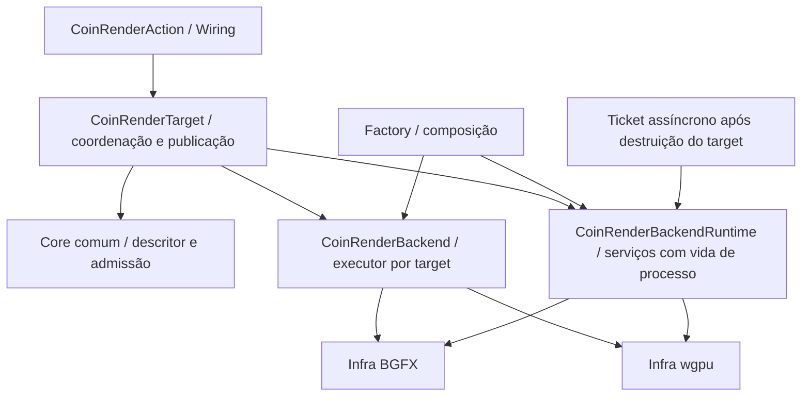

# Isolamento da infraestrutura do target

Segunda etapa na branch `codex/coin-render-isolation`, sobre `d6b87cb6a2`.
Continua a [separação da entrada comum](coin-render-isolation.md).

## Responsabilidades

| Componente | Responsabilidade |
| --- | --- |
| `CoinRenderTarget` / `CoinRenderTargetP` | Estado, admissão, tamanho, gerações, publicação transacional de pixels/tickets e coordenação de recuperação compartilhada. |
| `CoinRenderNativeSurfaceCore` | Validação mecânica do descritor: ABI, tamanho, campo reservado e handles obrigatórios. Sem SDK ou seleção de plataforma. |
| `CoinRenderBackend` | Executor preparado por target; submissão, recursos e fatos sobre inicialização de depth CPU e descarte ao desligar uma action. |
| `CoinRenderBackendRuntime` | Contrato privado de serviços que sobrevivem aos targets: suporte de superfície por plataforma, destruição da superfície, polling/cancelamento de tickets, telemetria e polling do dispositivo. |
| `CoinBgfxRuntime` / `CoinWgpuRuntime` | Materialização dos serviços na Infra específica. Layout de staging e chamadas FFI permanecem no conector wgpu; mecanismos de readback BGFX permanecem na Infra BGFX. |
| `CoinRenderBackendFactory` | Composição do executor e do runtime compilados. |

`CoinRenderTarget.cpp` não inclui classes de executores específicos, não chama a
FFI wgpu e não contém seleção por macros BGFX/wgpu ou `dynamic_cast` de backend.
A escolha compilada continua na factory; a API pública continua a mesma.

## Ciclos de vida preservados

- O runtime é um colaborador sem posse de handles do host. Seu objeto de serviço
  tem vida de processo, inclusive durante shutdown; não cria nem retém dispositivos
  GPU. A Infra mantém a posse dos recursos concretos e dos tickets.
- Destruir um target libera sua superfície wgpu antes de destruir o executor,
  sem destruir a janela ou a conexão do host.
- Polling e cancelamento públicos usam o runtime compilado, sem depender do target
  que originou o ticket. Telemetria do target usa seu colaborador de runtime.
- A política de BGFX ao desligar uma action permanece: descartar o executor e
  avançar a geração. Outros executores mantêm o comportamento anterior.
- BGFX não recebe preenchimento sintético de depth CPU por padrão. O executor
  explicita esse fato; targets com o executor CPU ainda recebem o buffer CPU,
  mesmo em builds BGFX. O override diagnóstico existente continua na Shell.
- A admissão de superfícies mantém a ordem: suporte de janela, cabeçalho do
  descritor, suporte do tipo na plataforma, handles e dimensões.
- Na implementação sem readback assíncrono, o status continua `READBACK_UNSUPPORTED`;
  a mensagem agora informa que o backend selecionado não suporta a operação.
  As mensagens de superfície/plataforma permanecem as anteriores.

## Validação Linux

12 casos CTest comuns (quatro por build RECORDING, BGFX e Rust/wgpu), todos aprovados.
O novo `CoinRenderRuntimeBoundaryTest` injeta um runtime e executor independentes:
valida descritores, suspensão/resize, liberação de superfície antes do executor,
preservação dos handles do host, telemetria por colaborador, depth e detach sem
identidade BGFX/wgpu.

17 execuções de testes com GPU e dois exemplos de janela também passaram, sem skips:

- Depth e readback em BGFX Vulkan/OpenGL e wgpu Vulkan/OpenGL.
- Sombras obrigatórias e múltiplos targets, com RTT staged e direto, em Vulkan
  nos dois backends.
- Cache/telemetria/polling, readback FFI e action assíncrona em wgpu.
- Apresentação X11 real com injeções de falhas, resize e recuperação de device/surface
  em wgpu Vulkan/AMD.
- Três quadros dos exemplos BGFX e wgpu Vulkan/AMD.

Os testes de readback incluem polling/cancelamento após destruição do target,
metadados inválidos sem consumir o ticket e invalidação em perda de dispositivo.
NVIDIA foi usada para Vulkan/OpenGL BGFX e Vulkan wgpu; AMD para OpenGL wgpu e janelas.
Windows, Wayland, AppKit, Android e protótipos DAWN/WGPU_NATIVE não foram executados.

Cena estática de 40 mil edifícios, 1024×1024: as quatro variantes preservaram os
checksums anteriores (`0x6714299260985122` em Vulkan, `0x156847cec1d97864` em BGFX
OpenGL e `0x3a998bbb78caa846` em wgpu OpenGL). Não se estabelece ganho de desempenho
nesta refatoração.

[Comandos, scripts e logs](validation/render-runtime-linux/) registram a execução.

## Próxima fronteira

Separar no `CoinRenderFramePlanBuilder` a leitura de action/estado Coin das funções
mecânicas sobre snapshots e arrays. Depois, extrair as operações reutilizáveis que
continuam no `CoinBgfxLowering`. A coordenação compartilhada de targets permanece
comum; os mecanismos concretos de perda de dispositivo continuam na Infra.
