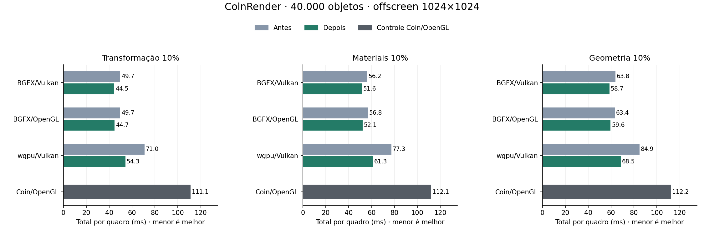

# CoinRender: composição e estado comum wgpu — Linux, 2026-10-05

Continuação de [cache de Cubes e qualificação CPU](coin-render-cube-template-linux.md).
Referência: Coin3D/Coin/OpenGL clássico, `SoGLRenderAction`.

## O que mudou

### Common: classificação de ranges compartilhados

A classificação repetia índices, materiais e profundidade dos mesmos vértices em cada ocorrência. Agora um memo **local à chamada**, com até **1.024 intervalos exatos `(firstIndex, indexCount)`**, guarda alpha dos materiais dos vértices e máximos absolutos XYZ. Cada ocorrência continua verificando estado, textura, política, centro, câmera e profundidade de saída.

O scan de Z é omitido somente quando há centro de ordenação, estilo de superfície 1 e model-view afim com divisor homogêneo exatamente 1. Um bound absoluto em double menor que `FLT_MAX/8` prova que produtos, somas parciais e midpoint seriam finitos; o centro determina a profundidade final. Câmeras perspectiva e ortográficas são atendidas quando a model-view satisfaz essa prova.

Miss inválido não altera alpha nem diagnóstico: executa o loop original na mesma ordem. Transformações projetivas, strokes, ausência de centro, bound insuficiente, NaN, saturação ou falha de alocação opcional usam o caminho original. O cache ainda serve seus hits depois de saturar; novos misses não criam summaries. Não há cache por nó, revision ou ponteiro entre chamadas.

Optout: `COIN_RENDER_DISABLE_COMPOSITION_RANGE_MEMOIZATION=1`.

### wgpu: um estado comum e uma prova de matrizes

`tryOpaqueInstancing` monta uma única `CoinWgpuRenderState` comum. Todos os estados, inclusive não referenciados por draws, continuam qualificados. Igualdade dos campos fonte que o packer transporta preserva dados de textura, fog e offset desabilitados, signed zero, slots e codificação de maximum depth. Por ocorrência continuam os cálculos authored de model-view/normal e as provas de determinant, finite e residual.

O caminho evita montar a struct de 2.280 bytes e calcular projeção/MVP descartados para cada ocorrência. A projeção comum é preparada uma vez. `rememberOpaqueCamera` consome a prova de matrizes concluída no mesmo `prepare`, eliminando a segunda inversão/model-view. Essa prova é privada, consumida antes de retornos e revogada em reset/falha; nenhuma mutação com a mesma revision ganha licença para usar valores anteriores.

Optout: `COIN_WGPU_DISABLE_INSTANCE_COMMON_STATE=1` conserva o caminho literal de montagem por estado e a segunda prova de câmera. O runner limpa ambos os optouts e os dois aliases de tracing. ABI C++/Rust permanece **43**; Rust, shaders e código específico BGFX não foram alterados.

## Resultados

40.000 objetos, PHONG, duas luzes direcionais, 1024×1024 offscreen. Tempo total de parede no processo = update + render + publication, incluindo espera GPU/readback. Cada valor é a mediana das medianas de três processos.

| Caso | BGFX/Vulkan (ms) | BGFX/OpenGL (ms) | wgpu/Vulkan (ms) | Coin/OpenGL controle (ms) |
|---|---:|---:|---:|---:|
| Transformação 10% | 49.67 → 44.53 | 49.69 → 44.74 | 70.97 → 54.27 | 111.11 |
| Materiais 10% | 56.24 → 51.61 | 56.82 → 52.08 | 77.28 → 61.33 | 112.06 |
| Geometria 10% | 63.78 → 58.68 | 63.37 → 59.55 | 84.93 → 68.53 | 112.21 |

O wgpu reduziu **23,53% em transformação**, **20,65% em materiais** e **19,30% em geometria parcial**. O Common também beneficiou BGFX: transformação caiu cerca de 10%, materiais cerca de 8%, e geometria parcial entre 6% e 8%. Não houve redução de objetos ou conteúdo renderizado. O transporte mantém 24 vértices, 36 índices e 40.001 instâncias nesses perfis; o plano de origem mantém a geometria da etapa anterior.

### Primeiro quadro

A primeira linha CSV é o primeiro quadro registrado durante warmup, com atualização do objeto; não representa todo o tempo de inicialização do aplicativo.

| Caso | BGFX/Vulkan (ms) | BGFX/OpenGL (ms) | wgpu/Vulkan (ms) | Coin/OpenGL controle (ms) |
|---|---:|---:|---:|---:|
| Estático | 423.27 → 432.02 | 380.28 → 374.73 | 306.82 → 290.99 | 338.69 |
| Transformação 10% | 438.74 → 438.01 | 379.25 → 374.88 | 312.05 → 295.17 | 367.32 |
| Materiais 10% | 460.99 → 456.66 | 399.43 → 399.45 | 337.77 → 321.19 | 354.51 |
| Geometria 10% | 463.74 → 466.10 | 405.86 → 405.00 | 344.51 → 326.27 | 364.85 |

O primeiro quadro estático wgpu caiu de **306,82 para 290,99 ms**. BGFX/OpenGL caiu 5,55 ms; BGFX/Vulkan aumentou **8,74 ms**. A campanha demonstra ganho de animação, sem melhora uniforme do primeiro quadro; não isolamos a causa desse aumento BGFX/Vulkan.

### Controles e stress

| Caso | BGFX/Vulkan (ms) | BGFX/OpenGL (ms) | wgpu/Vulkan (ms) | Coin/OpenGL controle (ms) |
|---|---:|---:|---:|---:|
| Estático | 2.00 → 2.09 | 2.32 → 2.33 | 2.82 → 2.69 | 12.09 |
| Câmera | 7.56 → 8.00 | 8.24 → 8.21 | 8.12 → 8.48 | 70.02 |
| Geometria 100% | 223.01 → 223.52 | 220.77 → 221.19 | 236.42 → 224.87 | 227.04 |

Os caminhos estático e câmera não executam os novos scans a cada quadro. Observamos +0,09 ms no estático BGFX/Vulkan e +0,44 ms na câmera; no wgpu estático −0,13 ms e câmera +0,36 ms. São variações pequenas nesta amostra, sem atribuição isolada de causa.

Com 100% da geometria distinta, BGFX variou +0,19% a +0,23% (até +0,52 ms); wgpu caiu **4,88%**, ou **11,55 ms**. O cache de ranges traz pouca oportunidade de compartilhamento nesse caso, mas a preparação do estado comum wgpu ainda se aplica. O stress tem sete quadros medidos por processo; não caracteriza caudas p99.

## Ablação: onde ficou o ganho

Doze processos instrumentados alternaram os dois optouts em transformação, materiais e geometria 10%. A tabela usa transformação 10%: mediana dos **três quadros medidos**, excluindo todos os cinco warmups. É diagnóstico N=1 por configuração, separado da campanha alternada.

| Modo | Classificação (ms) | Validação Target (ms) | Pack wgpu (ms) |
|---|---:|---:|---:|
| Ambos ligados | 6.82 | 18.87 | 23.02 |
| Composição legada | 13.01 | 24.92 | 22.80 |
| Estado comum legado | 6.88 | 19.09 | 34.46 |
| Ambos desligados | 13.10 | 25.12 | 33.86 |

O trace de transformação mostra 9 ranges retidos, 39.992 hits e 1.440.036 profundidades de índices evitadas por classificação. O trace wgpu confirma **1 estado packed contra 40.001**, e **40.001 provas authored reutilizadas pela câmera**. Esses contadores descrevem trabalho CPU evitado; a única struct comum já era o estado transportado à GPU na versão anterior. Não alegam redução de 91,2 MB de upload GPU.

Restam aproximadamente **19 ms de validação Target** e **23 ms de pack wgpu** nesse diagnóstico. A classificação ainda custa cerca de 7 ms; o scan de estados e a preparação de matrizes continuam relevantes.

## Protocolo e limites

Código final: ac28529a27da5ea370cf90eef4eeaf8b22f08850. Controle CoinRender congelado: 9737b2e1e60eba6b44988d684c2838271d99dc05. Coin/OpenGL congelado: 4d63bb993022ee8d40802558b0871a4803002b8d. Bibliotecas/executáveis identificados por SHA-256; o controle Coin/OpenGL usa uma execução por caso/rodada compartilhada nos dois conjuntos. Seu valor repetido é controle, não uma nova medição nem um ganho zero reavaliado.

Cena `/tmp/coin-render-city-40000.iv`, SHA-256 `bb9ccc612cd38ffb749ee599d9350a80974649eab5bf477d2f344538a42b2576`: 40.000 objetos e 480.012 triângulos, seed 136. Ryzen 5800H, NVIDIA RTX 3060 Laptop, driver 610.57.04, GCC 13.3, Release/Ninja, governor powersave. As observações de clock/temperatura em machine.json foram registradas depois da campanha; não são uma série temporal das amostras.

Campanha principal: cinco casos × três rodadas × cinco warmups + 15 medidos. Stress geometry100: três rodadas × três warmups + sete medidos. Papéis/variantes alternados: **126 processos válidos, 1.722 quadros medidos e 588 warmups**. Não medimos duração GPU nem latência real de exibição.

A tela estava ativa no diagnóstico inicial, mas antes da campanha em janela o checkpoint registrou **Monitor Off** e **Cinnamon ScreenSaver=true**. Nenhum processo de benchmark em janela foi iniciado; esse escopo ficou fora dos resultados. O estado foi consultado sem alterar a sessão. wgpu/OpenGL continua fora pela limitação de criação do device documentada nas etapas anteriores.

## Validação

- **10 gates CPU**: os nove gates de Action/Core/FFI/profundidade/style/clipping e `CoinRenderCompositionTest --range-memo`.
- **13 gates GPU**: três wgpu/Vulkan de câmera/multi-device/RTT, surface camera com display obrigatório, seis BGFX/Vulkan/OpenGL de instancing/depth/RTT e três execuções completas de composição (wgpu/Vulkan, BGFX/Vulkan e BGFX/OpenGL). Nenhum desses gates foi pulado.
- O gate de clipping passou inicialmente com sua subchecagem opcional Coin/OpenGL omitida. Uma execução complementar com GLX pixmap direto passou, exigindo explicitamente `Coin/GL reference passed` e ausência de `[SKIP]`; comando e log foram preservados.
- Oráculo de composição compara todos os campos e bytes float, resultado, ordem parcial e diagnósticos. Cobre ranges sobrepostos, alpha heterogêneo, texturas, centros/câmera, todos os modos, cap, overflow, strokes, NaN, erros concorrentes e mutações com a mesma revision. Fallback OOM foi inspecionado; não houve injeção de OOM.
- Oráculo FFI compara buffers completos default/optout, 59 mutações tardias em estado não referenciado, sentinelas equivalentes, câmera→objetos 10/100%→câmera, RTT, resize, erro de nove lights e retry com a mesma revision.
- **168 comparações RGB idênticas por bytes**: seis casos × quatro variantes × sete quadros lógicos 0..600, passo100. Digests de estado iguais e movimento confirmado. São comparações antes/depois de cada variante; incluem 42 comparações Coin/OpenGL entre duas execuções independentes de verificação.

[Pacote de evidência e reprodução](validation/state-composition-linux/README.md) conserva CSVs, logs, comandos, hashes, scripts, métricas, gates, ablação e motivo da exclusão de janela. Os PPMs permanecem fora do Git.

## Próximos custos identificados

1. **Validação dos estados:** no perfil, cerca de 7,8 ms percorrem render states; oito programas de textura por estado representam 5,12 milhões de verificações de floats mesmo com texturas desabilitadas. Um memo local por bytes completos de programas já validados pode evitar repetição, mantendo rejeição de programas desabilitados malformados. Ganho ainda não medido.
2. **Matrizes por ocorrência:** o novo pack ainda calcula/prova MV/normal de todos os estados. Investigar reutilização por valores próprios exatos de model/view, com limite de memória e publicação transacional, preservando oráculo de bytes, estados não referenciados, erros tardios, câmera, RTT e retry. Não usar revision ou identidade do nó como prova.
3. **Primeiro quadro Common:** `rememberFrameRoot` prepara a base de câmera e `qualifyTranslationCapture` a prepara novamente na mesma captura. Uma prova local pode eliminar o segundo preparo. Unir as travessias exige resultados independentes para admissão de câmera e objetos, preservando conexões, ignored fields e contagem sintática por ocorrência.
4. **Cópias de composição:** Target copia a ordem capturada e o lowering monta outro schedule. O perfil instanced opaco pode estudar um empréstimo restrito à submissão, mantendo o schedule geral para transparência/RTT/sombras. Ainda não há medição isolada dessas cópias.
5. **Overlay de geometria:** a validação ordena todos os slots de posições para detectar duplicatas. Intervalos consecutivos podem reduzir esse trabalho, mantendo colisões parciais, limites e rollback; o perfil não separou ainda o custo do sort.
6. **Materiais:** a cena tem nove slots (720 bytes na tabela GPU de materiais wgpu). Otimizar bulk copy ou separar o hit exato da tabela de materiais no Rust merece uma cena com tabela maior; nesta cena esse custo é pequeno.

Esses itens são candidatos não implementados nesta etapa. Trabalho em `codex/coin-render-transform-performance`; master e checkout principal preservados.
