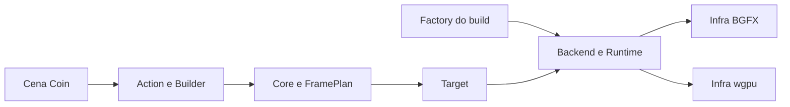
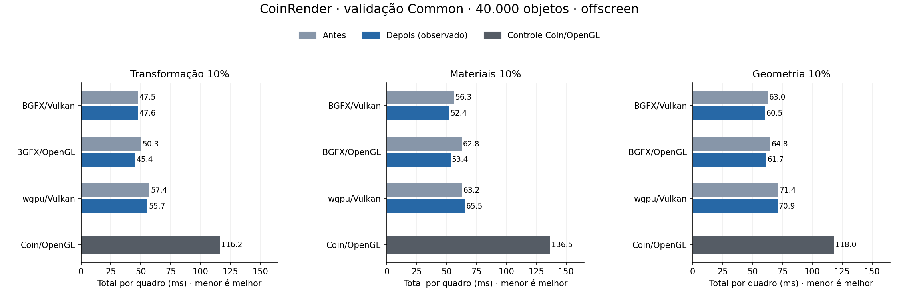

# CoinRender: validação Common e próximos custos — Linux, 2026-10-05

Continuação de [composição e estado comum wgpu](coin-render-state-composition-linux.md). Referência de render: Coin3D/Coin/OpenGL clássico, `SoGLRenderAction`.

## Organização atual

As [quatro fases de isolamento](coin-render-isolation-roadmap.md) estão concluídas. Esta etapa mantém as fronteiras existentes:

| Parte | Responsabilidade |
|---|---|
| `CoinRenderAction` e Builder | Entrada comum, travessia da cena, leitura de Coin, captura dos estados e callbacks. |
| Core comum | Montagem do plano, validação dos snapshots, composição, transparência, matemática e decisões de reuse. |
| `CoinRenderTarget` | Admissão, dimensões, gerações, execução e publicação transacional de pixels/tickets. |
| Factory, Backend e Runtime | Factory escolhe o executor no build; os contratos ligam Target aos conectores e serviços específicos. |
| BGFX / wgpu | BGFX mantém lowering, recursos e shaders; wgpu mantém pack/FFI, Rust, recursos e shaders. |

`CoinBgfxAction` continua como tipo de compatibilidade, encaminhando à entrada comum. A seleção de backend permanece no build. A biblioteca e os snapshots ainda usam tipos Coin; o isolamento atual organiza responsabilidades dentro do módulo.

## Primeiro custo implementado: programas de textura

`CoinRenderFramePlan::isValid` validava os 16 floats de cada um dos oito programas de textura de todos os estados. Isso inclui unidades desabilitadas e estados que nenhum draw referencia.

Agora a chamada possui um memo de **512 bytes de programas próprios**, mais flags e contadores, na pilha. Guarda o último programa válido de cada unidade. Um hit exige igualdade dos **64 bytes completos** do programa; um miss chama o validador original. Só sucesso entra no cache. Não há alocação, revisão, ponteiro ou identidade de nó como chave, nem licença entre chamadas.

Os checks de textura habilitada, imagem, sampler, matriz, modelo e todos os checks anteriores/posteriores continuam na ordem original. A comparação inclui signed zero e todos os campos de programas inativos. A/B/A numa unidade exige nova validação de A; esse é o limite deliberado deste memo simples.

Optout: `COIN_RENDER_DISABLE_COMBINE_VALIDATION_MEMO=1`. O runner limpa essa variável antes dos benchmarks normais. ABI C++/Rust continua **43**; código específico BGFX/wgpu, Rust e shaders não foram alterados.

## Ablação: custo local

Oito processos instrumentados usaram o mesmo binário com memo ligado/desligado. Cada um teve cinco warmups e três quadros medidos. As medianas abaixo excluem os warmups por meio da coluna CSV, com correspondência de contagem entre trace e CSV. É diagnóstico N=1 por configuração; os intervalos são aninhados e não devem ser somados.

| Caso | Estados, literal → memo (ms) | Target, literal → memo (ms) |
|---|---:|---:|
| wgpu transformação 10% | 7.46 → 6.59 | 19.73 → 18.75 |
| wgpu materiais 10% | 7.61 → 6.59 | 22.37 → 20.53 |
| wgpu geometria 10% | 7.76 → 6.36 | 21.85 → 19.92 |
| BGFX/Vulkan transformação 10% | 8.25 → 6.44 | 20.14 → 18.54 |

Em cada quadro desses perfis: **320.008 consultas**, **320.000 hits**, **8 chamadas ao validador original**, contra 320.008 chamadas com optout. O loop de finitude passa de 5.120.128 para 128 verificações nesse validador; as comparações de bytes ainda ocorrem por consulta.

A ablação registrou economia de aproximadamente **0,9 a 1,8 ms na validação dos estados**. Ela apoia a redução desse custo local. A campanha completa abaixo registra também regressões; ainda não há ganho uniforme do quadro total.

## Tempos totais observados

40.000 objetos, 480.012 triângulos, PHONG com duas luzes direcionais, 1024×1024 offscreen. Tempo de parede no processo = update + render + publication, incluindo espera GPU/readback. Cada valor é a mediana das medianas de três processos; antes é o código da etapa anterior, medido novamente nesta campanha.

| Caso | BGFX/Vulkan (ms) | BGFX/OpenGL (ms) | wgpu/Vulkan (ms) | Coin/OpenGL controle (ms) |
|---|---:|---:|---:|---:|
| Transformação 10% | 47.47 → 47.62 | 50.32 → 45.39 | 57.41 → 55.72 | 116.24 |
| Materiais 10% | 56.33 → 52.44 | 62.78 → 53.42 | 63.15 → 65.47 | 136.50 |
| Geometria 10% | 63.00 → 60.47 | 64.84 → 61.65 | 71.40 → 70.86 | 118.00 |

wgpu registrou −2,94% em transformação, **+3,67% em materiais** e −0,76% em geometria parcial. BGFX/Vulkan registrou +0,32%, −6,91% e −4,02%; BGFX/OpenGL −9,78%, −14,91% e −4,91%, respectivamente. Esses percentuais descrevem a amostra completa, sem atribuição isolada de todas as diferenças à memoização. Os custos restantes de captura, matrizes e transporte continuam presentes.

### Controles e stress

| Caso | BGFX/Vulkan (ms) | BGFX/OpenGL (ms) | wgpu/Vulkan (ms) | Coin/OpenGL controle (ms) |
|---|---:|---:|---:|---:|
| Estático | 2.21 → 2.26 | 2.43 → 2.48 | 3.02 → 2.94 | 12.93 |
| Câmera | 8.48 → 8.61 | 8.69 → 8.85 | 10.40 → 11.06 | 77.05 |
| Geometria 100% | 237.56 → 239.17 | 234.03 → 244.87 | 238.41 → 252.82 | 244.18 |

A câmera wgpu registrou **+6,35%** (+0,66 ms). Geometria 100% registrou +0,68% BGFX/Vulkan, **+4,63% BGFX/OpenGL** e **+6,05% wgpu**. Esses resultados ficam registrados para acompanhamento; a causa das variações não foi isolada. Não houve redução de objetos ou conteúdo para obter os resultados. O stress tem sete quadros medidos por processo e não caracteriza caudas p99.

### Primeiro quadro estático

| Caso | BGFX/Vulkan (ms) | BGFX/OpenGL (ms) | wgpu/Vulkan (ms) | Coin/OpenGL controle (ms) |
|---|---:|---:|---:|---:|
| Estático | 440.51 → 446.16 | 386.16 → 390.80 | 320.40 → 313.04 | 372.00 |

É o primeiro quadro CSV, registrado durante warmup, incluindo atualização; não é toda a inicialização do aplicativo. wgpu caiu 7,36 ms; BGFX/OpenGL e BGFX/Vulkan aumentaram 4,63 e 5,65 ms, respectivamente.

## Protocolo e validação

Código final: 6182410f5789bbdc30d5ccd06fa341e1810aef8e. Controle CoinRender congelado: ac28529a27da5ea370cf90eef4eeaf8b22f08850. Coin/OpenGL congelado: 4d63bb993022ee8d40802558b0871a4803002b8d. O congelamento verificou os oito hashes da etapa anterior antes de reconstruir as bibliotecas atuais. Os 20 hashes de binários/bibliotecas dos três controles continuaram iguais depois da campanha.

Cena `/tmp/coin-render-city-40000.iv`, SHA-256 `bb9ccc612cd38ffb749ee599d9350a80974649eab5bf477d2f344538a42b2576`, seed 136. Ryzen 5800H, NVIDIA RTX 3060 Laptop, driver 610.57.04, GCC 13.3, Linux 6.17.0-42, Release/Ninja e governor powersave. `machine.json` é uma observação posterior à campanha; não é história de clocks/temperatura das amostras. `load-observation.json` registra uma consulta durante a campanha; seu ps usa uma visão restrita de processos e não demonstra que o host estivesse ocioso.

- Principal: cinco casos × três rodadas × cinco warmups + 15 medidos.
- Stress geometry100: três rodadas × três warmups + sete medidos.
- Papéis/variantes alternados: **126 processos de tempo, 1.722 quadros medidos e 588 warmups**. Coin/OpenGL usa um processo por caso/rodada compartilhado nos conjuntos antes/depois; seu valor repetido é um controle compartilhado.
- **9 execuções Core/CPU e 14 GPU** passaram, sem skips: FrameCore nas duas builds, Action/Core/FFI/composição; texturas/multitexturas/composição nos três conectores/API; câmera, RTT e clipping. A referência Coin/OpenGL foi exigida nos testes de multitextura e clipping.
- Oráculo Core compara aceitação e diagnóstico completo literal/memo: active/inactive, cada uma das 16 posições × oito unidades × NaN/±Inf, signed zero, estados sem draws, A/B/A, textura habilitada, limites, precedência de erros, mutação/reparo sem nova revisão e diagnóstico opcional.
- **168 comparações RGB idênticas por bytes**, seis casos × quatro variantes × sete quadros lógicos 0..600, passo100, com digests iguais e movimento confirmado. Antes reaproveita a verificação da etapa anterior, compilada de ac28529a27da5ea370cf90eef4eeaf8b22f08850, cujos hashes coincidem com o controle congelado. Depois executou 24 processos novos. São comparações antes/depois por variante, incluindo 42 Coin/OpenGL; não são uma alegação de igualdade entre backends.

Esta campanha é offscreen. Não medimos janela, duração GPU ou latência real de exibição. Os PPMs permanecem fora do Git. [Evidência e reprodução](validation/validation-programs-linux/README.md) conserva comandos, CSVs, logs, hashes de binários, controles, fases, contadores e scripts.

## Próximos custos, em ordem

1. **Matrizes por ocorrência wgpu:** a etapa anterior mediu aproximadamente 23 ms de pack, sem separar só a matemática. A cena tem modelos distintos dentro de cada quadro; a oportunidade é temporal. Proposta: cache por índice com cópias próprias de model/MV/normal (192 bytes por entrada) e view comum copiada, igualdade dos bytes atuais, orçamento independente de 8 MiB e publicação só após sucesso. Para 40.001 estados, dados das entradas somam 7,68 MB, além da view e flags. Potencial teórico: cerca de 90% de hits em transformação 10% e quase todos em materiais/geometria. Ganho ainda não medido. Exige ambiente de arredondamento/denormais compatível, invalidação em erro/fallback/RTT/camera patch e preservação das provas de campos comuns, bounds, estados não referenciados e retry. Uma alternativa menor é fundir operações para evitar um determinante e uma transposta por estado, preservando a inversa/residual literais.
2. **Captura do primeiro quadro:** reaproveitar a base de câmera preparada na mesma captura; preservar admissão independente de câmera/objetos e as travessias necessárias.
3. **Cópias de composição:** estudar empréstimo limitado à submissão no perfil instanced opaco, mantendo schedules gerais para transparência, RTT e sombras.
4. **Overlay de geometria:** reconhecer intervalos consecutivos e evitar sort completo, mantendo colisões, limites e rollback.
5. **Materiais:** estudar cópias/tabela no Rust com uma cena que tenha mais slots; esta cena tem nove slots, 720 bytes na tabela GPU wgpu.

Esses próximos itens ainda não foram implementados. Trabalho em `codex/coin-render-transform-performance`; master e checkout principal preservados.
