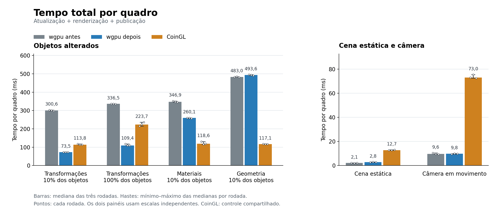

# Instâncias e translação no wgpu — Linux, 2026-10-04

Common: `64b909b00b`. wgpu/ABI e testes: `b02aa54783`.
Branch: `codex/coin-render-transform-performance`.
Esta etapa sucede a [redução de reconstrução CPU](coin-render-wgpu-motion-linux.md).
A referência permanece o Coin/OpenGL clássico do Coin3D, `SoGLRenderAction`
(CoinGL).

## Implementação

O Common pode atualizar somente as matrizes e centros de ordenação dos objetos
cuja translação mudou, preservando a captura de geometria. A prova é conservadora:
tipos exatos, `SoSeparator` com material, transform e um `SoCube`, transform e
pai com uma referência na admissão, campos sem conexão/ignored, nenhum callback
adicional, matrizes afins finitas e domínio limitado. O prefixo anterior ao
transform é capturado para respeitar rotação, escala e reflexão. O `center`
local precisa ser zero; um `center` no prefixo é suportado. O teto é 65.536
objetos/estados/draws e coordenadas/matrizes dentro de 32.768.

Somente atualizações do campo `translation` entram no conjunto de objetos sujos.
Material, luz, geometria, estrutura, outro campo de transform e câmera invalidam
essa prova e fazem captura completa. Depois de uma translação, a próxima mudança
de câmera recaptura e estabelece uma nova base. Matrizes, centros e revisão são
restaurados se a atualização falhar, permitindo retry. A revisão privada de
registro de callbacks impede pular callbacks adicionados pelo usuário, inclusive
em cenas estáticas. A classificação continua `RESOURCE_REBUILD`; os backends
continuam validando o plano. `COIN_RENDER_DISABLE_TRANSLATION_OVERLAY=1` desativa
essa atualização.

O packer wgpu agora reconhece conjuntos compatíveis de triângulos opacos, mantém
uma cópia de cada malha canônica e envia model-view, matriz normal e slot de
material por instância. A igualdade da geometria usa hash seguido de comparação
exata; somente o slot de material do vértice é separado. Grupos consecutivos
preservam a ordem de traversal, inclusive A/B/A. Não se ordena a cena por malha.

O perfil exige pelo menos 256 draws, view/projection e estado GPU comuns, material
uniforme por ocorrência e ausência de texturas, fog, clip, offset, sombras,
transparência e RTT direto. Há limites de 128 grupos, 8 MiB de geometria canônica,
32 MiB de instâncias e 32 MiB de materiais. Perfis incompatíveis continuam no
caminho existente. `COIN_WGPU_DISABLE_OPAQUE_INSTANCING=1` desativa o novo perfil;
`COIN_WGPU_DISABLE_OPAQUE_BATCHING=1` também o desativa.

A ABI privada passa de 42 para 43: instância de 144 bytes e range de 16 bytes,
com assertions de tamanho/offset nos dois lados. O shader usa storage buffer no
binding 24 e `instance_index`, preservando os atributos existentes. Matrizes e
material chegam à mesma iluminação PHONG e ao mesmo fragment shader.

O Rust conserva snapshots imutáveis por dispositivo e geração. Um frame completo
não é aceito como igual apenas por revisão; payloads são comparados exatamente.
Geometria GPU é reutilizada quando seus bytes coincidem. Mudança de objetos cria
um novo buffer de instâncias, sem sobrescrever buffers em uso. Estático e câmera
reutilizam os buffers. O novo snapshot só é publicado após o ponto de sucesso do
render correspondente; falha tardia preserva a base anterior, e perda de device
invalida a geração. Os budgets limitam cada payload/cache, sem constituir teto
global de RSS/VRAM: versões e comandos em voo podem coexistir. O transporte
também valida campos auxiliares antes de aceitar reuso. RTT direto continua no caminho anterior.

### Cidade de 40 mil prédios

O frame contém 40.001 ocorrências. Nove ranges de origem tornam-se duas malhas e
dois grupos, com **48 vértices e 72 índices**, em vez de expandir 960.024 vértices.
Após o primeiro frame, translação/material compatível envia **5.760.864 bytes**
de instâncias e materiais, contra **101.762.544 bytes** de vértices/índices no
caminho anterior: **94,34% menos bytes**, aproximadamente 17,7 vezes menos.
Ainda se envia o buffer inteiro de instâncias quando objetos mudam; não é um
upload limitado aos 10% animados. O primeiro upload inclui mais 5.088 bytes de
geometria. Estático/câmera não fazem upload desses payloads após a admissão.

## Método

- Cidade: 40.000 prédios, grade 200 × 200, seed 136, 480.012 triângulos,
  PHONG e duas luzes direcionais; SHA-256
  `bb9ccc612cd38ffb749ee599d9350a80974649eab5bf477d2f344538a42b2576`.
- Ryzen 7 5800H, RTX 3060 Laptop, NVIDIA 610.57.04, Linux 6.17.0-42,
  Release GCC 13.3/Ninja, governor `powersave`, clocks não fixados.
- Antes: wgpu congelado de `1357bea43d`, incluindo a otimização CPU da etapa
  anterior e timers de apresentação opt-in. Depois: conteúdo de `b02aa54783`.
  CoinGL congelado de `4d63bb993022ee8d40802558b0871a4803002b8d`.
  SHA-256 de executáveis e bibliotecas identifica os binários realmente usados.
- As rodadas alternam CoinGL, wgpu anterior e wgpu novo, com ordem rotativa.
  O CoinGL roda uma vez por caso/rodada e o resultado exato é copiado para os
  dois conjuntos (`shared_control`). Não são controles CoinGL independentes.
- Offscreen: seis cenários, três rodadas, cinco warmup e 30 quadros medidos,
  1024 × 1024, publicação RGBA síncrona. São 54 processos e 1.620 amostras.
- Imagens: campanha separada, sete estados lógicos 0/100/.../600 por caso e
  variante. Os tempos dessas capturas e dos traces não qualificam desempenho.

Nenhuma build ou teste GPU concorrente. Caches do sistema/driver não foram
esvaziados. Primeiro quadro significa processo novo. Estatísticas agregadas são
medianas das estatísticas por processo; percentis não misturam rodadas. RSS é
pico do processo, não VRAM. Estes ensaios de 30 quadros não substituem a campanha
histórica de 600 quadros.

## Desempenho

Tempo total por quadro, incluindo atualização, render/readback e publicação:

| Caso | wgpu anterior | wgpu novo | Mudança | CoinGL |
|---|---:|---:|---:|---:|
| Translação 10% | 300,55 ms | 73,50 ms | -75,5% | 113,82 ms |
| Translação 100% | 336,52 ms | 109,44 ms | -67,5% | 223,71 ms |
| Materiais 10% | 346,91 ms | 260,08 ms | -25,0% | 118,62 ms |
| Geometria 10% | 483,01 ms | 493,56 ms | +2,2% | 117,06 ms |
| Estático, controle curto | 2,13 ms | 2,76 ms | +29,4% | 12,73 ms |
| Câmera, controle curto | 9,59 ms | 9,83 ms | +2,5% | 72,98 ms |

Translação de 10% ficou **4,09 vezes mais rápida** que o wgpu anterior e 35,4%
abaixo do CoinGL neste protocolo. Translação de todos os objetos ficou 3,08 vezes
mais rápida que o wgpu anterior e 51,1% abaixo do CoinGL. Materiais melhoraram
25,0%, mas continuam 2,19 vezes mais caros que CoinGL, pois o Common recaptura.

**Geometria piorou 2,2%**, com aumento presente nas três rodadas. Esse caso excede
os 128 grupos consecutivos e usa o batch expandido anterior, ainda com upload de
101,76 MB por revisão. Não se declara melhora nesse fallback. O conjunto completo
permanece no arquivo de evidência. Estático/câmera têm controles mais longos
apresentados abaixo.

### Primeiro quadro e memória

Primeiro render: primeira linha do CSV, excluindo atualização e publicação.
RSS: mediana do pico do processo nas três rodadas, em MiB.

| Caso | Primeiro render antes → depois | RSS antes → depois |
|---|---:|---:|
| Translação 10% | 403,37 → 307,74 ms | 673,21 → 427,88 MiB |
| Translação 100% | 404,95 → 304,80 ms | 678,50 → 439,27 MiB |
| Materiais 10% | 438,11 → 360,71 ms | 690,33 → 525,73 MiB |
| Geometria 10% | 569,63 → 653,40 ms | 927,16 → 939,27 MiB |
| Estático, controle curto | 408,76 → 309,36 ms | 598,09 → 421,68 MiB |
| Câmera, controle curto | 400,89 → 303,13 ms | 603,16 → 427,21 MiB |

Translação 10% reduziu o pico de RSS em **245,33 MiB** (36,4%) e o primeiro render
em 23,7%, chegando perto de 308 ms. O primeiro render do fallback de geometria
piorou 14,7%, com aproximadamente 12 MiB adicionais. A admissão inicial faz
qualificações separadas de câmera e translação; seu custo não aparece no subtotal
do trace `profileExecuted`. Essa admissão é uma causa possível do aumento no
primeiro frame, sem prova causal para a diferença recorrente de 8–12 ms.

### Controles mais longos

| Caso e protocolo | wgpu anterior | wgpu novo | CoinGL |
|---|---:|---:|---:|
| Estático, 30 warmup + 300 quadros | 2,01 ms | 2,65 ms | 12,53 ms |
| Câmera, 10 warmup + 100 quadros | 8,59 ms | 9,09 ms | 71,72 ms |

Três rodadas por caso, com ordem alternada. O custo adicional de estático se
confirma: **0,63 ms** (31,4%). Câmera sobe **0,50 ms** (5,8%); seu p95 permanece
praticamente igual, 10,20 → 10,19 ms. Ambos continuam abaixo do controle CoinGL.
Esses controles resolvem a diferença curta; não a ocultam. Usar instâncias
introduz leitura de matrizes/material no vertex shader, e o frame estático com
payload completo também compara bytes na admissão Rust. Os tempos totais não
isolam quanto cada fator contribui.

### Janela

Atualização + chamada render/present, sem captura; três rodadas, cinco warmup e
30 quadros por caso, 1024 × 1024. São 18 processos e 540 amostras medidas.
Este timer CPU não mede duração GPU, latência até a tela ou FPS físico.

| Caso | wgpu anterior | wgpu novo | p95 anterior → novo | CoinGL |
|---|---:|---:|---:|---:|
| Translação 10% | 220,17 ms | 70,90 ms | 223,61 → 72,84 ms | 112,83 ms |
| Translação 100% | 256,83 ms | 106,81 ms | 259,62 → 110,06 ms | 222,29 ms |

Nesta campanha, as chamadas de translação 10% caíram 67,8%, e as de 100% caíram
58,4%. As duas medianas ficaram abaixo do CoinGL. A espera alternada dentro de
`present()` registrada na etapa anterior **não se reproduziu nesta sessão, já
nos binários anteriores**. O trace anterior à alteração mediu 35 apresentações
com mediana 0,153 ms e máximo 2,240 ms. A política de apresentação permaneceu
igual; esta melhoria reduz o trabalho de captura/pack/upload. Não se atribui ao
patch o desaparecimento daquela espera intermitente do driver/compositor.

### Custos do fallback

Uma coleta diagnóstica separada de geometria usou um warmup e cinco quadros com
trace, nos binários anterior/novo e com optouts de instâncias/translação. Na
versão nova, o pack pós-primeiro quadro teve mediana 57,28 ms; desativar somente
instâncias registrou 51,70 ms. Isso localiza parte do custo na tentativa de
admissão de um perfil que termina no fallback. A captura e o encoder também
apresentaram diferenças. Quatro processos instrumentados não são suficientes
para atribuir toda a regressão nem qualificam uma nova tabela de desempenho.

Próximos custos identificados: rejeitar perfis incompatíveis com menos trabalho,
compartilhar a qualificação inicial do Common, atualizar somente as instâncias
sujas e evitar recaptura completa de materiais. Deformação de geometria continua
mais de quatro vezes acima de CoinGL; instâncias não resolvem esse caso atual.

## Validação

- CPU: `CoinRenderActionTest`, `CoinRenderTransformCoreTest`,
  `CoinRenderFrameReuseCoreTest` e `CoinWgpuFfiFrameTest` passaram. Os testes
  cobrem prova/fallback, callbacks, transform composto, câmera ↔ objetos,
  conteúdo/geometria/material/estado, A/B/A, limites, falha e retry.
- Rust: 27 testes passaram em execução serial na NVIDIA/Vulkan, incluindo os
  dois testes GPU existentes de profundidade e sombra.
- `CoinWgpuMultiDeviceTest` passou: cor/profundidade contra referência baked
  independente, primeiro índice de instância não zero, revisão igual com payload
  diferente, câmera, erro tardio, falha de poll, perda de device e isolamento.
  Tolerâncias da referência: até dois níveis por canal e `2e-6` na profundidade;
  isso não é uma medida de erro máximo observado da cidade.
- `CoinRenderCameraReuseReferenceTest` com CoinGL obrigatório,
  `CoinRenderSurfaceTest` (câmera e faults/loss), `CoinRenderSceneTextureTest`
  e `CoinRenderRttOwnershipTest` passaram. Gates BGFX `CoinBgfxCoreTest` e
  `CoinBgfxInstancingTest` também passaram após a mudança no Common.
- **84/84 imagens before/after são RGB idênticas**, com SHA-256 e todos os digests
  de estado/RGB/RGBA iguais; 42 são wgpu. Cada cenário dinâmico tem sete estados
  e imagens distintos; estático permanece estático.
- Diferenças existentes contra CoinGL ficaram exatamente iguais: MAE máxima
  0,02793821 numa escala 0–255, máximo por canal 150 e no máximo sete pixels
  acima de três níveis numa imagem de 1.048.576 pixels. A cidade não capturou
  profundidade; a evidência de depth vem dos gates GPU separados.

Uma execução padrão paralela dos 27 testes Rust terminou em SIGSEGV. O stack
chega a `vkEnumerateInstanceExtensionProperties` no loader Vulkan antes de
adapter/device, durante os dois testes GPU preexistentes. A causa exata de
loader/driver/layers ou concorrência não foi determinada nem corrigida nesta
etapa. A execução serial controlada passou; o log de falha e o diagnóstico
permanecem no arquivo de validação.

## Evidências e reprodução

Dados em [validation/wgpu-instancing-linux](validation/wgpu-instancing-linux):
CSV por quadro, logs, comandos/ambiente, identidades dos binários, resumos
recomputados e hashes/métricas das imagens. PPMs permanecem nos diretórios
temporários de captura e não entram no Git. Os traces são diagnósticos separados
das campanhas sem instrumentação.

O helper arquivado `offscreen/summarize.py` recalcula tempos a partir dos CSVs.
`--verify-before/--verify-after` compara os pixels originais;
`--recorded-rgb` permite validar com métricas arquivadas, marcando que os pixels
não foram recomputados. `--require-identical-rgb` exige igualdade. O runner
intercalado arquivado aceita os três builds e suas revisões separadamente.
