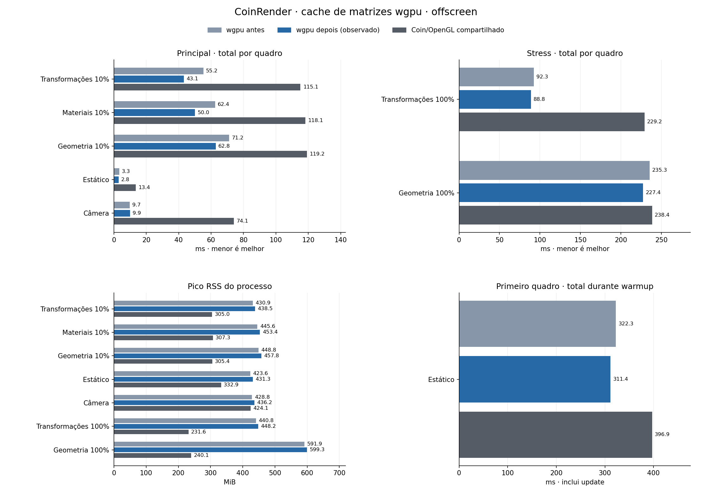

# CoinRender: cache de matrizes wgpu — Linux, 2026-10-05

Referência de render: Coin3D/Coin/OpenGL clássico (`SoGLRenderAction`).

## Mudança e escopo

Continuação de [validação Common e custos identificados](coin-render-validation-programs-linux.md). As quatro fases de isolamento continuam concluídas; esta mudança fica em `CoinWgpuFfiFrame`, dentro de pack/FFI específico do wgpu.

O cache temporal possui cópias próprias dos 16 floats de modelo, modelo-view e normal por índice de estado, além de uma view comum própria. Cada entrada tem **196 bytes**, incluindo o status FP observado. Um hit exige igualdade dos bytes atuais de modelo/view e um ambiente FP compatível; não usa revisão, ponteiro ou identidade de nó como chave.

O teto independente é **8 MiB por CoinWgpuFfiFrame**, incluindo capacidade alocada, view, bookkeeping e 256 bytes de margem do alocador. A cidade com 40.001 estados usa **7.840.548 bytes (~7,48 MiB)** contabilizados. O crescimento libera a capacidade anterior antes de alocar, sem duas cópias simultâneas. Acima do teto ou em falha de alocação opcional, mantém o cálculo literal.

Guarda numérica conservadora: GCC/Clang x86 com matemática SSE/SSE2, FE_TONEAREST, underflow gradual, FTZ/DAZ desligados, exceções mascaradas e controles x87 reconhecidos. Cada entrada só é reutilizável quando o cálculo anterior não mudou as flags sticky SSE/x87 e o status atual coincide. O cache não altera o ambiente FP; plataformas ou modos não reconhecidos usam a matemática literal.

O estado de índice zero continua literal, inclusive quando nenhum draw o referencia: `packState` calcula suas matrizes em toda preparação completa. No quadro medido da cidade, transformação 10% teve **36.000 hits e 4.001 matrizes calculadas**; materiais/geometria 10% tiveram **40.000 hits e uma calculada**. Transformação 100% teve zero hits e 40.001 calculadas.

A licença anterior é revogada antes de escrever entradas em lugar. Só o sucesso final do prepare CPU instanced publica uma licença nova; scratch `bakeMatrices` não é autoridade. Erro de prepare, fallback, camera patch, RTT/allowInstancing=false, optout e ambiente FP não reconhecido a invalidam. A prova não contém recurso ou device GPU.

Todos os estados atuais, inclusive os sem draws e campos transportados desabilitados, continuam sendo qualificados. Projeção, geometria, limites de posição/normal e fatoração de transporte são atuais em cada preparação. As matrizes guardadas vêm dos estados da cena, antes da fatoração diagonal. O contrato anterior de revisão imutável para REUSE permanece intacto.

Optout: `COIN_WGPU_DISABLE_INSTANCE_MATRIX_CACHE=1`.

Cena: 40.000 objetos, 480.012 triângulos, PHONG com duas luzes direcionais, seed 136, 1024×1024 offscreen. ABI permanece 43: state 2.280 bytes, instance 144 bytes e frame view 448 bytes. Core/Common, BGFX, Rust e shaders não receberam alterações nesta etapa.

Ryzen 5800H, NVIDIA RTX 3060 Laptop, driver 610.57.04, GCC 13.3, Linux 6.17.0-42, Release/Ninja, governor powersave. `machine.json` é observação posterior à campanha, sem histórico de clocks/temperatura por amostra.

## Tempos totais observados

Cada valor é a mediana das medianas por processo. O total é tempo de parede de update + render/readback + publication. Diferenças positivas indicam aumento do tempo. A alternância reduz a dependência da ordem; não prova igualdade de clocks, temperatura ou estado do driver.

| Caso | wgpu antes → depois (ms) | Variação | Coin/OpenGL compartilhado (ms) |
|---|---:|---:|---:|
| Transformações 10% | 55.21 → 43.14 | -21.86% | 115.14 |
| Materiais 10% | 62.45 → 50.00 | -19.93% | 118.15 |
| Geometria 10% | 71.16 → 62.85 | -11.67% | 119.16 |
| Estático | 3.26 → 2.85 | -12.64% | 13.43 |
| Câmera | 9.72 → 9.95 | +2.34% | 74.08 |

### Stress

| Caso | wgpu antes → depois (ms) | Variação | Coin/OpenGL compartilhado (ms) |
|---|---:|---:|---:|
| Transformações 100% | 92.35 → 88.76 | -3.89% | 229.18 |
| Geometria 100% | 235.33 → 227.42 | -3.36% | 238.44 |

### Recursos e primeiro quadro

| Caso | RSS wgpu antes → depois (MiB) | Primeiro total wgpu antes → depois (ms) | Primeiro Coin/OpenGL (ms) |
|---|---:|---:|---:|
| Transformações 10% | 430.90 → 438.49 | 307.65 → 312.26 | 372.63 |
| Materiais 10% | 445.61 → 453.45 | 332.43 → 345.13 | 378.58 |
| Geometria 10% | 448.79 → 457.83 | 374.69 → 386.09 | 391.17 |
| Estático | 423.64 → 431.34 | 322.33 → 311.36 | 396.89 |
| Câmera | 428.83 → 436.23 | 301.90 → 320.82 | 360.36 |
| Transformações 100% | 440.80 → 448.20 | 326.96 → 335.42 | 399.68 |
| Geometria 100% | 591.92 → 599.32 | 658.10 → 677.88 | 397.95 |

RSS é o pico do processo em MiB, não memória GPU. O primeiro total vem da primeira linha CSV, durante warmup, incluindo update; é mostrado separadamente dos quadros medidos e não inclui toda a inicialização do aplicativo.

### Variações registradas

- Transformações 10%: 55.21 → 43.14 ms; -12.07 ms (-21.86%).
- Materiais 10%: 62.45 → 50.00 ms; -12.45 ms (-19.93%).
- Geometria 10%: 71.16 → 62.85 ms; -8.31 ms (-11.67%).
- Estático: 3.26 → 2.85 ms; -0.41 ms (-12.64%).
- Câmera: 9.72 → 9.95 ms; +0.23 ms (+2.34%).
- Transformações 100%: 92.35 → 88.76 ms; -3.59 ms (-3.89%).
- Geometria 100%: 235.33 → 227.42 ms; -7.91 ms (-3.36%).

Os deltas descrevem a amostra desta campanha. A ablação abaixo isola o custo local do pack com o mesmo binário; ela não atribui automaticamente toda variação do quadro completo ao cache.

## Ablação e contadores

Diagnóstico separado: 8 processos, 24 quadros medidos e 40 warmups. As medianas usam somente os índices CSV marcados como medidos, e somente séries com a mesma cardinalidade do CSV. Intervalos de fases podem ser aninhados e não devem ser somados.

| Perfil | Pack literal → cache (ms) | Total literal → cache (ms) |
|---|---:|---:|
| wgpu/Vulkan · Geometria 10% | 23.85 → 15.26 | 69.26 → 59.03 |
| wgpu/Vulkan · Materiais 10% | 23.57 → 14.39 | 60.40 → 51.25 |
| wgpu/Vulkan · Transformações 10% | 20.06 → 11.73 | 52.08 → 43.28 |
| wgpu/Vulkan · Transformações 100% | 20.34 → 21.95 | 93.38 → 93.07 |

| Perfil | Hits literal → cache | Matrizes calculadas literal → cache | Bytes literal → cache | Alocações literal → cache | Bypass literal → cache |
|---|---:|---:|---:|---:|---:|
| wgpu/Vulkan · Geometria 10% | 0 → 40.000 | 40.001 → 1 | 0 → 7.840.548 | 0 → 0 | 1 → 0 |
| wgpu/Vulkan · Materiais 10% | 0 → 40.000 | 40.001 → 1 | 0 → 7.840.548 | 0 → 0 | 1 → 0 |
| wgpu/Vulkan · Transformações 10% | 0 → 36.000 | 40.001 → 4.001 | 0 → 7.840.548 | 0 → 0 | 1 → 0 |
| wgpu/Vulkan · Transformações 100% | 0 → 0 | 40.001 → 40.001 | 0 → 7.840.548 | 0 → 0 | 1 → 0 |

Contadores são medianas por quadro medido quando há correspondência de contagem. `n/d` preserva ausência de campo, divergência de cardinalidade ou protocolo não comparável; o trace bruto permanece em `analysis.json`. Bytes representam a contabilização privada do cache, não a memória total do processo; bypass é o código emitido pelo trace.

## Protocolo, fontes e validação

Código atual: `199b0e02b4f0b74ffb5d042d98e2837aafc31ad8`. Antes wgpu: `6182410f5789bbdc30d5ccd06fa341e1810aef8e`. Coin/OpenGL: `4d63bb993022ee8d40802558b0871a4803002b8d`.

Cena SHA-256: `bb9ccc612cd38ffb749ee599d9350a80974649eab5bf477d2f344538a42b2576`.

- **offscreen:** casos `transforms-10,materials-10,geometry-10,static,camera`, 3 rodadas, 5 warmups e 15 quadros medidos por processo; 45 processos únicos, 675 quadros medidos, 225 warmups.
- **stress:** casos `transforms-100,geometry-100`, 3 rodadas, 3 warmups e 7 quadros medidos por processo; 18 processos únicos, 126 quadros medidos, 54 warmups.
- Total das campanhas: **63 processos únicos, 801 quadros medidos e 279 warmups**.
- Coin/OpenGL usa uma execução compartilhada por caso/rodada. Suas cópias são deduplicadas mediante metadados e SHA-256 de CSV/log.
- Warmups são excluídos pela coluna CSV; percentis por processo usam nearest rank. As amostras curtas não caracterizam caudas de latência.

- Execuções CPU/Core: 6 (metadados da etapa).
- Execuções GPU: 7 (metadados da etapa).
- Comparações RGB: 98 (metadados da etapa).
- ABI C++/Rust: 43 (metadados da etapa).
- Todas as comparações RGB idênticas por bytes: sim (metadados da etapa).

### Gates e revisão

- Seis execuções CPU/Core passaram: PlanAssembly, Transform, FrameCore, DepthContract e FrameReuse na primeira rodada; FfiFrame oracle na rodada corrigida. As cinco primeiras usam a mesma produção: entre d3f1656766 e 199b0e02b4 só mudou o teste.
- Uma tentativa FfiFrame inicial falhou por uma expectativa errada no oracle: FFI packing sozinho pode transportar um estado não finito sem draw. O teste corrigido usa admissão/diagnóstico literais como autoridade, verifica ausência de licença e mantém a revisão somente se o prepare falhou. Logs da tentativa e do reparo estão preservados; nenhuma falha de produção foi detectada.
- Sete execuções GPU passaram sem skips: MultiDevice, CameraReuseReference, SceneTexture staged/direct, Transparency, Composition e Multitexture. As referências Coin/OpenGL de câmera/transparência/multitextura foram exigidas por ambiente; multitextura registra CPU=0.
- Oráculo compara bytes completos de states/instances/geometry/draws/materials e flags de exceção SSE/x87: 0/10/100%, A/B/A, signed zero, reorder, estado sem draw, material/geometry/projection/resize, camera/RTT/optout, rounding/FTZ/DAZ/traps, clear/raise/readmissão, shear/reflection, singular/limiares/overflow/NaN/Inf, erro tardio e reparo na mesma revisão, recusa de bound após loop de hits e teto 40.001/43.000 estados.
- RGB fresco antes e depois: sete casos × duas variantes × sete quadros lógicos, 98 comparações idênticas com digests de estado iguais e movimento confirmado. Antes wgpu usa binário 6182410f congelado; depois usa 199b0e02b4. Coin/OpenGL permanece 4d63bb99 em ambos. São comparações por variante entre revisões, não igualdade entre backends.
- Os 12 hashes dos binários/bibliotecas dos três controles permaneceram iguais após todas as campanhas.
- Revisão independente da produção e dos testes confirmou propriedade das chaves, publicação transacional, qualificações atuais, guardas FP e teto. Corrigiu o perfil SSE e duas expectativas do oracle antes da validação final.
- Revisão independente do protocolo confirmou 63 processos únicos/801 medidos/279 warmups, exclusão dos warmups, optouts limpos, fontes congeladas e compartilhamento Coin/OpenGL por SHA de CSV/log.

## Limites da evidência

Esta campanha é offscreen. Tempo total inclui espera GPU/readback; não mede duração GPU isolada, latência de exibição ou fluidez em janela.

- Ablação N=1 por configuração, cinco warmups e três quadros medidos; não estima variância populacional. O pack caiu 8,33/9,19/8,59 ms em transformação/materiais/geometria 10%, respectivamente.
- Em transformação 100%, a ablação não registrou hits e o pack aumentou 20,34 → 21,95 ms (+1,60 ms; +7,88%). A queda do total antes/depois nesse stress não é evidência de economia do cache quando todos os modelos mudam.
- O cache ainda precisa calcular todas as matrizes no primeiro quadro e ocupa memória também em cenas que alteram todos os modelos. Os deltas do primeiro quadro, estático e câmera são observados; não atribuem economia diretamente a hits deste cache.
- Câmera aumentou 9,72 → 9,95 ms (+0,23 ms; +2,34%) nesta campanha. Camera patch invalida a reutilização de matrizes authored.
- Não houve benchmark BGFX nesta etapa específica do wgpu. Resultados em janela e latência de exibição continuam sem medição nesta campanha.
- PPMs e bibliotecas ficam fora do Git. O arquivo RGB conserva hashes e métricas calculadas a partir dos 196 PPMs originais (98 pares); a reprodução sem PPMs reutiliza esses registros de forma explícita.

[Evidência e reprodução](validation/wgpu-matrix-cache-linux/README.md).

Os JSONs de entrada e os hashes do gerador são registrados em `report-inputs.json`. Nenhum número de desempenho é embutido no gerador.
