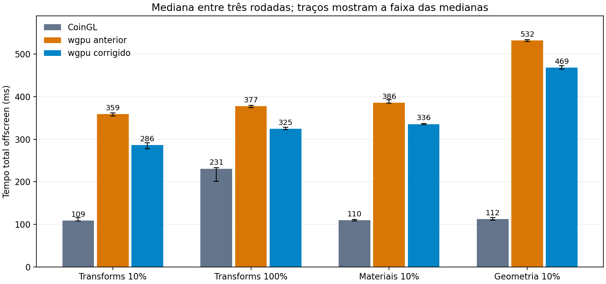
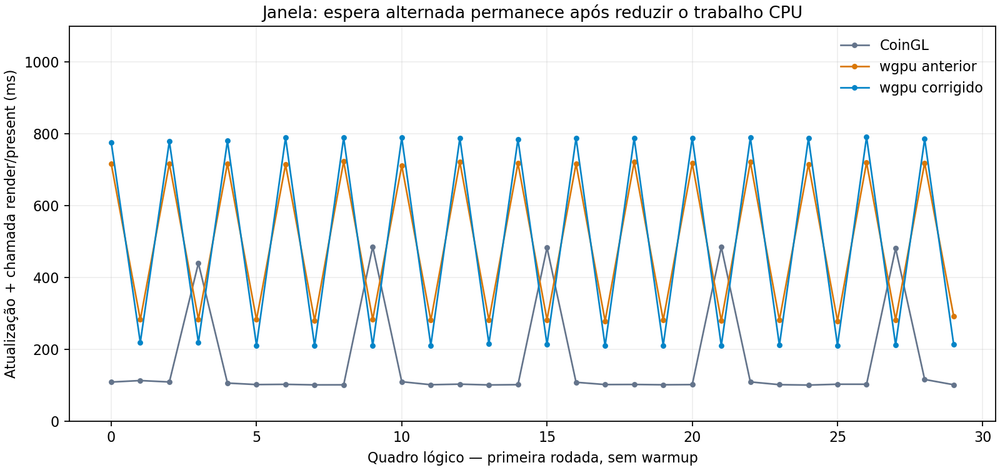

# Movimento de objetos no wgpu — Linux, 2026-10-04

Implementação C++: `9e347591a9825ce4c1fcbdc76dc31d142d50d264`.
Diagnóstico opt-in de apresentação: `1357bea43d`.
Branch: `codex/coin-render-transform-performance`.
Esta etapa sucede a [reutilização da câmera](coin-render-camera-reuse-linux.md).
A referência continua sendo o OpenGL clássico do Coin3D, `SoGLRenderAction`
(CoinGL), com as correções locais de GLX/PRIME descritas nos relatórios anteriores.

## Correção

O batch opaco wgpu expandia e liberava aproximadamente 102 MB a cada revisão
completa. Agora a arena de vértices e índices permanece alocada. Um cache de
conteúdo compara geometria, índices, materiais, layout, ordem, slots, dimensões,
view/projection e estado GPU comum. Quando essa prova coincide, somente as
ocorrências com matrizes model-view/normal diferentes são reconstruídas.

Na cidade de 40 mil prédios, mover 10% reconstrói **96.000 vértices / 9,6 MB**, em
vez de **960.024 vértices / 96 MB**. Os índices existentes permanecem intactos.
O trace `wgpu_opaque_batch` registra os ranges/vértices realmente reconstruídos.
O perfil continua restrito ao batch opaco compatível; revisão e
`RESOURCE_REBUILD` não servem como prova de igualdade do conteúdo.

A prova retida tem teto de 16 MiB. A arena de matrizes de trabalho fica fora
desse teto: cerca de 4,88 MiB nesta cidade. O batch expandido também fica fora
dele. Câmera, fallback, erro e alteração de conteúdo invalidam a prova; a falha
também invalida a revisão empacotada, permitindo retry seguro. O optout
`COIN_WGPU_DISABLE_INCREMENTAL_OPAQUE_BATCH=1` desativa a reconstrução parcial;
a arena persistente continua ativa.

O Common, a ABI e os shaders permanecem iguais. O Rust continua enviando todos
os **101.762.544 bytes** de vértices/índices em cada revisão completa de objetos.
A redução de trabalho CPU não constitui uma atualização parcial da GPU.

## Método

- Cidade: 40.000 prédios, grade 200 × 200, seed 136, 480.012 triângulos,
  PHONG e duas luzes direcionais; SHA-256
  `bb9ccc612cd38ffb749ee599d9350a80974649eab5bf477d2f344538a42b2576`.
- Ryzen 7 5800H, RTX 3060 Laptop, NVIDIA 610.57.04, Release GCC 13.3/Ninja,
  `-O3 -DNDEBUG`, governor `powersave`, clocks não fixados.
- Antes: binários congelados de `4d63bb993022ee8d40802558b0871a4803002b8d`.
  Depois: binários de `9e347591a9`, congelados por SHA-256 antes do diagnóstico
  adicional. O diagnóstico posterior adiciona somente timers condicionados a
  `COIN_RENDER_TRACE_PHASES`, sem mudar a sequência de comandos GPU.
- Offscreen: seis casos, três rodadas, cinco warmup e 30 quadros medidos,
  1024 × 1024, RGBA síncrono com publicação. 54 processos efetivos e 1.620
  amostras medidas. O CoinGL é executado uma vez por caso/rodada e seu controle
  exato é copiado para os dois conjuntos, marcado como `shared_control`.
- Janela: transforms-10, mesmo tamanho, três rodadas de cinco warmup e 30
  quadros, sem captura. Nove processos efetivos e 270 amostras medidas.
- Controle estático mais longo: três rodadas, 30 warmup e 300 quadros,
  também intercalado; nove processos e 2.700 amostras medidas.
- Imagens: campanhas separadas dos timers, sete estados lógicos 0/100/.../600
  por caso/variante, sem warmup. Antes/depois usam as mesmas seleções e digests
  de estado. Os tempos emitidos nessas campanhas não qualificam desempenho.

Cada caso intercala CoinGL / wgpu anterior / wgpu corrigido, alternando a ordem
entre rodadas. Nenhuma build ou outro teste GPU concorrente. Caches de sistema e
driver não foram esvaziados. Primeiro quadro significa processo novo. Os números
abaixo são medianas das estatísticas por processo, não percentis de amostras
misturadas. Esses controles de objetos têm 30 quadros por processo e não
substituem a [campanha histórica de 600](coin-render-animation-linux.md).

## Offscreen

Tempo total por quadro, incluindo atualização, render/readback e publicação:

| Caso | wgpu anterior | wgpu corrigido | Redução | CoinGL |
|---|---:|---:|---:|---:|
| Transforms 10% | 358,96 ms | 286,35 ms | 20,2% | 109,04 ms |
| Transforms 100% | 377,48 ms | 324,82 ms | 14,0% | 230,98 ms |
| Materiais 10% | 385,94 ms | 335,70 ms | 13,0% | 110,06 ms |
| Geometria 10% | 532,14 ms | 468,67 ms | 11,9% | 112,45 ms |
| Câmera | 8,17 ms | 8,08 ms | 1,0% | 70,15 ms |

Os objetos continuam mais caros que CoinGL. A melhora também nos casos que
invalidam a prova incremental mostra o benefício de preservar as arenas.

A amostra estática curta registrou 1,98 → 2,52 ms. O controle mais longo foi
executado para resolver essa diferença: registrou **1,84 → 1,82 ms**, CoinGL
**12,32 ms**. Não se usa a amostra curta para declarar regressão nem o controle
mais longo para ocultá-la; ambos os conjuntos completos estão arquivados.

### Memória e primeiro quadro

RSS máximo do processo, agregado por mediana das três rodadas; não mede VRAM:

| Caso | RSS anterior | RSS corrigido |
|---|---:|---:|
| Transforms 10% | 764,48 MiB | 673,02 MiB |
| Transforms 100% | 769,96 MiB | 678,43 MiB |
| Materiais 10% | 788,17 MiB | 690,67 MiB |
| Geometria 10% | 953,71 MiB | 927,26 MiB |
| Estático, controle curto | 588,24 MiB | 598,12 MiB |
| Câmera | 593,22 MiB | 603,27 MiB |

Transforms-10 reduziu o pico em **91,46 MiB**. Estático/câmera conservam cerca de
10 MiB adicionais de prova e matrizes. O primeiro render de transforms-10 mudou
de **385,50 para 381,75 ms**; no controle estático curto, **392,68 para 385,60 ms**.
Essa etapa não demonstra uma melhora substancial de inicialização.

## Janela e pausas de apresentação

Tempo CPU da atualização e chamada render/present; não mede duração GPU,
latência até a tela ou FPS físico:

| Variante | Mediana anterior | Mediana corrigida | p95 anterior | p95 corrigido |
|---|---:|---:|---:|---:|
| wgpu/Vulkan | 500,62 ms | 498,79 ms | 721,89 ms | 789,74 ms |
| CoinGL, mesmo controle | 106,52 ms | 106,52 ms | 468,03 ms | 468,03 ms |

O ganho offscreen ainda não demonstra uma animação mais fluida na janela.
Cada processo wgpu tem duas populações alternadas: aproximadamente 280/720 ms
antes e 210/790 ms depois. Os pares somam aproximadamente um segundo. A mediana
próxima de 500 ms fica entre as populações; não é o custo de cada chamada.
O quadro rápido melhora e o lento absorve a diferença. CoinGL também registra
pausas periódicas, mas apresenta chamadas mais rápidas nesta cena.

O trace separado confirmou acquire próximo de 0,02–0,03 ms e encode de cerca
de 18 ms. As pausas ficam em `submit_present_ms`, que antes agrupava submissão,
registro de conclusão, captura e apresentação. O diagnóstico adicional separa
`queue_submit_ms`, `completion_registration_ms`, `capture_readback_ms` e
`present_ms`, exclusivamente quando o trace está ativado.

A coleta com os campos separados confirmou a espera **dentro de
`surface_texture.present()`**: chamadas lentas de aproximadamente 566–786 ms,
enquanto `queue_submit_ms` ficou em 0,046–0,062 ms, registro de conclusão
abaixo de 0,002 ms e acquire em 0,023–0,029 ms. Assim, a espera observada
nesta coleta não fica na aquisição nem na submissão. Ela pertence ao caminho
de apresentação Vulkan; o trace não determina qual componente do driver,
compositor ou plataforma causa o bloqueio, nem mede quando o quadro chega à tela.
Essa coleta usa instrumentação e fica fora das tabelas de desempenho.

## Validação

- Quatro testes CPU passaram: `CoinRenderActionTest`,
  `CoinRenderFrameReuseCoreTest`, `CoinRenderTransformCoreTest` e
  `CoinWgpuFfiFrameTest`.
- O teste C++ compara bytes com o empacotamento completo original: movimento
  0/10/100%, alteração de fontes/índices/material/slots/ordem/estado/luzes,
  viewport/projeção, câmera ↔ objetos, singularidade, erro tardio e retry, optout
  e teto da prova. Uma revisão independente não encontrou regressão funcional.
- GPU: `CoinWgpuMultiDeviceTest`, `CoinRenderCameraReuseReferenceTest` com
  referência CoinGL obrigatória, e `CoinRenderSurfaceTest --camera-only
  --require-vulkan` passaram. O teste de surface foi repetido após adicionar
  os campos de diagnóstico.
- **84 imagens antes/depois são RGB idênticas**, incluindo 42 imagens wgpu.
  Todos os digests de estado correspondem. Movimento e alteração real das
  imagens foram verificados nos cinco casos dinâmicos.
- Cada campanha também fez 84 comparações com CoinGL. As diferenças existentes
  permaneceram iguais: MAE máxima 0,027938, máximo por canal 150 e no máximo
  sete pixels acima de três níveis em uma imagem de 1.048.576 pixels.

## Experimento descartado e próximos custos

Um protótipo reutilizou VB/IB da GPU por staging/cópia no encoder, mantendo
upload completo. No piloto offscreen idêntico de três rodadas, cinco warmup e
20 quadros, o protótipo registrou transforms-10 **257,63 ms**, contra **254,75 ms**
com apenas C++, e transforms-100 **296,81**, contra **289,26 ms**. Ele foi
descartado; seus resultados negativos e hashes foram preservados. Não foi
ensaiado em janela. O patch arquivado inclui um endurecimento posterior de
rollback, que não foi o código compilado nessa ablação.

Comparar diretamente os 20 quadros do piloto com os 30 da campanha final
produziria uma conclusão incorreta: os últimos dez quadros são mais caros.
A análise dos CSVs registra as duas janelas. No mesmo subintervalo 0–19,
transforms-10 C++ final ficou em 254,82 ms, próximo dos 254,75 ms do piloto.
Esses recortes servem para explicar o protocolo, não substituem a tabela final.

Custos que permanecem: recaptura/reconstrução comum em mudanças de objetos,
expansão para vértices de 100 bytes e upload completo de aproximadamente 102 MB.
BGFX usa geometria compacta e instâncias; wgpu ainda não tem esse caminho de
instâncias. A espera da apresentação também precisa de investigação própria.
Nenhuma destas limitações foi marcada como corrigida nesta etapa.

## Evidências e reprodução

Dados completos em [validation/wgpu-motion-linux](validation/wgpu-motion-linux):
CSV de cada quadro, logs, manifestos, comandos, ambiente, SHA-256 dos binários,
resumos recomputados e hashes/métricas das imagens. Os PPM ficam nos diretórios
temporários de captura e não foram adicionados ao Git.

O helper `offscreen/summarize.py` recalcula tempos a partir dos CSVs. Seu
`--recorded-rgb` permite conferir o arquivo usando métricas RGB arquivadas quando
os PPM originais não estiverem disponíveis; essa modalidade fica explicitamente
marcada como sem recomputação dos pixels. `--verify-before/--verify-after`
recalcula os pixels originais. `--require-identical-rgb` exige igualdade.

O runner intercalado arquivado aceita os builds anterior/corrigido e o build
CoinGL separadamente, com revisões e hashes por variante. O controle compartilhado
é executado uma vez e copiado; os dois conjuntos não representam execuções CoinGL
independentes.
