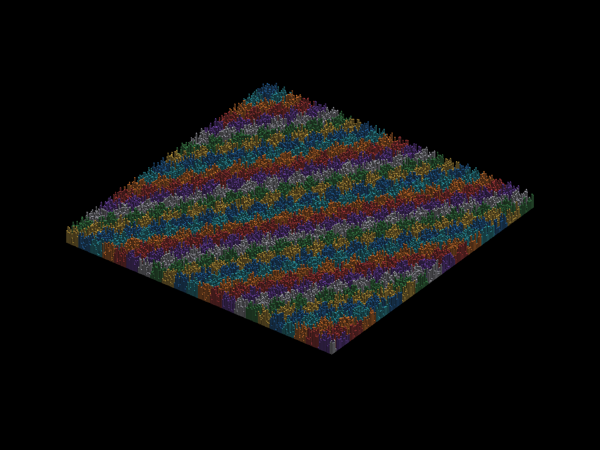
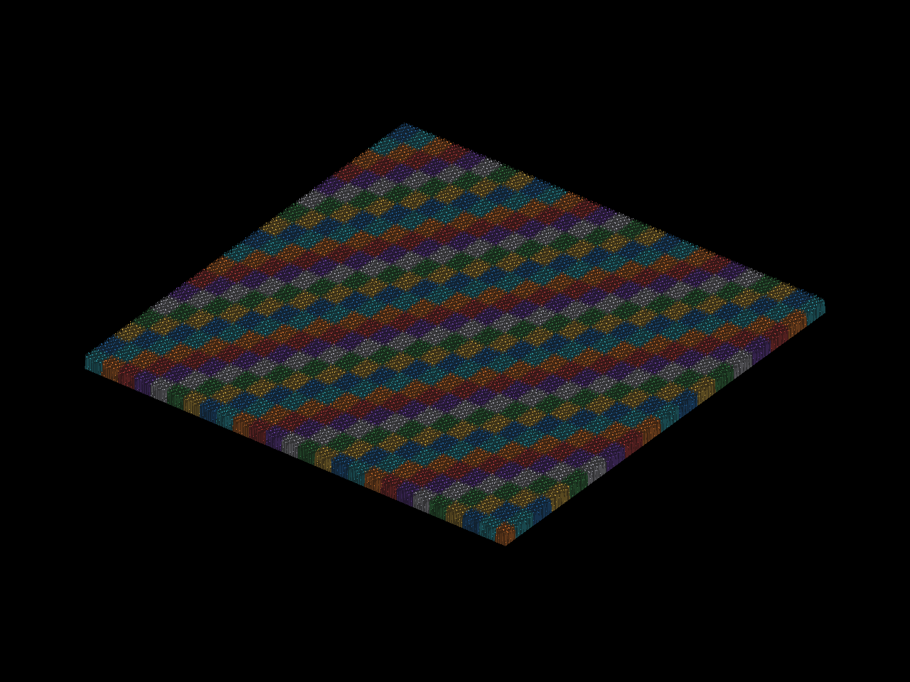
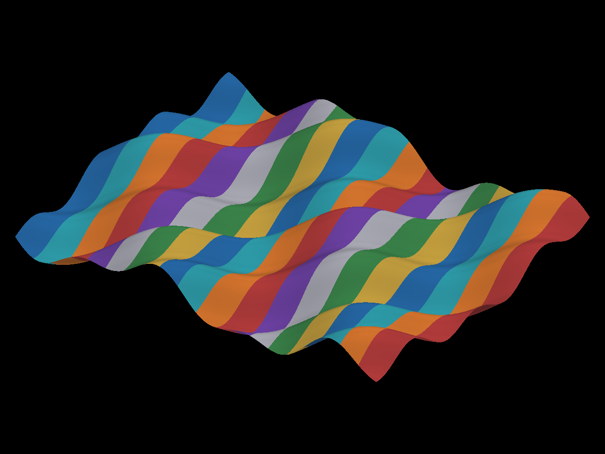
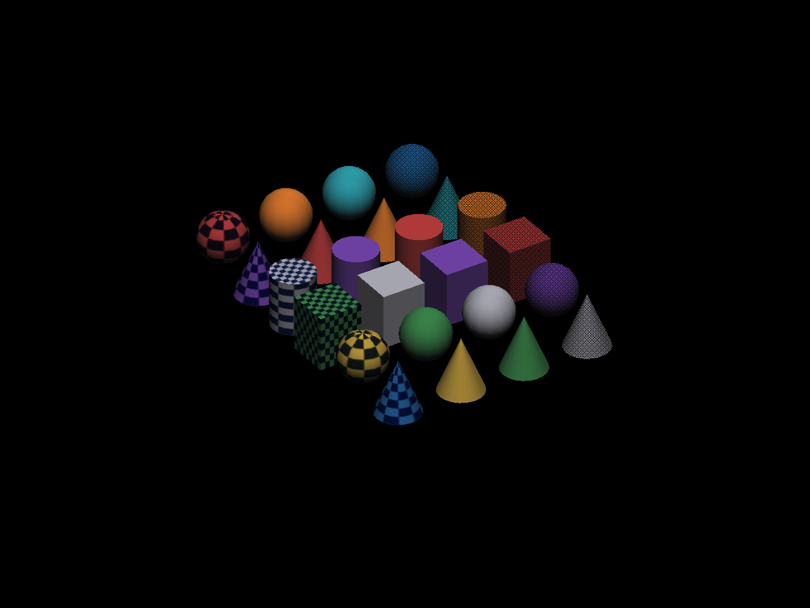

# Cenas visuais de CoinRender no Windows

Campanha pública em 1280×960: 72 processos, 30 passes e 42 falhas no gate estrito janela/offscreen. As cenas mostram edifícios, relevo, iluminação, textura e transparência. As falhas permanecem abertas; nenhuma tolerância foi ampliada.

Coin/CoinRender corresponde ao código publicado em `6caeb62d5be534dbc7b428c58c13c529a55e36d9`, na mesma branch `codex/coin-portable-sampling-study`. Foram usados os prefixes isolados BGFX e wgpu da campanha anterior, com o SDK BGFX corrigido ali e os consumidores públicos recompilados nesta campanha. Os caminhos e SHA256 das DLLs efetivamente carregadas constam dos logs e de `provenance.json`. Windows 10 Pro 19045, NVIDIA GTX 1060 6GB, driver 581.08 / 32.0.15.8108; D3D12, Vulkan e OpenGL físicos, sem fallback contado como passe. Intel não foi exercitada.

## Cenas e comparação

- Cidade de 40.000 edifícios: 200×200 cubos, 480.000 triângulos, oito cores, alturas variadas e duas luzes direcionais.
- Cidade de 1.000.000 de instâncias: 1000×1000 colocações de oito shapes compartilhados, 12.000.000 de triângulos geométricos antes de oclusão. São instâncias lógicas no grafo, não um milhão de shapes únicos nem um milhão de objetos FreeCAD. A captura da cidade inteira deixa muitos edifícios menores que um pixel; o controle de 40.000 mostra melhor o volume.
- Terreno iluminado: 501.501 vértices, 500.000 quads triangulados em 1.000.000 de triângulos, elevação sinusoidal e vinte faixas de materiais. Não equivale à cidade de um milhão de instâncias.
- Sólidos: 24 esferas/cones/cilindros/cubos, seis objetos com textura procedural 63×47 e seis com transparência 0,35. A transparência usa o comportamento padrão; não qualifica OIT ou oito sombras.

Cada processo usa uma política explícita `native` ou `portable`, um warmup e dois frames com submissões crescentes. A câmera ortográfica inclinada gira de 0,65 a 1 radiano; os controles separados mantêm a câmera em 0,65. O primeiro controle usou height 155; visual-static-matched repete height 140 e os mesmos parâmetros da cidade original, sem mudar a tolerância. Nenhum readback ocorre dentro desse pequeno trecho. Os CSVs são diagnósticos de retorno CPU; a amostra curta e a pressão de memória das cidades não qualificam desempenho ou latência de display.

As capturas inicial/final ocorrem fora do trecho medido. Cada imagem da janela é comparada a um alvo offscreen novo, com nova action, a mesma cena, API e política: RGB máximo exigido 0 e cobertura maior que 10%. wgpu/OpenGL usa GDI externo; os demais usam readback público solicitado antes da submissão. A comparação verifica consistência entre superfícies; não é uma referência CoinGL independente nem uma prova completa da semântica de iluminação/sampling. Os PNGs preservam exatamente os RGB dos PPMs; as máscaras em branco mostram pixels divergentes, sem alterar os renders.

## Resultados

| Campanha | Processos | Passes | Falhas |
|---|---:|---:|---:|
| visual-initial | 36 | 10 | 26 |
| visual-million | 12 | 0 | 12 |
| visual-static-control | 12 | 10 | 2 |
| visual-static-matched | 12 | 10 | 2 |

| Cena e campanha | Backend/API | Passes de 2 políticas | Inicial max/pixels | Final max/pixels |
|---|---|---:|---|---|
| city-40000-bgfx-d3d12 (visual-initial) | BGFX Direct3D 12 NVIDIA (vendor 0x10de, device 0x1c03) | 0/2 | 0/0 | 136/38 |
| city-40000-bgfx-vulkan (visual-initial) | BGFX Vulkan NVIDIA (vendor 0x10de, device 0x1c03) | 0/2 | 0/0 | 136/38 |
| city-40000-bgfx-opengl (visual-initial) | BGFX OpenGL NVIDIA (vendor 0x10de, device 0x0000) | 0/2 | 1/9 | não capturado |
| city-40000-wgpu-d3d12 (visual-initial) | NVIDIA GeForce GTX 1060 6GB (Dx12) | 0/2 | 0/0 | 136/42 |
| city-40000-wgpu-vulkan (visual-initial) | NVIDIA GeForce GTX 1060 6GB (Vulkan) | 0/2 | 0/0 | 136/42 |
| city-40000-wgpu-opengl (visual-initial) | NVIDIA GeForce GTX 1060 6GB/PCIe/SSE2 (Gl) | 0/2 | 0/0 | 136/42 |
| terrain-million-bgfx-d3d12 (visual-initial) | BGFX Direct3D 12 NVIDIA (vendor 0x10de, device 0x1c03) | 0/2 | 0/0 | 1/4 |
| terrain-million-bgfx-vulkan (visual-initial) | BGFX Vulkan NVIDIA (vendor 0x10de, device 0x1c03) | 0/2 | 0/0 | 1/5 |
| terrain-million-bgfx-opengl (visual-initial) | BGFX OpenGL NVIDIA (vendor 0x10de, device 0x0000) | 0/2 | 0/0 | 1/4 |
| terrain-million-wgpu-d3d12 (visual-initial) | NVIDIA GeForce GTX 1060 6GB (Dx12) | 0/2 | não capturado | não capturado |
| terrain-million-wgpu-vulkan (visual-initial) | NVIDIA GeForce GTX 1060 6GB (Vulkan) | 0/2 | não capturado | não capturado |
| terrain-million-wgpu-opengl (visual-initial) | NVIDIA GeForce GTX 1060 6GB/PCIe/SSE2 (Gl) | 0/2 | não capturado | não capturado |
| solids-bgfx-d3d12 (visual-initial) | BGFX Direct3D 12 NVIDIA (vendor 0x10de, device 0x1c03) | 2/2 | 0/0 | 0/0 |
| solids-bgfx-vulkan (visual-initial) | BGFX Vulkan NVIDIA (vendor 0x10de, device 0x1c03) | 2/2 | 0/0 | 0/0 |
| solids-bgfx-opengl (visual-initial) | BGFX OpenGL NVIDIA (vendor 0x10de, device 0x0000) | 0/2 | 1/1 | não capturado |
| solids-wgpu-d3d12 (visual-initial) | NVIDIA GeForce GTX 1060 6GB (Dx12) | 2/2 | 0/0 | 0/0 |
| solids-wgpu-vulkan (visual-initial) | NVIDIA GeForce GTX 1060 6GB (Vulkan) | 2/2 | 0/0 | 0/0 |
| solids-wgpu-opengl (visual-initial) | NVIDIA GeForce GTX 1060 6GB/PCIe/SSE2 (Gl) | 2/2 | 0/0 | 0/0 |
| city-million-bgfx-d3d12 (visual-million) | BGFX Direct3D 12 NVIDIA (vendor 0x10de, device 0x1c03) | 0/2 | 0/0 | 112/98 |
| city-million-bgfx-vulkan (visual-million) | BGFX Vulkan NVIDIA (vendor 0x10de, device 0x1c03) | 0/2 | 0/0 | 112/102 |
| city-million-bgfx-opengl (visual-million) | BGFX OpenGL NVIDIA (vendor 0x10de, device 0x0000) | 0/2 | 115/50 | 123/97 |
| city-million-wgpu-d3d12 (visual-million) | NVIDIA GeForce GTX 1060 6GB (Dx12) | 0/2 | 0/0 | 118/79 |
| city-million-wgpu-vulkan (visual-million) | NVIDIA GeForce GTX 1060 6GB (Vulkan) | 0/2 | 0/0 | 118/79 |
| city-million-wgpu-opengl (visual-million) | NVIDIA GeForce GTX 1060 6GB/PCIe/SSE2 (Gl) | 0/2 | 0/0 | 118/79 |
| city-40000-bgfx-d3d12 (visual-static-control) | BGFX Direct3D 12 NVIDIA (vendor 0x10de, device 0x1c03) | 2/2 | 0/0 | 0/0 |
| city-40000-bgfx-vulkan (visual-static-control) | BGFX Vulkan NVIDIA (vendor 0x10de, device 0x1c03) | 2/2 | 0/0 | 0/0 |
| city-40000-bgfx-opengl (visual-static-control) | BGFX OpenGL NVIDIA (vendor 0x10de, device 0x0000) | 0/2 | 1/2 | 1/2 |
| city-40000-wgpu-d3d12 (visual-static-control) | NVIDIA GeForce GTX 1060 6GB (Dx12) | 2/2 | 0/0 | 0/0 |
| city-40000-wgpu-vulkan (visual-static-control) | NVIDIA GeForce GTX 1060 6GB (Vulkan) | 2/2 | 0/0 | 0/0 |
| city-40000-wgpu-opengl (visual-static-control) | NVIDIA GeForce GTX 1060 6GB/PCIe/SSE2 (Gl) | 2/2 | 0/0 | 0/0 |
| city-40000-bgfx-d3d12 (visual-static-matched) | BGFX Direct3D 12 NVIDIA (vendor 0x10de, device 0x1c03) | 2/2 | 0/0 | 0/0 |
| city-40000-bgfx-vulkan (visual-static-matched) | BGFX Vulkan NVIDIA (vendor 0x10de, device 0x1c03) | 2/2 | 0/0 | 0/0 |
| city-40000-bgfx-opengl (visual-static-matched) | BGFX OpenGL NVIDIA (vendor 0x10de, device 0x0000) | 0/2 | 1/9 | 1/9 |
| city-40000-wgpu-d3d12 (visual-static-matched) | NVIDIA GeForce GTX 1060 6GB (Dx12) | 2/2 | 0/0 | 0/0 |
| city-40000-wgpu-vulkan (visual-static-matched) | NVIDIA GeForce GTX 1060 6GB (Vulkan) | 2/2 | 0/0 | 0/0 |
| city-40000-wgpu-opengl (visual-static-matched) | NVIDIA GeForce GTX 1060 6GB/PCIe/SSE2 (Gl) | 2/2 | 0/0 | 0/0 |

Os valores max/pixels na tabela detalham `native`; `portable` está registrado integralmente nos JSONs e PNGs. Não capturado é ausência de evidência, nunca passe. Na primeira versão do fixture, uma falha da comparação inicial encerrava o processo antes da rotação; isso afetou BGFX/OpenGL na cidade de 40.000 e nos sólidos. A versão estendida mantém a falha inicial e prossegue para recolher o diagnóstico final quando a renderização permite.

O terreno no wgpu falhou nas duas políticas e três APIs: panic de validação `Coin Uncached Vertex Buffer` inválido, capturado pela ponte Rust como status 7. O diagnóstico do log não estabelece sozinho a causa ou o limite de buffer violado; a causa requer investigação. Nenhum desses processos recebeu passe ou imagem substituta.

As divergências após mover a câmera das cidades aparecem em ambos os backends; o controle com câmera fixa delimita o problema, mas não demonstra a causa. Não houve correção de produção nesta entrega. `native` continua sendo o padrão. Diferenças entre imagens native/portable nos sólidos também estão quantificadas em `policy-pixel-comparison.json`; essa comparação é diagnóstica, pois políticas distintas não são por si uma referência independente de correção.

## Imagens reais









## Reprodução e evidências

O diretório [de evidências](validation/windows-visual-20261010) guarda logs iniciais, XML de todos os resultados, comandos/ambiente, CSVs, clocks/P-state/driver, fontes das três versões do fixture, logs de build, SHA256, PNGs e máscaras. `pixel-manifest.json` registra hashes dos PPMs mantidos no diretório de execução e dos RGB/PNGs publicados. `artifact-manifest.json` protege os bytes dos arquivos publicados. O SDK e suas revisões/patch estão registrados na [campanha anterior](coin-render-windows-remaining-gates-20261010.md).

Para recompilar, configurar `visual-src` separadamente com `CMAKE_PREFIX_PATH` apontando para cada prefixo Coin/CoinRender BGFX/wgpu, gerador Visual Studio 17 2022, x64, Release e parallel 2. Colocar o `bin` do respectivo prefixo primeiro em PATH, selecionar `COIN_BGFX_RENDERER` e `WGPU_BACKEND`, e executar:

```text
coin_visual_campaign.exe <d3d12|vulkan|opengl> <native|portable> <city-40000|city-million|terrain-million|solids> 2 1 <prefixo-saida>
```

O controle estático usa `COIN_VISUAL_STATIC_CAMERA=1`. O fixture inicial preservado tem somente três cenas e encerra antes da captura final se a inicial divergir. Os runners publicados configuram as APIs, verificam a NVIDIA e os módulos carregados, preservam falhas e geram os XMLs.

Permanecem abertos: consistência exata das cidades sob movimento, BGFX/OpenGL nos casos divergentes, terreno iluminado wgpu e a qualificação independente de imagem/performance da cidade do milhão. Esta campanha C++ não fecha consumidores FreeCAD, monitores com DPI diferente, perda de device em outras APIs ou driver TDR.
