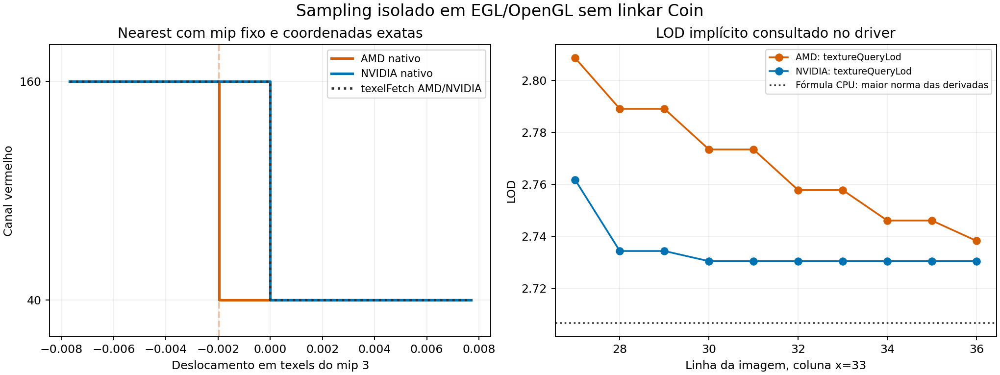

# Origem do sampling projetivo AMD — Coin isolado

Investigação separada de `codex/coin-render`, sobre Coin `master`
`01b360af32`, na branch `codex/coin-sampling-amd-study`.
Nenhum arquivo de produção foi alterado. Reprodutores e evidências ficam nesta
branch; a branch do renderer permaneceu em `f94a6c2898`, limpa, durante a rodada.

## Resultado

A divergência de sampling projetivo reproduz integralmente **sem linkar Coin**.
O Coin da master envia mipmaps, matriz e filtros corretos e produz exatamente a
mesma imagem que OpenGL direto e EGL puro, nas duas GPUs. A diferença ocorre na
seleção nearest e no LOD nativos dos drivers. Nesta fixture, o gate CPU/nativo
pressupõe uma seleção de texels perto da fronteira que a AMD não reproduz.
Não há evidência de erro em `SoTexture2`, `SoGLImage` ou na matriz de textura
para esse caso, nem razão demonstrada para corrigir esses nós como solução.

A investigação também confirmou **outro problema do Coin**, no bootstrap GLX
NVIDIA: a master tenta somente visuais single-buffer, mas o driver deste sistema
oferece RGBA/depth apenas com double-buffer. Isso impede `SoOffscreenRenderer`
de iniciar; pertence à seleção de visual do Coin e é independente do sampling.
Ele fica registrado para uma correção própria do Coin, sem mudar o renderer.

## Isolamento e controles

[`testsuite/reproducers/coin-sampling-amd-study`](../testsuite/reproducers/coin-sampling-amd-study/README.md)
contém três executáveis independentes:

1. `coin-native-sampling`: scene graph da master, OpenGL direto e shaders de
   diagnóstico, sem CoinRender ou seu IR.
2. `pure-egl-sampling`: cria o próprio contexto EGL e emite todo o GL diretamente;
   suas dependências ELF não contêm Coin ou CoinRender.
3. `glx-visual-probe`: consulta as ofertas single/double-buffer por GLX, sem Coin.

Foi reconstruído `libCoin.so` da master, sem símbolos CoinRender/wgpu. O
[recibo de linkage](validation/coin-sampling-amd-study-20261007/linkage.json)
conserva bibliotecas e hashes. Os arquivos `SoGLImage.cpp`, `SoTexture2.cpp`,
`SoTextureMatrixTransform.cpp` e `SoGLMultiTextureMatrixElement.cpp` são idênticos
à versão presente na branch do renderer.

Máquina qualificada: AMD Renoir/radeonsi Mesa 25.2.8, NVIDIA RTX 3060 Laptop
610.57.04, ambos OpenGL 4.6 compatibility. Coin AMD usa GLX pixmap direto, com
pbuffer desativado; Coin NVIDIA usa `SoGLRenderAction` em EGL atual porque o
bootstrap GLX original falha. O EGL puro usa seu próprio pbuffer nas duas GPUs.
A identificação física aparece em todas as rotas; não inferir vendor pelo display.

A fixture é a original: RGB 128×128, checker de blocos 8×8 com valores 40/160,
quad de 16 pixels, UV S=0,03..0,97 e T=0,02..0,98, Q=1+0,3*S, alpha 0,8,
fundo 0,1. Qualidades 0,5 e 0,8, offsets S/T 0/-0,001/+0,001. OpenGL direto
recebe mips construídos pela fórmula da imagem e S/T/Q já calculados, evitando
os nós de textura/matriz do Coin. Não foi usado o sampler CPU para construir
os controles GL ou o oracle numérico.

Foram **24 processos**, 204 renders de diagnóstico e **72/72 controles** positivos:
60 pares de referência, seis cruzamentos GPU com fetch explícito e seis controles
exatos de varredura. Coin versus GL direto/EGL puro deu **MAE 0/máximo 0 nos
12 casos autorais**, para os caminhos fixed e shader. Isso não significa que o
gate CPU/nativo passou: sua divergência original continua registrada abaixo.

## Conteúdo e estado enviados pelo Coin

Leitura GPU de todos os oito mipmaps, 128² até 1²: **zero bytes diferentes** da
fórmula independente, em ambas as GPUs e qualidades. O formato lido é RGB8,
com valores constantes 100 do mip 4 em diante. Não há geração incorreta de mips
ou bytes obsoletos nesta fixture.

- Qualidade 0,5: `GL_NEAREST_MIPMAP_LINEAR` (9986); 0,8:
  `GL_LINEAR_MIPMAP_LINEAR` (9987); magnificação linear.
- S/T REPEAT, base 0, anisotropia 1, LOD bias 0.
- Matriz Coin com Q projetivo 0,300000012, identidade nos demais termos originais,
  offsets autorais conservados. No controle GL direto, a matriz é identidade e
  as coordenadas Q são explícitas, com a mesma imagem final.
- `TEXTURE_MAX_LEVEL=1000` do Coin e 7 do controle manual são equivalentes para
  a cadeia completa 128²..1²; os acessos observados ficam nos níveis 2/3.

## Seleção nearest isolada do LOD

O controle `boundary-scan` fixa mip=3 e calcula S diretamente de `gl_FragCoord`,
com frações binárias exatas. Não há UV interpolado, matriz projetiva nem derivadas
implícitas nessa consulta. Cada pixel avança 1/4096 de um texel do mip 3, perto
da fronteira inteira 8. O resultado deveria mudar de vermelho 160 para 40 ao
mudar o texel escolhido.

| Consulta | Primeiro pixel da transição |
|---|---:|
| Sampler nativo AMD | 24 |
| Sampler nativo NVIDIA | 32 |
| Floor + `texelFetch`, AMD | 32 |
| Floor + `texelFetch`, NVIDIA | 32 |

Todos os 4.096 pixels do shader fetch conferem com o oracle inteiro. O sampler
AMD confere byte a byte com o modelo **round 1/256 texel e depois floor** nesse
controle; o NVIDIA confere com floor. Coin/GL direto e EGL puro repetem o mesmo
fingerprint. A diferença de transição corresponde a meio passo, 1/512 texel;
isso caracteriza o comportamento observado, não todos os formatos/samplers AMD.

No pixel (33,27) da fixture original, S no mip 3 vale 7,998724964. Ele está
à esquerda da fronteira matemática 8, mas à direita da transição AMD medida.
O sampler nativo e o fetch inteiro selecionam texels de cores diferentes.
A grande diferença RGB surge dessa troca discreta, não de um pequeno erro de cor.

## LOD medido, sem dedução a partir das cores

`textureQueryLod(...).y` foi lido em EGL puro e codificado com resolução 1/4096.
A consulta reporta o LOD nativo relativo à base conforme
[GLSL 4.60, §8.9.1](https://registry.khronos.org/OpenGL/specs/gl/GLSLangSpec.4.60.html).

| Pixel | LOD AMD consultado | LOD NVIDIA consultado | Maior norma fine da fórmula CPU |
|---|---:|---:|---:|
| 33,27 | 2,80859375 | 2,76171875 | 2,70668163 |
| 33,36 | 2,73828125 | 2,73046875 | 2,70668163 |
| 35,31 | 2,72265625 | 2,68359375 | 2,66408864 |

As duas implementações nativas diferem da fórmula usada pela referência CPU.
Isso não era evidente na NVIDIA porque, nesses pixels, os níveis consultados
selecionam texels da mesma cor. A
[especificação OpenGL 4.6, §8.14.1](https://registry.khronos.org/OpenGL/specs/gl/glspec46.compatibility.pdf)
define a footprint elíptica ideal e permite aproximações delimitadas para o fator
de escala. O estudo localiza a diferença; não certifica conformidade dos drivers.

Em (33,27), qualidade 0,5:

| Caminho AMD, EGL sem Coin | Vermelho |
|---|---:|
| Sampling nativo, LOD implícito | 55 |
| LOD explícito da fórmula CPU, sampler nativo | 65 |
| Mesmo LOD, round 1/256 + fetch inteiro | 65 |
| Mesmo LOD, floor + fetch inteiro | 133 |
| Fórmula independente da cena | 133 |

Fixar apenas o LOD conserva a troca de texel. Fixar LOD e seleção inteiro/floor
elimina a divergência entre GPUs. Na região original de 100 pixels:
AMD nativo versus fetch explícito mantém **MAE 8,08/máximo 78**, exatamente como
o gate anterior; NVIDIA nativo versus fetch dá **0/0**. No perfil nearest,
fetch explícito versus fórmula independente dá **0/0 em ambas as GPUs**.
Na qualidade 0,8 o oracle independente mantém máximo 1; controles preservam
MAE≤1,5/máximo≤4. Nenhum resultado nativo foi convertido em PASS por tolerância.

## Falha Coin separada: escolha de visual GLX NVIDIA

O Coin original retorna `Couldn't get any OpenGL-capable RGBA X11 visual` antes
do primeiro draw NVIDIA/GLX. O
[controle GLX independente](validation/coin-sampling-amd-study-20261007/glx-visual-summary.json)
consulta as duas opções diretamente:

| Driver GLX | Visual RGBA/depth single-buffer | Visual RGBA/depth double-buffer |
|---|---:|---:|
| Mesa/AMD | disponível | disponível |
| NVIDIA | ausente | disponível |

`src/glue/gl_glx.cpp`, em `glxglue_build_GL_attrs`/`glxglue_find_gl_visual`, testa
apenas oito combinações sem `GLX_DOUBLEBUFFER`. Nenhuma pode obter o visual
NVIDIA oferecido. O mesmo Coin rende corretamente em EGL já atual. Portanto,
é uma falha de admissão de contexto no Coin; não explica o sampling AMD nem
indica dados de textura errados. Não houve patch de produção nesta rodada.

Os logs de falha GLX são conservados, separados dos passes EGL. Isso não é uma
qualificação de `SoOffscreenRenderer` NVIDIA/GLX; a correção de fallback visual
merece uma mudança própria do Coin, com controles single/double e pbuffer/pixmap.

## Consequências

Corrigir imagem ou matriz no Coin não resolve esta divergência: um executável
que não liga a biblioteca reproduz os mesmos pixels. O gate de portabilidade
precisa distinguir sampling nativo perto de fronteiras de um contrato de seleção
explícita; manter a igualdade matemática exigiria executar esse contrato nos
backends e medir seu custo. Nenhuma dessas políticas foi aplicada aqui.

O problema GLX encontrado pertence ao Coin e fica separado. Junções curvas
continuam no estudo específico; os resultados daqui qualificam sampling RGB8 2D
projetivo nesta máquina, não rasterização de linhas, Android ou Windows.
A referência CPU e os gates da branch `coin-render` permaneceram intactos.

## Reprodução e evidências

Seguir o README do reproducer. O runner conserva comandos, ambientes, exits e
hashes dos binários; análise lê dumps top-down RGB 64×64 e usa fórmulas próprias.
O `manifest.json` inclui fontes, master-base, libCoin, executáveis e evidências.
Resultados são versionados nesta branch e espelhados em
`/mnt/Laranja/Git/externos/coin-sampling-amd-artifacts/20261007`.
